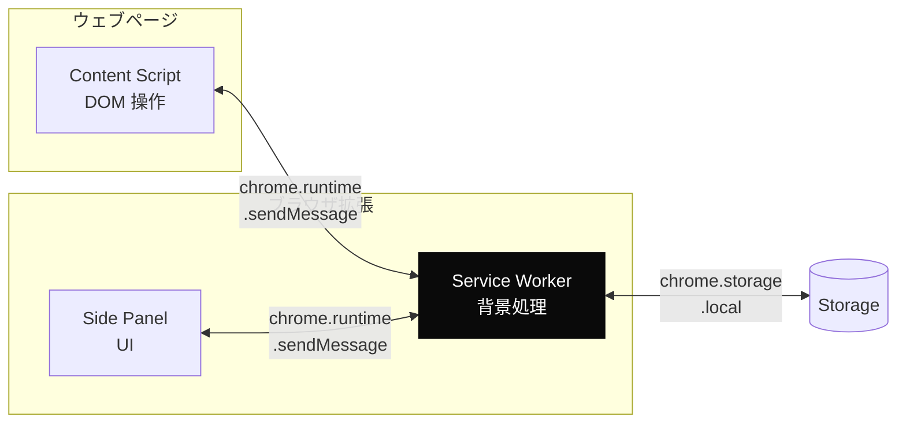
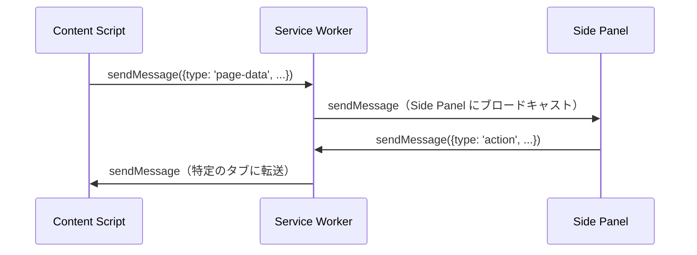

---
tags:
  - chrome-extension
  - manifest-v3
  - service-worker
---

# Chrome 拡張 Manifest V3 での Content Script + Side Panel 連携

Case Studies
#chrome-extension
#manifest-v3
#service-worker
updated 2026-04-13
3 min read

Chrome 拡張 Manifest V3 で、Content Script（ページに注入するスクリプト）と Side Panel（ブラウザ右側のパネル UI）を連携させる際に遭遇した実装上の落とし穴と対処。

### アーキテクチャ

### 観察された問題と対処

**1. Service Worker は頻繁に寝る**

MV3 では Service Worker がアイドル時に停止する。永続的な状態を持てないため、状態管理は `chrome.storage` に逃がす。

- **対策**: メモリ上の状態は一時的なものに限定し、永続化が必要なデータは `chrome.storage.local` に書き出す
- **落とし穴**: `setInterval` のような時間ベースの処理は Service Worker 再起動で消える。`chrome.alarms` を使う

**2. Side Panel と Content Script の直接通信はできない**

両者は互いを直接呼び出せない。必ず Service Worker を経由する。

- **対策**: Service Worker にメッセージルーターを実装。`tabId` を添えて転送先を制御する

**3. Side Panel のタブごとの状態管理**

Side Panel は全タブで共有される UI。タブごとに別の状態を見せたい場合、Side Panel 側でアクティブタブを監視する。

- **対策**: `chrome.tabs.onActivated` で切り替えを検知し、現在のタブ ID に紐付いた状態を `chrome.storage` から引く

**4. Content Script の CSP 制約**

注入先のサイトの Content Security Policy によっては、特定のスクリプト読み込みがブロックされる。

- **対策**: 外部 CDN 依存を減らし、依存を拡張内にバンドルする。ビルド時にインライン化する

### まとめ

Service Worker は「寝る前提で設計する」。状態は Storage に、タイマーは `chrome.alarms` に、通信はルーター越しに、依存はバンドル内に。この 4 点を押さえると MV3 特有の落とし穴の大半は回避できる。

## 関連エントリ

- [chrome.storage は local / sync / session を正しく使い分ける](../tech-notes/chromestorage-は-local-sync-session-を正しく使い分ける.md)
- [CLAUDE.md 肥大化を ADR 分離で回復した事例](claudemd-肥大化を-adr-分離で回復した事例.md)
- [LLM エージェントに push 通知チャネルを組み込む際の落とし穴](llm-エージェントに-push-通知チャネルを組み込む際の落とし穴.md)

  
← [LLM エージェントに大規模リファクタリングを安全に任せる手順](llm-エージェントに大規模リファクタリングを安全に任せる手順.md)

  
[Next.js + Supabase + Prisma 併用時の認証と RLS の扱い方](nextjs-supabase-prisma-併用時の認証と-rls-の扱い方.md) →

