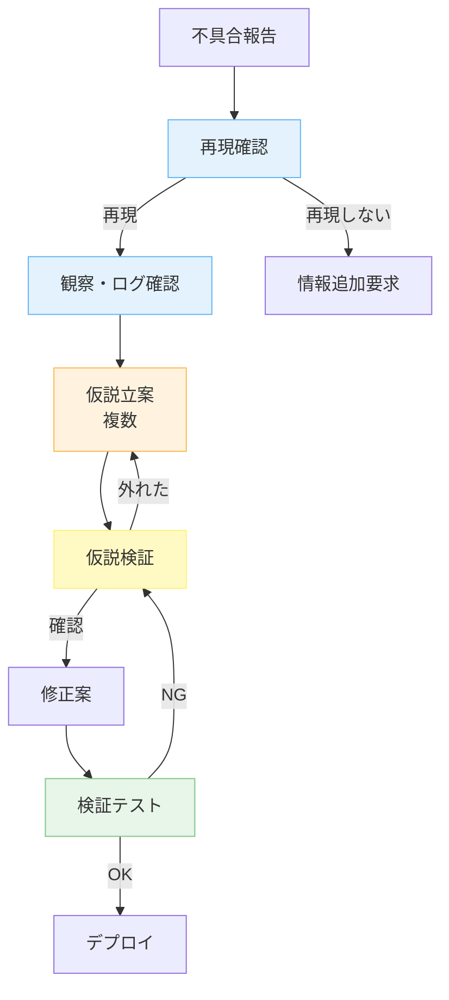
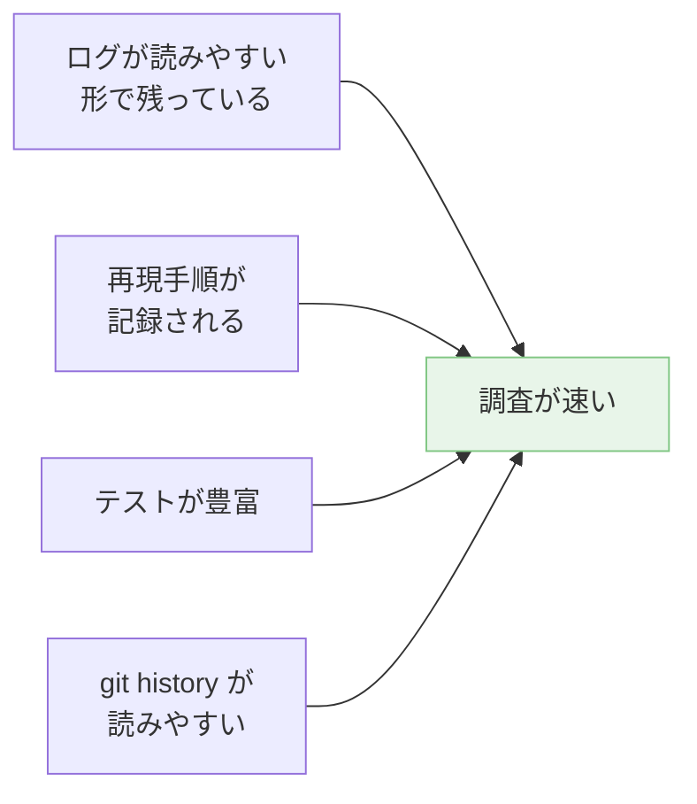

---
tags:
  - debugging
  - claude-code
  - case-study
  - workflow
---

# Claude Code を使った効率的な不具合調査

Case Studies
#debugging
#claude-code
#case-study
#workflow
updated 2026-04-13
5 min read

不具合調査で Claude Code を使うと、「何となく修正して動いた」では終わらず、**根本原因まで特定**できる確率が大きく上がる。ただし**やり方を間違えるとむしろ遅くなる**。効率的な進め方を整理。

### 調査フロー

### 効率的な進め方

**1. 再現確認を先にやる**

修正から始めるのは NG。**最初に再現させる**。再現できない不具合は、情報を集め直す。

    Claude への指示例:
    「以下の手順でエラーが出ると報告されている。
     実際に再現するか、最小の再現スクリプトを作成して。」

**2. 仮説を複数出させる**

「原因は何?」と 1 つ聞くと、最尤仮説だけを答えがち。**複数挙げさせる**。

    「この症状の原因として考えられるものを、可能性順に 5 つ挙げて。
     各仮説について、検証方法も添えて。」

**3. 仮説ごとに検証する**

優先度の高い仮説から順に、**最小コストで検証**する。検証して外れたら次の仮説へ。

**4. 根本原因を確認してから修正**

「たぶんこれで直る」で修正するのは危険。**原因を特定した上で**修正する。

    「原因が X であることを、以下の証拠で確認した:
      - ログに Y がある
      - コードの Z 行目で A をしている
      - 期待値は B だが、実際は C が返っている」

**5. 副作用を確認する**

修正が他の箇所に影響しないかを Claude にチェックさせる。

    「この修正により、他に影響を受ける可能性がある場所を洗い出して。」

**6. 回帰テストを追加**

同じバグを二度と出さないため、**評価セットにテストケースを追加**する。

### 陥りやすい失敗

**1. Claude の第一仮説をそのまま採用**

LLM は最初に思いついた仮説を正解のように見せる。**他の可能性を確認**してから進める。

**2. 証拠なしで修正する**

「たぶんここだと思います」で修正を始めると、**見当違いの変更**を積み重ねることになる。

**3. 症状だけ直す**

根本原因を特定せずに症状を抑える修正（try-except で握りつぶす等）は、**似た問題が繰り返す**もと。

**4. 再現せずに直す**

再現できない不具合を直そうとすると、本当に直ったか確認できない。**まず再現させる**。

### 効率化のための準備

ログ・再現性・テスト・コミット履歴の質が、調査効率を決める。**普段からの整備**が効く。

### Claude への指示例（テンプレート）

    【役割】
    あなたはこのプロジェクトの不具合調査を担当するエージェントです。

    【タスク】
    以下の不具合について、根本原因を特定し、修正案を提示してください。

    【症状】
    - 何が起きているか
    - いつから
    - 再現手順

    【方針】
    1. まず最小の再現スクリプトを作成
    2. 仮説を 3〜5 個挙げ、優先度順に検証
    3. 原因特定の証拠を明記
    4. 修正は原因を直す形で提案
    5. 副作用を確認

    最終的に、以下の形式で報告してください:
    - 根本原因: <説明>
    - 修正内容: <diff 形式>
    - 回帰防止: <追加するテスト>

### チェックリスト

- [ ] 不具合を再現できた
- [ ] 複数の仮説を立てた
- [ ] 証拠に基づいて原因を特定した
- [ ] 修正は根本原因を直している
- [ ] 副作用を確認した
- [ ] 回帰テストを追加した

### まとめ

Claude Code での不具合調査は、**「再現 → 仮説 → 検証 → 根本修正」**の 4 ステップを守る。近道を探すと、結果的に遠回りになる。

## 関連エントリ

- [LLM エージェントに大規模リファクタリングを安全に任せる手順](llm-エージェントに大規模リファクタリングを安全に任せる手順.md)
- [CLAUDE.md 肥大化を ADR 分離で回復した事例](claudemd-肥大化を-adr-分離で回復した事例.md)
- [LLM エージェントに push 通知チャネルを組み込む際の落とし穴](llm-エージェントに-push-通知チャネルを組み込む際の落とし穴.md)

  
← [比喩的な指示が実装の食い違いを生む — 二役レビューで救われた事例](比喩的な指示が実装の食い違いを生む-二役レビューで救われた事例.md)

  
[LLM エージェントに push 通知チャネルを組み込む際の落とし穴](llm-エージェントに-push-通知チャネルを組み込む際の落とし穴.md) →

