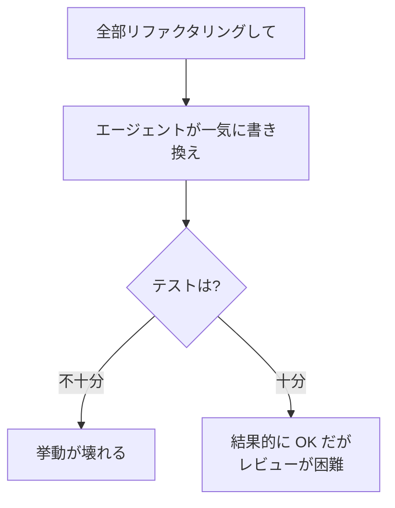
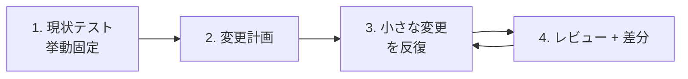

---
tags:
  - refactoring
  - claude-code
  - case-study
---

# LLM エージェントに大規模リファクタリングを安全に任せる手順

Case Studies
#refactoring
#claude-code
#case-study
updated 2026-04-13
3 min read

LLM エージェントに大規模な構造変更（リファクタリング）を任せる際、ナイーブに依頼すると既存挙動を壊す。**段階分けと挙動保証の仕組み**を先に作ってから進めるのが鉄則。

### 失敗パターン

### 成功させる 4 ステップ

**1. 現状の挙動をテストで固定する**

リファクタリング前に、現状の入出力を記録するテストを書く。エージェントに「今の動きと同じテストを書いて」と頼むのが最速。

- 外部インターフェースの I/O を記録
- エッジケース（エラー系・境界値）を含める
- 実データを使ったゴールデンテストも有効

**2. 変更計画を先に合意する**

「どの単位で・何を変えるか」を事前に決める。計画なしに「いい感じに直して」と言うと、勝手な判断で広範囲を書き換えられる。

    変更計画の例:
    Phase 1: lib/ ディレクトリの構造整理（機能変更なし）
    Phase 2: utils.py の関数を category/ 単位に分割
    Phase 3: 重複した正規表現を共通化
    Phase 4: 型アノテーションの追加

**3. 小さな単位で反復する**

1 回の変更は **1 コミット相当の粒度** に絞る。エージェントに「Phase 1 だけやって」と指示する。

- 変更後はテストを実行
- コミット
- 次の Phase へ

**4. 差分レビューを挟む**

各 Phase 完了後、**git diff** を読んでレビューする。Claude Code に「この diff を説明して」と問うと、想定と違う変更を拾いやすい。

### 陥りやすい失敗

**1. 「全部やって」と丸投げする**

エージェントは曖昧な指示を自分の解釈で埋める。結果、想定外の変更が混入する。

**2. テストなしで進める**

挙動を保証する仕組みがない状態で進めると、後から壊れたことに気づけない。

**3. 1 コミットが巨大化する**

100 ファイル変更のコミットは、レビュー不可能。小さく区切る。

**4. エージェントの自己判断に任せすぎる**

「これはついでにやっておいた」と書かれると、レビューコストが跳ね上がる。計画外の変更は拒否する運用にする。

### チェックリスト

- [ ] リファクタリング前に現状テストがある（または書いた）
- [ ] 変更計画を明文化し、合意した
- [ ] Phase 単位で小さく進めている
- [ ] 各 Phase 完了時に diff をレビューしている
- [ ] テストが通る状態でコミットしている
- [ ] 計画外の変更はロールバックする方針

### 得られる効果

- 挙動が壊れるリスクが大幅に減る
- レビュー負荷が分散する
- 途中で方針変更しても戻せる
- エージェントの暴走を防げる

### まとめ

リファクタリングは**エージェントが最も苦手とするタスクの一つ**。準備 8 割、実行 2 割の意識で、テスト・計画・小さな反復の 3 点を徹底する。

## 関連エントリ

- [Claude Code を使った効率的な不具合調査](claude-code-を使った効率的な不具合調査.md)
- [CLAUDE.md 肥大化を ADR 分離で回復した事例](claudemd-肥大化を-adr-分離で回復した事例.md)
- [LLM エージェントに push 通知チャネルを組み込む際の落とし穴](llm-エージェントに-push-通知チャネルを組み込む際の落とし穴.md)

  
← [LLM エージェントに push 通知チャネルを組み込む際の落とし穴](llm-エージェントに-push-通知チャネルを組み込む際の落とし穴.md)

  
[Chrome 拡張 Manifest V3 での Content Script + Side Panel 連携](chrome-拡張-manifest-v3-での-content-script-side-panel-連携.md) →

