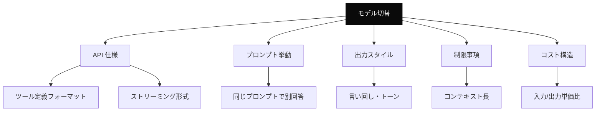
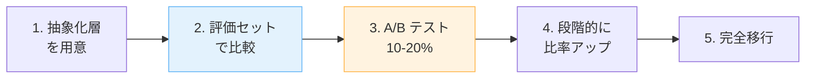

---
tags:
  - migration
  - llm
  - openai
  - anthropic
---

# LLM モデル / プロバイダー切り替え時の互換性問題と段階移行

Case Studies
#migration
#llm
#openai
#anthropic
updated 2026-04-13
4 min read

コストや性能を理由に、運用中の LLM を別のモデル・プロバイダーに切り替える場面は増えている。**互換性は完全ではない**。事前に想定すべき差分と、段階的な移行手順。

### 遭遇しうる差分

### よく遭遇する具体的な問題

**1. Function Calling / Tool Use のフォーマットが違う**

OpenAI の `tools` 形式と Anthropic の `tools` 形式はスキーマが異なる。SDK で吸収できる場合もあるが、独自実装だと全書き換え。

- **対策**: 抽象化層を最初から入れる。プロバイダー依存のコードは薄いラッパーに閉じ込める

**2. プロンプトが効かなくなる**

細かい指示がモデル依存で効いていた場合、切り替え後に無視される。

- 箇条書きを理解してくれない
- few-shot の解釈が違う
- role の扱いが違う

- **対策**: プロンプトを**両モデルで再調整**する。評価セットで回帰を確認

**3. 出力スタイルが変わる**

同じ質問に、同じ内容でもトーン・長さが違う。ユーザー体験が変わる。

- OpenAI: 簡潔寄り
- Anthropic: 丁寧・冗長寄り

- **対策**: 出力形式を指示で揃える（「3 文以内で」等）

**4. コンテキスト長と入出力比率**

モデルごとにコンテキスト長が違う。また入力単価と出力単価の比率も違う。

- **対策**: 長いプロンプトの扱い・出力長制限を再設計

### 段階的な移行手順

**Step 1: 抽象化層を作る**

    # プロバイダー依存を隠す
    class LLMClient:
      def generate(self, messages, tools=None):
        raise NotImplementedError

    class OpenAIClient(LLMClient): ...
    class AnthropicClient(LLMClient): ...

**Step 2: 評価セットで並行実行**

既存モデルと新モデルに同じ入力を流し、スコア差を定量化する。

**Step 3: 本番で A/B テスト**

10-20% のトラフィックを新モデルに流す。ユーザー満足度・エラー率・コストの 3 軸で比較。

**Step 4: 段階的に比率を上げる**

問題なければ 50% → 100% へ。問題が出たらロールバック。

**Step 5: 完全移行後の後始末**

旧モデルのコードを削除。抽象化層は残す（次回切り替え時に活きる）。

### 落とし穴

**1. 「互換性があるから大丈夫」と思う**

API 仕様の互換性と、**実際のプロンプト挙動の互換性は別**。必ず評価し直す。

**2. 一気に全量切替え**

A/B なしで切り替えると、本番で想定外の挙動が出たときに大打撃。段階移行必須。

**3. コスト計算をざっくりやる**

入力/出力単価比が違うと、プロンプトの特性によって想定外の金額になる。実ログで見積もる。

**4. 評価セットを再調整しない**

旧モデル前提の評価セットで新モデルを評価すると、不公平。評価軸も必要に応じて調整。

### チェックリスト

- [ ] プロバイダー依存を抽象化層に閉じ込めた
- [ ] 評価セットで両モデルを並行実行した
- [ ] 本番 A/B テストで影響を確認した
- [ ] コスト変化を実測した
- [ ] ロールバック手順を用意した
- [ ] ユーザー体験の変化を説明できる

### まとめ

LLM モデル切替は**アプリの再テスト**に近い労力がかかる。抽象化・評価・A/B の 3 点を先に準備すれば、移行は安全かつ可逆になる。

## 関連エントリ

- [OpenAI と Anthropic API の主要差分](../tech-notes/openai-と-anthropic-api-の主要差分.md)
- [Next.js で LLM のストリーミング応答を扱う実装パターン](nextjs-で-llm-のストリーミング応答を扱う実装パターン.md)
- [Eval-Driven Development — LLM 機能開発は評価から始める](../concepts/eval-driven-development-llm-機能開発は評価から始める.md)

  
← [Next.js で LLM のストリーミング応答を扱う実装パターン](nextjs-で-llm-のストリーミング応答を扱う実装パターン.md)

  

