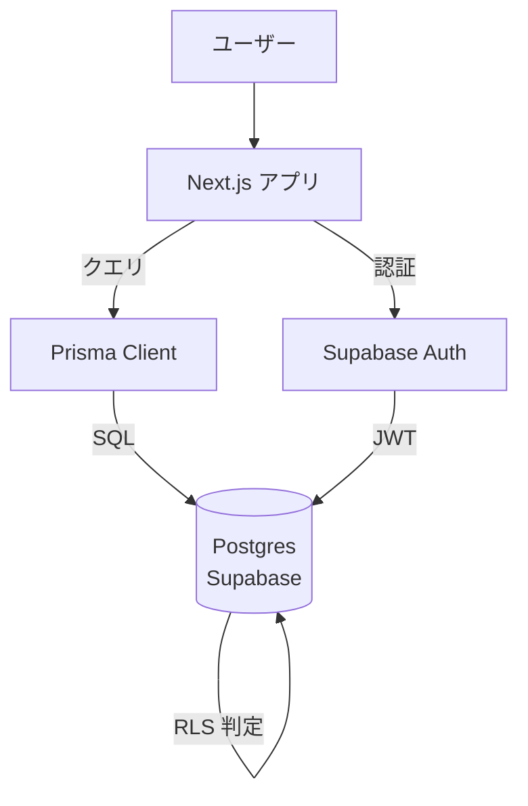
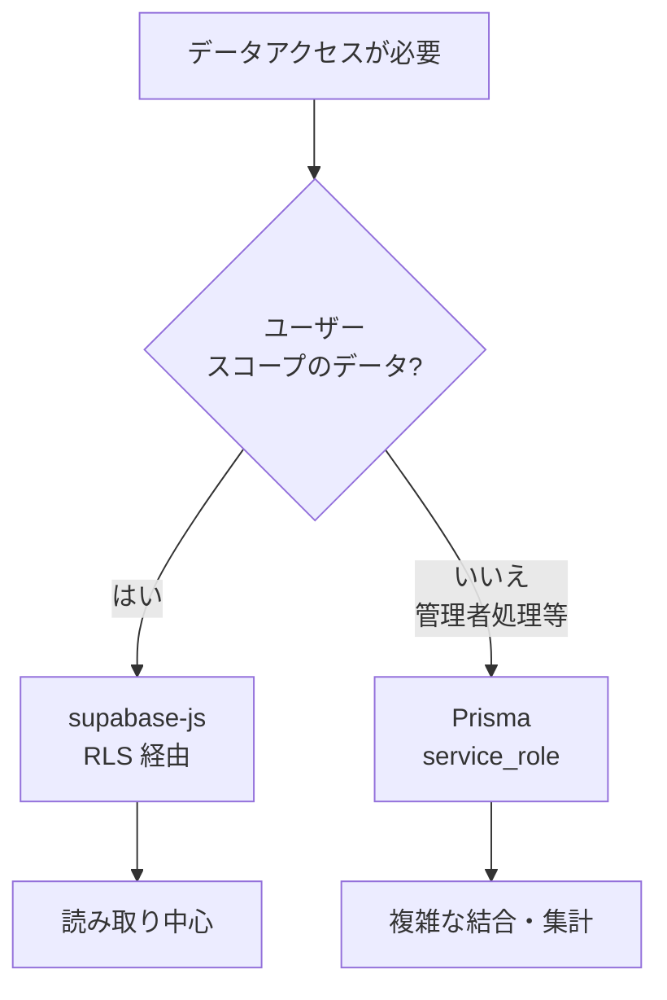

---
tags:
  - nextjs
  - supabase
  - prisma
  - rls
---

# Next.js + Supabase + Prisma 併用時の認証と RLS の扱い方

Case Studies
#nextjs
#supabase
#prisma
#rls
updated 2026-04-13
3 min read

Next.js アプリで Supabase（認証・RLS 付き Postgres）と Prisma（型付き ORM）を併用する際、認証情報の同期で詰まる問題と対処。

### 併用の基本構造

### ハマりどころ

**1. Prisma は auth.uid() を知らない**

Supabase の RLS（Row Level Security）ポリシーは `auth.uid()` を前提に書かれるが、Prisma は通常の DB ユーザーで接続するため `auth.uid()` が NULL になり、RLS に引っかかる。

- **対策 A**: Prisma は service_role キーで接続し、RLS をバイパスする。代わりにアプリ層でアクセス制御する
- **対策 B**: RLS を尊重したい場合は、Supabase Client の `supabase-js` を使う。Prisma とは役割分担する

**2. セッション管理が二重化する**

Next.js 側でセッションを管理する場合、Supabase のクッキーと Next.js のセッション管理が別々になり得る。

- **対策**: `@supabase/auth-helpers-nextjs`（または後継の `@supabase/ssr`）を使い、SSR / Client 両方で同じセッションを参照する

**3. マイグレーションが競合する**

Prisma Migrate と Supabase の SQL Editor 由来のマイグレーションが衝突する。

- **対策**: マイグレーションの発生源を一本化する。Prisma Migrate を正とし、Supabase ダッシュボードでのスキーマ変更は禁止する

### 判断フロー

ユーザースコープの読み書きは supabase-js（RLS 尊重）、管理者処理や複雑な集計は Prisma（service_role）という住み分けが実運用で機能した。

### 学び

- **Supabase の RLS は強力だが、ORM 経由では機能しないことを理解する**
- Prisma と Supabase Client は競合ではなく役割分担で使う
- マイグレーションの発生源は必ず一本化する

## 関連エントリ

- [Next.js で LLM のストリーミング応答を扱う実装パターン](nextjs-で-llm-のストリーミング応答を扱う実装パターン.md)
- [Stripe Webhook を Next.js で安全に実装する](stripe-webhook-を-nextjs-で安全に実装する.md)
- [Edge Runtime vs Node Runtime の使い分け](../tech-notes/edge-runtime-vs-node-runtime-の使い分け.md)

  
← [Chrome 拡張 Manifest V3 での Content Script + Side Panel 連携](chrome-拡張-manifest-v3-での-content-script-side-panel-連携.md)

  
[Stripe Webhook を Next.js で安全に実装する](stripe-webhook-を-nextjs-で安全に実装する.md) →

