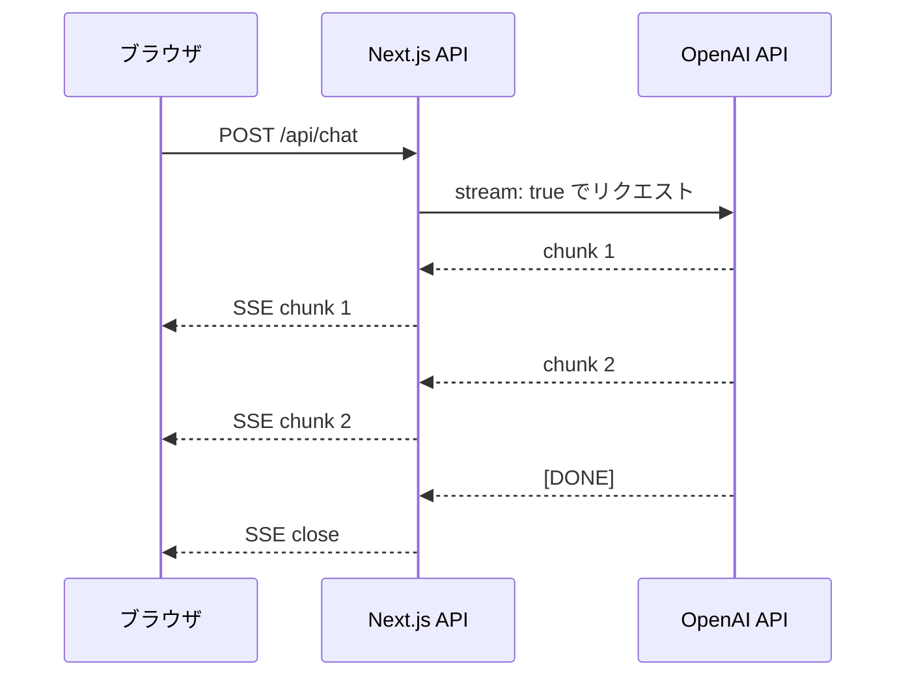
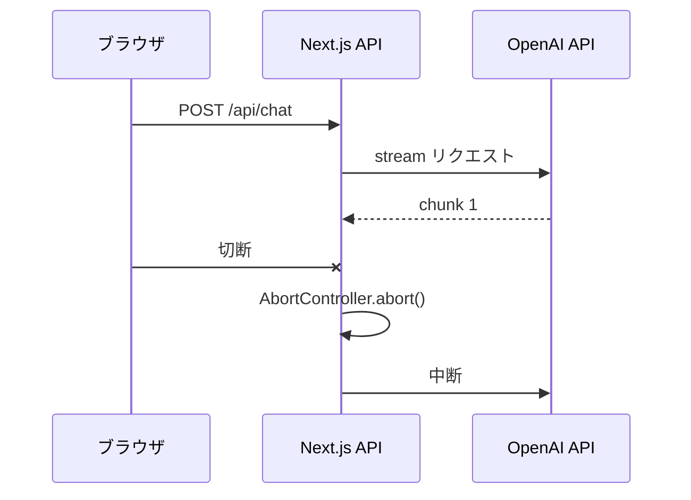

---
tags:
  - nextjs
  - openai
  - streaming
  - sse
---

# Next.js で LLM のストリーミング応答を扱う実装パターン

Case Studies
#nextjs
#openai
#streaming
#sse
updated 2026-04-13
5 min read

OpenAI（や Anthropic）の Chat Completions API でストリーミング応答を Next.js サーバーから受けて、ブラウザにリアルタイム表示する実装パターン。**Server-Sent Events（SSE）** が標準解。

### 全体のデータフロー

### 実装の要点

**1. Node.js の Readable stream を使う**

Next.js の `Response` に直接 `ReadableStream` を渡す。OpenAI SDK の `openai.chat.completions.create({ stream: true })` を `for await` で回す。

    export async function POST(req: Request) {
      const openai = new OpenAI()
      const stream = await openai.chat.completions.create({
        model: 'gpt-4o',
        messages: [...],
        stream: true,
      })
      const encoder = new TextEncoder()
      const readable = new ReadableStream({
        async start(controller) {
          for await (const chunk of stream) {
            const text = chunk.choices[0]?.delta?.content || ''
            if (text) controller.enqueue(encoder.encode(text))
          }
          controller.close()
        },
      })
      return new Response(readable, {
        headers: { 'Content-Type': 'text/event-stream' },
      })
    }

**2. クライアント側は `ReadableStream` を読む**

    const res = await fetch('/api/chat', { method: 'POST', body })
    const reader = res.body!.getReader()
    const decoder = new TextDecoder()
    while (true) {
      const { value, done } = await reader.read()
      if (done) break
      setText(prev => prev + decoder.decode(value))
    }

### ハマりどころ

**1. バッファリングで止まる**

CDN やリバースプロキシ（Vercel, Cloudflare 等）がレスポンスをバッファリングして、ストリームが届かないことがある。

- **対策**: `Cache-Control: no-cache, no-transform` を返す
- **対策（Vercel）**: Edge Runtime を使う（`export const runtime = 'edge'`）

**2. 中断処理**

ユーザーがページを閉じた後も OpenAI 側でトークンが消費され続ける。

- **対策**: `AbortController` を使い、クライアント切断時にアップストリームも中断する

**3. エラーハンドリング**

ストリーム途中でエラーが起きた場合、すでに 200 OK を返しているので HTTP ステータスでエラーを示せない。

- **対策**: ストリーム内に JSON 形式のエラーイベントを埋め込む

### 学び

- **ストリーミングはバッファリングが最大の敵**。本番環境で動かないときは、まずプロキシのバッファリング設定を疑う
- **クライアント切断をアップストリームに伝播させる**。放置するとコストが膨らむ
- **エラーはストリーム内で伝える設計**にする。HTTP ステータスだけでは不十分

## 関連エントリ

- [Next.js + Supabase + Prisma 併用時の認証と RLS の扱い方](nextjs-supabase-prisma-併用時の認証と-rls-の扱い方.md)
- [Stripe Webhook を Next.js で安全に実装する](stripe-webhook-を-nextjs-で安全に実装する.md)
- [Edge Runtime vs Node Runtime の使い分け](../tech-notes/edge-runtime-vs-node-runtime-の使い分け.md)

  
← [Stripe Webhook を Next.js で安全に実装する](stripe-webhook-を-nextjs-で安全に実装する.md)

  

