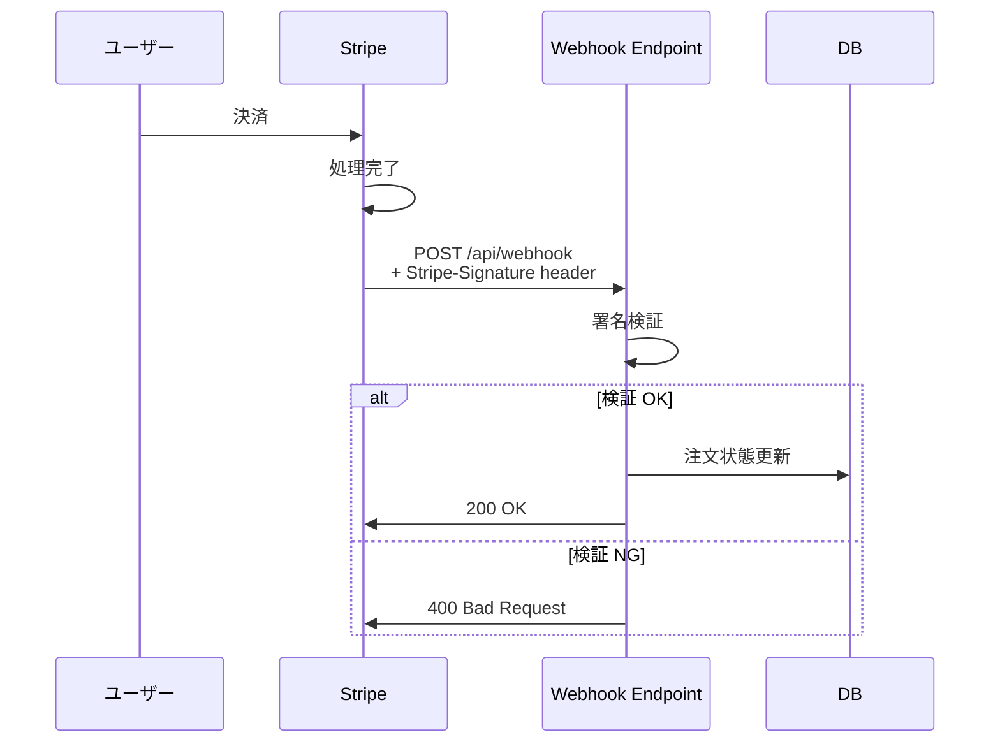
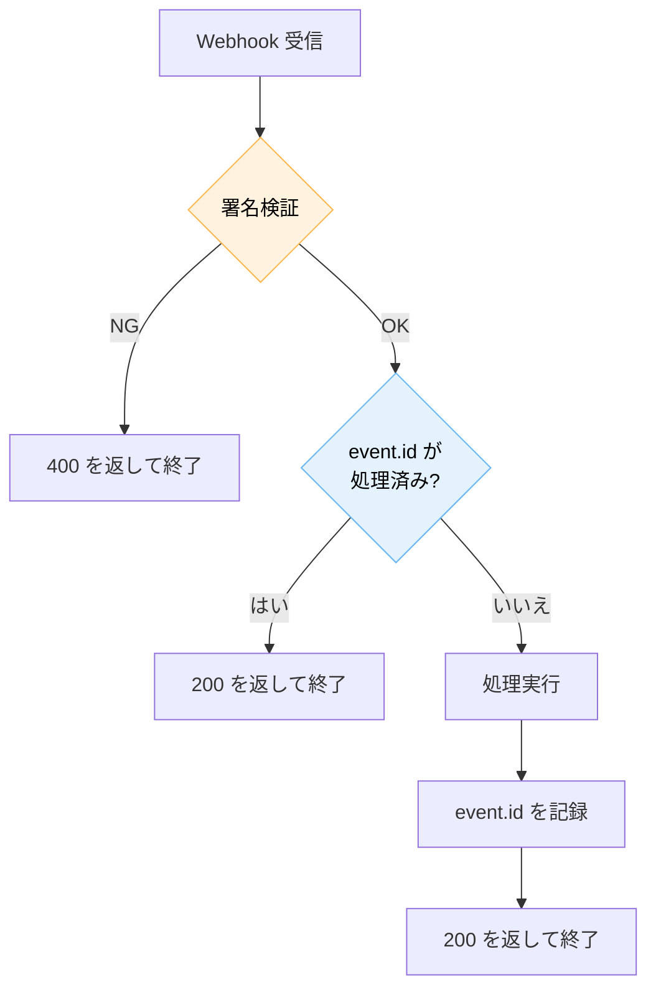

---
tags:
  - stripe
  - webhook
  - nextjs
  - security
---

# Stripe Webhook を Next.js で安全に実装する

<div class="dnk-meta" markdown>
<span class="pill cat">Case Studies</span>
<span class="pill">#stripe</span>
<span class="pill">#webhook</span>
<span class="pill">#nextjs</span>
<span class="pill">#security</span>
<span class="pill">updated 2026-04-13</span>
<span class="pill">4 min read</span>
</div>

Stripe の Webhook エンドポイントを実装する際、署名検証を正しく行わないと、第三者が偽の決済完了通知を送り込める。Next.js 環境での実装で遭遇した落とし穴と対処。

### Webhook の基本フロー



### 遭遇した問題

**1. Next.js App Router で raw body が取れない**

Stripe の署名検証には **生のリクエストボディ**（parsing 前のバイト列）が必要。App Router の `request.json()` は内部でパースしてしまい、生バイトが失われる。

- **対策**: `request.text()` で文字列として取り、その文字列をそのまま `stripe.webhooks.constructEvent()` に渡す

    ```ts
    export async function POST(req: Request) {
      const body = await req.text()  // JSON.parse しない
      const sig = req.headers.get('stripe-signature')!
      const event = stripe.webhooks.constructEvent(
        body, sig, process.env.STRIPE_WEBHOOK_SECRET!
      )
      // ...
    }
    ```

**2. 冪等性の担保**

Stripe は同じイベントを複数回送ってくることがある（ネットワーク失敗時のリトライ等）。同じ `event.id` で同じ処理を 2 回走らせると二重課金になる。

- **対策**: `event.id` を DB に保存し、既に処理済みならスキップする。`ProcessedEvents` テーブルで一意制約を張る

**3. ローカル開発でのテスト**

開発環境で Webhook を受けるには、Stripe CLI でトンネルを張る。

    stripe listen --forward-to localhost:3000/api/webhook

**4. シークレットの漏洩**

`STRIPE_WEBHOOK_SECRET` は環境変数管理。`.env.local` は必ず gitignore。クライアントコード（`NEXT_PUBLIC_*`）には入れない。

### 処理の冪等化パターン



### チェックリスト

- [ ] 署名検証を実装した
- [ ] raw body を使っている（パース前）
- [ ] `event.id` で冪等化している
- [ ] `STRIPE_WEBHOOK_SECRET` を環境変数で管理
- [ ] 検証失敗時に 4xx を返す（2xx を返さない）
- [ ] 処理が遅い場合はキューに逃がし、Webhook は即 200 を返す

### 学び

- **署名検証の実装を省略しない**。テスト用に検証を一時的に外すと、そのまま本番に入るリスクがある
- **Webhook は at-least-once 配信**と割り切り、冪等化を最初から組み込む
- **Webhook エンドポイントの処理時間は短く**。重い処理はキューに逃がして非同期化する


## 関連エントリ

- [Next.js + Supabase + Prisma 併用時の認証と RLS の扱い方](nextjs-supabase-prisma-併用時の認証と-rls-の扱い方.md)
- [Next.js で LLM のストリーミング応答を扱う実装パターン](nextjs-で-llm-のストリーミング応答を扱う実装パターン.md)
- [Edge Runtime vs Node Runtime の使い分け](../tech-notes/edge-runtime-vs-node-runtime-の使い分け.md)


<div class="dnk-prev-next" markdown>
  <div class="prev">← [Next.js + Supabase + Prisma 併用時の認証と RLS の扱い方](nextjs-supabase-prisma-併用時の認証と-rls-の扱い方.md)</div>
  <div class="next">[Next.js で LLM のストリーミング応答を扱う実装パターン](nextjs-で-llm-のストリーミング応答を扱う実装パターン.md) →</div>
</div>
