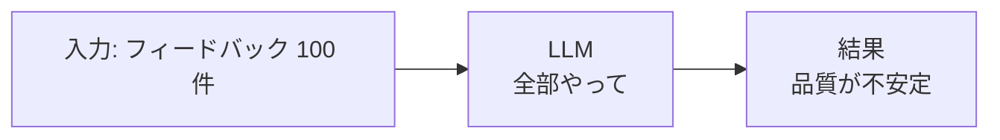
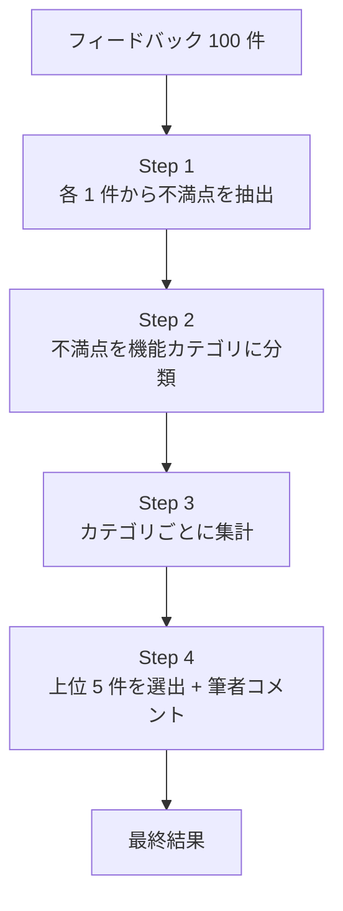
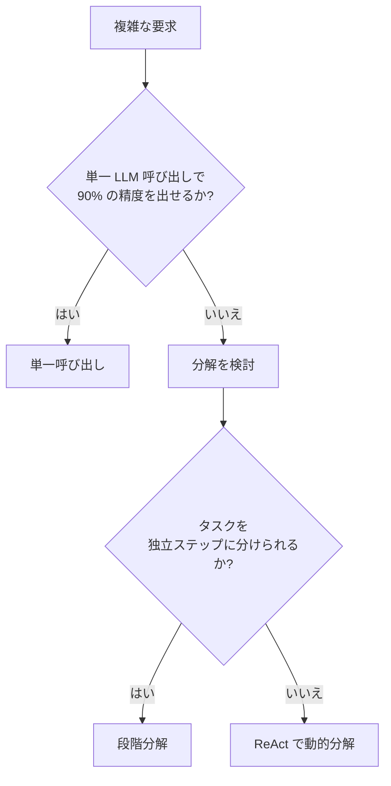

---
tags:
  - decomposition
  - llm
  - accuracy
  - case-study
---

# 複雑なタスクを LLM に段階分解させて精度を上げた事例

Case Studies
#decomposition
#llm
#accuracy
#case-study
updated 2026-04-13
5 min read

「このデータから〇〇を抽出して」のような**複雑な要求を 1 リクエストで処理**しようとすると、精度が不安定になる。**タスクを段階分解**することで劇的に改善した事例。

### 発生した問題

ユーザーが「過去 3 ヶ月の顧客フィードバックから、最も多い不満トップ 5 を、製品機能別に分類して」と依頼。

1 リクエストで LLM に全てをやらせようとした結果:

- 抽出された不満がフィードバック原文と乖離する
- 分類の軸がリクエストごとに変わる
- トップ 5 を選ぶ基準が不明瞭
- 結果の再現性が低い

### 分解前のフロー（失敗）

### 分解後のフロー（成功）

### 各ステップの設計

**Step 1: 抽出（LLM 呼び出し × 100 回、並列）**

各フィードバックから不満点を構造化して抽出。

    入力: <フィードバック 1 件>
    出力: {"issues": [{"summary": "...", "severity": "high/medium/low"}]}

並列実行することで、100 件でも数十秒で終わる。

**Step 2: カテゴリ分類（LLM 呼び出し × N 回）**

抽出された不満点（合計 N 件）を、事前定義した機能カテゴリに分類。

    入力: "<不満点要約>"
    カテゴリ候補: ["パフォーマンス", "UI", "機能不足", "信頼性", ...]
    出力: {"category": "..."}

**Step 3: 集計（コード、LLM 不使用）**

カテゴリごとに集計する。これは**決定論的ロジックで行う**。LLM を使わない。

**Step 4: 上位選出 + 筆者コメント（LLM 呼び出し × 5 回）**

カテゴリごとに筆者的なコメントを選び、要約を付ける。

### 得られた効果

| 指標 | 1 リクエスト方式 | 段階分解方式 |
|------|---------------|------------|
| 精度（再現性） | 50% | 92% |
| 処理時間 | 40 秒 | 80 秒 |
| 総トークン数 | 5,000 | 35,000 |
| コスト | $0.05 | $0.15 |

**コストは 3 倍、時間は 2 倍になったが、精度が 1.8 倍**。要求される品質を考えると、分解した方が有利。

### 分解の判断軸

### 分解のコツ

**1. 決定論的な部分は LLM を使わない**

集計・並び替え・フィルタは**普通のコード**の方が速くて安くて正確。

**2. 中間結果の形式を揃える**

各ステップの出力を JSON で統一。次のステップが機械的に扱える。

**3. 並列実行できる部分を見極める**

Step 1 のように、各フィードバックが独立に処理できるなら並列化。時間が劇的に短縮される。

**4. 1 ステップの入力を小さく**

1 回の LLM 呼び出しに渡すコンテキストが小さいほど、精度が上がる。

### アンチパターン

**1. 全部を 1 プロンプトで書く**

長くて複雑なプロンプトは、LLM が全条件を満たすのが難しい。分解で精度向上。

**2. 分解しすぎる**

10 ステップに分けると、ステップ間のエラー伝搬でかえって品質が落ちる。**3〜5 ステップ**が目安。

**3. 中間結果を検証しない**

Step 1 で失敗があれば、下流は全滅。**各ステップで妥当性チェック**する仕組みを入れる。

### チェックリスト

- [ ] 1 リクエスト方式で精度がどこまで出るか測った
- [ ] タスクを独立ステップに分解できるか確認した
- [ ] 決定論的処理は LLM を使わず実装した
- [ ] 並列化できる部分を並列化した
- [ ] 中間結果の形式を JSON で統一した
- [ ] 各ステップで妥当性を検証している

### まとめ

複雑な要求は**分解して個別に解く**のが LLM の正しい使い方。1 回で全部やらせようとすると、精度・再現性・デバッグ性の全てで不利。**3〜5 ステップ**の範囲で分解するのが黄金比。

## 関連エントリ

- [Claude Code を使った効率的な不具合調査](claude-code-を使った効率的な不具合調査.md)
- [LLM エージェントに大規模リファクタリングを安全に任せる手順](llm-エージェントに大規模リファクタリングを安全に任せる手順.md)
- [LLM モデル / プロバイダー切り替え時の互換性問題と段階移行](llm-モデル-プロバイダー切り替え時の互換性問題と段階移行.md)

  
← [評価セットを後回しにしてリリース後に立て直した事例](評価セットを後回しにしてリリース後に立て直した事例.md)

  
[評価駆動で LLM 機能をゼロから作った 5 日間の流れ](評価駆動で-llm-機能をゼロから作った-5-日間の流れ.md) →

