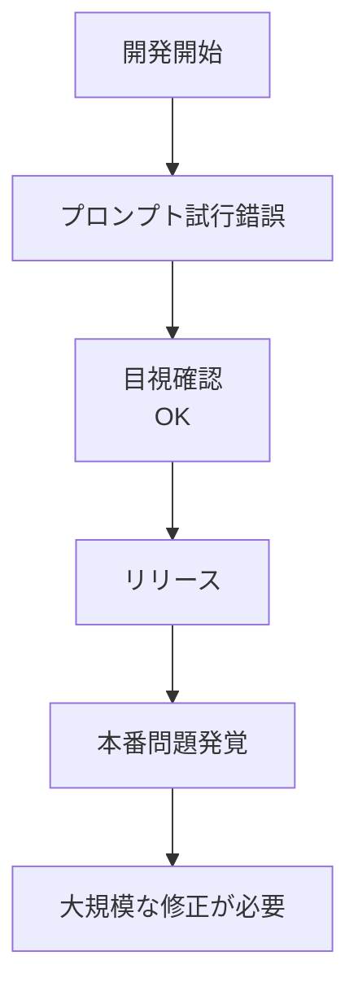
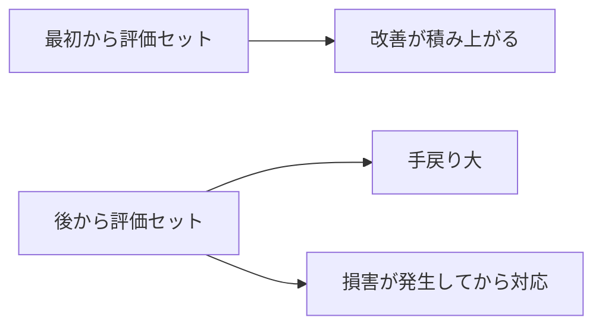

---
tags:
  - eval
  - case-study
  - regression
---

# 評価セットを後回しにしてリリース後に立て直した事例

Case Studies
#eval
#case-study
#regression
updated 2026-04-13
3 min read

新規の LLM 機能を作る際、**評価セットを後回しにした**ことで、本番リリース後に品質問題を抱えた事例と、そこからの立て直し。

### 発生した事象

新機能（ユーザー質問への自動回答）をリリース。開発中は**目視確認**で「良さそう」と判断していた。プロンプトの試行錯誤を重ね、リリースに至った。

1 ヶ月後、ユーザーから複数の問題報告:

- 一部の質問で全く無関係な回答を返す
- 英語の質問で日本語で返すことがある
- 自信がないのに断言的な口調で答える

### なぜ起きたか

- **評価セットを作らなかった**ため、「改善したかどうか」が感覚判断だった
- **回帰を検出する仕組みがなかった**。プロンプト修正のたびに他の機能が壊れていたことに気づかなかった
- **筆者的な入力パターンを網羅していなかった**。開発者が想像する入力しか試していなかった

### 立て直しの手順

**Step 1: 本番ログから失敗パターンを抽出**

ログをサンプリングし、ユーザーが満足していない応答（クレームや再質問）を**50 件**集めた。

**Step 2: 評価セットの骨格を作る**

集めた 50 件に、開発者が意図した**正常系を 100 件**加えて、150 件の初期評価セットを作成。

    - success: 80 件（期待通り答えられるべき）
    - failure: 50 件（本番で失敗した実例）
    - edge: 20 件（曖昧・多言語・攻撃的入力）

**Step 3: 自動スコアリングを組む**

- ルールベース: 言語判定、JSON 形式チェック
- LLM-as-Judge: 関連性・トーン・断言度

**Step 4: 現状のスコアを測る**

既存プロンプトで全 150 件を流したところ、**合格率 42%**。ユーザー報告と一致。

**Step 5: プロンプト改善 + 評価**

改善のたびにスコアを測る。1 ヶ月で **82%** まで引き上げた。改善内容:

- 「答えられない質問は明示的に『分かりません』と返す」few-shot 追加
- 言語判定を明示的に指示
- 断言度の段階指定（「確信」「推測」「不明」を区別）

### 学び

- **評価セットは開発の最初に作る**。後回しにすると、改善が感覚頼みになる
- **目視確認は再現性がない**。開発者が見た 10 件と、本番で流れる 1000 件は違う
- **本番ログを評価セットに流用する**習慣を初日から作る
- **回帰検出の仕組み**がないと、プロンプト改善が怖くなる

### 復帰後の運用

- PR ごとに評価セットを自動実行
- スコアが合格ライン（80%）を下回ったら**マージ不可**
- 新しい失敗は本番ログから月次で取り込み

この運用に変えてから、**本番でのクレーム数が 1/5 に**減った。

### 類似事例への予防

- [ ] 新機能の最初の PR で評価セットの枠を作る（小さくてよい）
- [ ] 開発中に評価セットに追加する習慣を作る
- [ ] リリース前に最低 50 件の評価セットがあることを確認
- [ ] 本番ログからの failure 抽出を月次で実施

### まとめ

評価セットを後回しにした開発は、**体感では速いが、本番で高くつく**。初日から小さくても評価セットを作り、育てる。これが LLM 機能開発の基本姿勢。

## 関連エントリ

- [Claude Code を使った効率的な不具合調査](claude-code-を使った効率的な不具合調査.md)
- [LLM エージェントに大規模リファクタリングを安全に任せる手順](llm-エージェントに大規模リファクタリングを安全に任せる手順.md)
- [比喩的な指示が実装の食い違いを生む — 二役レビューで救われた事例](比喩的な指示が実装の食い違いを生む-二役レビューで救われた事例.md)

  <a class="prev" href="../claude-code-を使った効率的な不具合調査/">←Claude Code を使った効率的な不具合調査</a>
  <a class="next" href="../複雑なタスクを-llm-に段階分解させて精度を上げた事例/">複雑なタスクを LLM に段階分解させて精度を上げた事例→</a>

