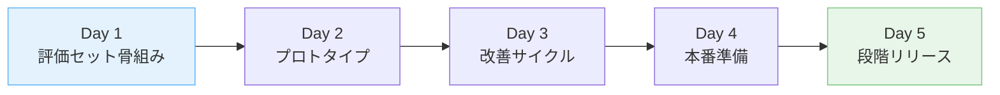
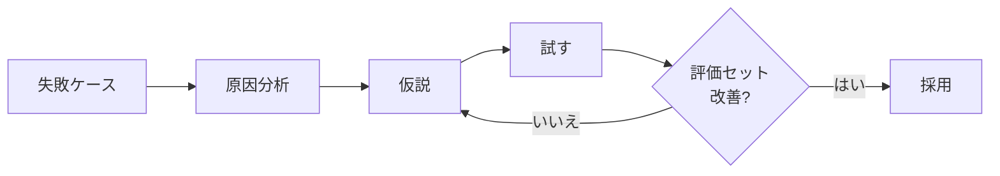
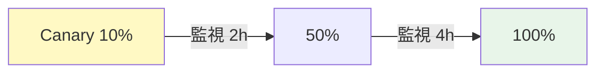

---
tags:
  - edd
  - case-study
  - walkthrough
  - new-feature
---

# 評価駆動で LLM 機能をゼロから作った 5 日間の流れ

Case Studies
#edd
#case-study
#walkthrough
#new-feature
updated 2026-04-13
6 min read

評価駆動開発（EDD）で LLM 機能を**ゼロから作った**際の、実際の時系列と意思決定。新規機能をどう立ち上げるかの雛形として使える。

### 開発する機能

ユーザーが入力した商品レビューから、**改善ポイントを 3 つ抽出**して返す機能。

### 時系列（実時間ベース）

### Day 1: 評価セット骨組み（2 時間）

**実装より先に評価セット**を作り始める。

**成果物**:

- 成功例 20 件（期待通り改善ポイントが抽出できる例）
- 失敗例 10 件（抽出できないべき例: 短すぎる、無意味、攻撃的等）
- 境界例 5 件（曖昧、多言語、絵文字等）

    # eval-set.yaml
    - id: case-001
      input: "このカメラは画質が素晴らしいけど、電池の持ちが悪い。"
      expected_count: 1  # 改善ポイント 1 個
      must_include: ["電池"]

    - id: case-050
      input: "最高！"
      expected_count: 0  # 改善ポイントなし
      must_refuse: true

**所要**: 2 時間（調査含む）

### Day 2: プロトタイプ（4 時間）

**目的**: 評価セット 35 件中、**70% 合格**を目指す。

**最初のプロンプト**:

    以下のレビューから改善ポイントを抽出してください。
    JSON 形式で、{"points": [...]} のように返してください。

**結果**: 合格率 52%。

問題点:

- 曖昧なレビューでも無理に抽出しようとする
- JSON のキーが日本語と英語で揺れる
- 3 個以上抽出することがある

**改善**:

- 「改善ポイントがなければ空配列を返す」を明示
- few-shot 例を 3 件追加
- 上限を「最大 3 個」と明示

**結果**: 合格率 78%。

### Day 3: 改善サイクル（6 時間）

各失敗ケースを見て、対応策を試す。

**3 ラウンドの改善**:

| Round | 変更 | 合格率 |
|-------|------|-------|
| R1 | 境界例用の few-shot 追加 | 78% → 85% |
| R2 | JSON Mode を使う | 85% → 88% |
| R3 | 「具体的な改善ポイントのみ」と明示 | 88% → 92% |

**合格ライン（90%）到達**。

### Day 4: 本番準備（4 時間）

**追加作業**:

- エラーハンドリング（タイムアウト、レート制限）
- ログ設計（入出力、トークン数、レイテンシ）
- コスト見積もり（想定 1,000 リクエスト/日で $5/日）
- プロンプトインジェクション対策（入力の特殊パターン検出）
- A/B テストの準備

### Day 5: 段階リリース（2 時間）

**10% 配信後の結果**:

- エラー率: 0.3%
- P95 レイテンシ: 1.8 秒
- コスト: 予算内
- ユーザーフィードバック: 好意的

問題なかったので 50% → 100% へ。

### 運用開始後

**Week 2**: 本番で 3 件の失敗パターンを発見（評価セットに未登録のパターン）。評価セットに追加して再評価 → プロンプト微調整 → デプロイ。

**Month 1**: ユーザーフィードバックを反映した改善プロンプト v2 をリリース。評価セットも 80 件に拡充。

### トータルコスト

- 開発時間: 約 18 時間
- 検証 API コスト: $15
- 本番運用（1 ヶ月）: $150

### 学び

**1. 評価セットを先に作った効果**

- 「何が良い出力か」が定量化されて、改善の方向が明確
- 後から振り返って「なぜこの形にしたか」を説明できる

**2. 小さく始めて大きく育てる**

- 35 件の評価セットで十分に走り出せた
- 本番で見つかった失敗を追加して育てる方が現実的

**3. プロトタイプと本番の間の距離**

- プロトタイプ後、**本番化に 4 時間**かかった
- これを甘く見積もるとスケジュール破綻

**4. Canary デプロイの安心感**

- 10% で試せるので、問題発覚時の被害が少ない
- 統計的に判断できる

### アンチパターン

- **評価セットを後回し**: プロトタイプ先行で、後で大規模修正
- **プロトタイプを本番投入**: 運用要件を無視すると事故る
- **一気に全ユーザーへ**: Canary なしは怖い
- **本番後の改善をしない**: デプロイして終わり、は品質低下の元

### チェックリスト

- [ ] 実装前に評価セットを作った
- [ ] 合格ラインを数値で決めた
- [ ] 改善のたびに評価スコアを測った
- [ ] 本番化に必要な要素（ログ・エラー処理等）を確認した
- [ ] Canary デプロイで段階的に配信した
- [ ] 本番後もフィードバックループを回している

### まとめ

EDD は**最初は遠回りに見えて、結果的に最速**。5 日で新機能を本番投入できる。評価セット・改善サイクル・Canary の 3 点があれば、速くて質の高い AI 機能が作れる。

## 関連エントリ

- [Claude Code を使った効率的な不具合調査](claude-code-を使った効率的な不具合調査.md)
- [LLM エージェントに大規模リファクタリングを安全に任せる手順](llm-エージェントに大規模リファクタリングを安全に任せる手順.md)
- [比喩的な指示が実装の食い違いを生む — 二役レビューで救われた事例](比喩的な指示が実装の食い違いを生む-二役レビューで救われた事例.md)

  
← [複雑なタスクを LLM に段階分解させて精度を上げた事例](複雑なタスクを-llm-に段階分解させて精度を上げた事例.md)

  
[LLM エージェントに push 通知チャネルを組み込む際の落とし穴](llm-エージェントに-push-通知チャネルを組み込む際の落とし穴.md) →

