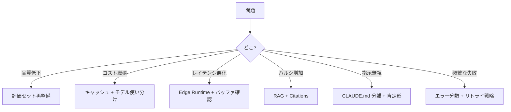

# チートシート

忙しいときの早見表。詳細は各エントリへ。

## :material-lightbulb: 今すぐ使える判断軸

### プロンプト設計

| 迷ったら | 選ぶ |
|---------|------|
| zero-shot or few-shot? | **few-shot（3 件）** |
| 文章出力 or JSON? | **JSON Mode** |
| 長さ制限なし or あり? | **明示的に指示する** |
| モデルはどれ? | **まず中位から、足りなければ上位** |
| Temperature? | **デフォルト（0.7 前後）。厳密なら 0.2** |

### エージェント運用

| 迷ったら | 選ぶ |
|---------|------|
| 自律度レベル? | **L2（承認付き実行）から始める** |
| MCP 何本まで? | **6 本以下** |
| CLAUDE.md の長さ? | **60 行以内** |
| レビュー役? | **別ロールの批判者を置く** |
| チェックポイント間隔? | **10〜15 分** |

### コスト最適化

| 迷ったら | 選ぶ |
|---------|------|
| 最初に見直すのは? | **プロンプトキャッシュ活用** |
| モデル選定は? | **タスク別に使い分け（ルータ）** |
| バッチ処理可能? | **バッチ API で 50% OFF** |
| 出力長が不必要? | **早期停止を実装** |

## :material-alert: 赤信号サイン

以下が出たら対応を検討。

- レイテンシが想定の 2 倍以上
- エラー率 5% 超え
- 1 日のコストが予算の 150%
- 同じ質問で回答が大きく違う
- ユーザーから「間違いを教えた」と報告が増える
- ログに同じファイル読み込みが繰り返し出る

## :material-file-document-multiple: テンプレート

### システムプロンプトの骨格

    あなたは <役割> です。

    # タスク
    <何をする>

    # 方針
    - <原則1>
    - <原則2>

    # 出力形式
    <JSON スキーマ or 文章形式>

### ヒアリング質問セット

    1. 目的（何を達成したいか）
    2. 成果物（最終アウトプット）
    3. 品質基準（どうなれば成功か）
    4. 頻度（1 回 or 継続）
    5. 制約（守るべきルール）
    6. 現状（既に試みたこと）
    7. 規模感（小さく始めるか本格的か）

### 批判者プロンプト

    あなたは忌憚なく指摘する同僚です。
    以下を対等な口調でレビューしてください。

    観点:
    - 目的との整合
    - 前提の妥当性
    - 見逃し
    - 実現性

    必ず 3 つ以上指摘してください。

### ADR フォーマット

    # ADR <番号>: <タイトル>

    ## 状況
    ## 決定
    ## 根拠
    ## トレードオフ

## :material-checkbox-marked: リリース前チェック（最小）

- [ ] 評価セット合格
- [ ] プロンプトインジェクション対策
- [ ] レート制限対応
- [ ] ログ・アラート設定
- [ ] ロールバック手順
- [ ] コスト監視

## :material-compass: 問題の場所別対処

## 主要エントリへのリンク

### 入門に読むと良い

- [LLM の非決定性を前提に設計する](concepts/llm-の非決定性を前提に設計する.md)
- [コンテキストは有限で劣化する資源である](concepts/コンテキストは有限で劣化する資源である.md)
- [単一エージェントの 7 つのアンチパターン](patterns/単一エージェントの7つのアンチパターン.md)

### 実装する前に読む

- [Few-shot Examples の効果的な設計](techniques/few-shot-examples-の効果的な設計.md)
- [プロンプトキャッシュを壊さない書き方](techniques/プロンプトキャッシュを壊さない書き方.md)
- [LLM API キーの管理と漏洩防止](tech-notes/llm-api-キーの管理と漏洩防止.md)

### 困ったときに読む

- [プロンプトデバッグ手順](techniques/プロンプトが期待通りに動かないときのデバッグ手順.md)
- [ハルシネーションを抑える 7 つの手法](techniques/ハルシネーションを抑える-7-つの手法.md)
- [評価セット設計の 6 つのアンチパターン](patterns/評価セット設計の-6-つのアンチパターン.md)
