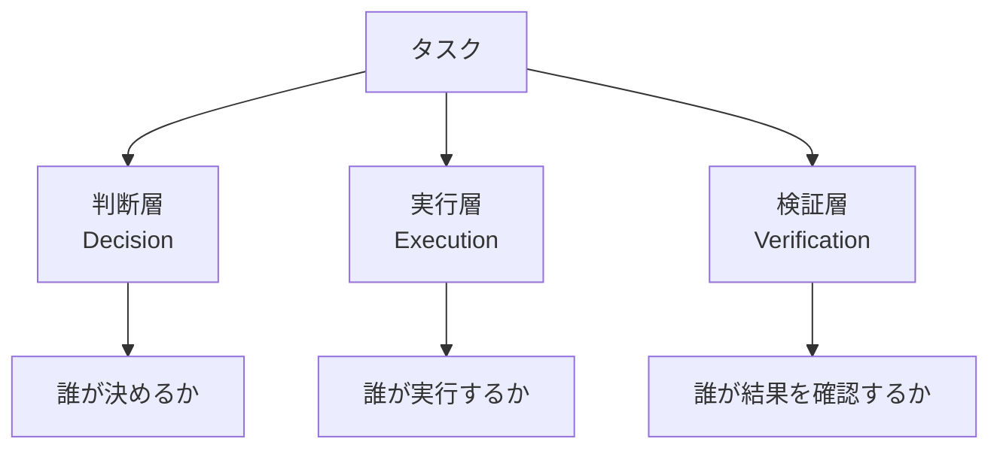
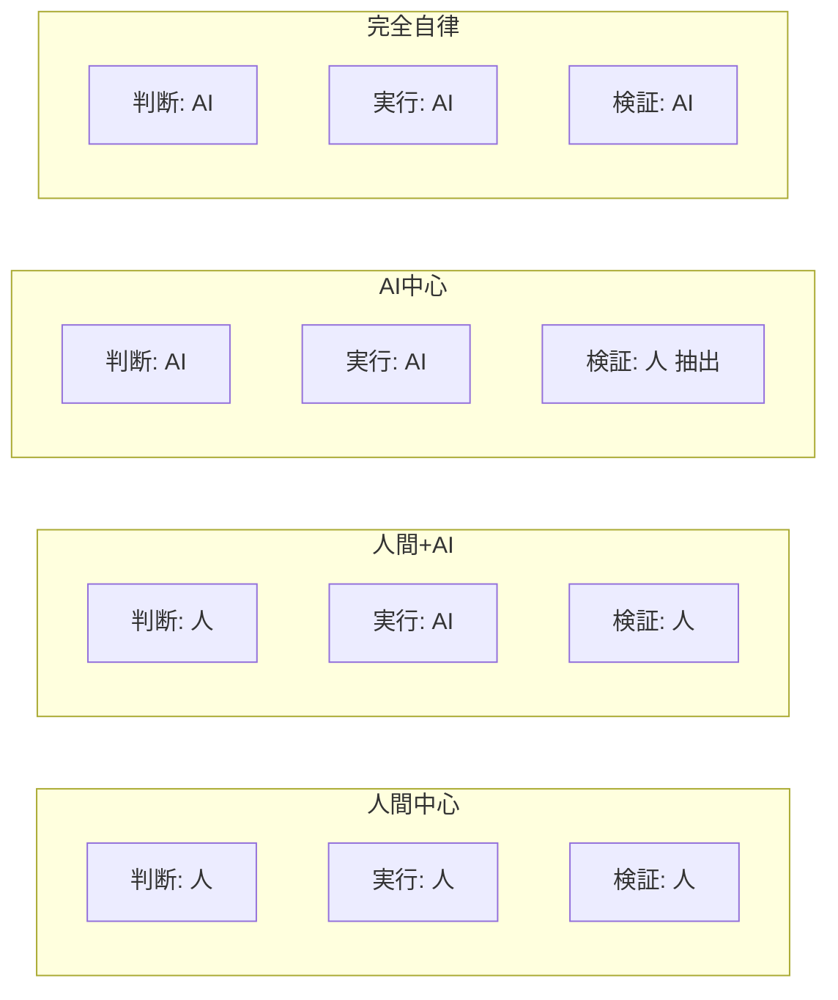
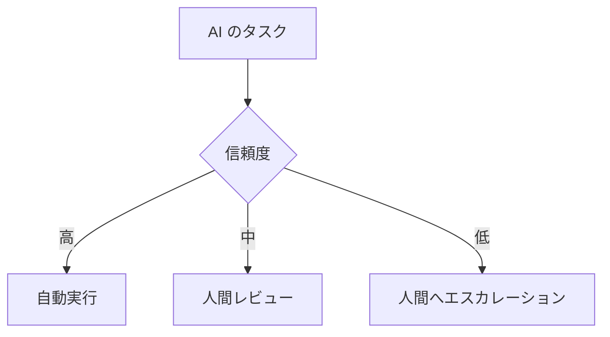

---
tags:
  - responsibility
  - governance
  - concept
---

# AI エージェントと人間の責任分界

Concepts
#responsibility
#governance
#concept
updated 2026-04-13
4 min read

AI エージェントに仕事を任せる際、**「誰が何の責任を持つか」**を曖昧にすると、事故時に収拾がつかなくなる。責任分界を明示的に設計する。

### 責任の 3 層

- **判断層**: 何をどうするか決める
- **実行層**: 決まったことを実際にやる
- **検証層**: 結果が期待通りかを確認する

エージェントと人間が、どの層をどこまで担うかを設計する。

### 典型的な役割配分

- **人間中心**: 手作業。最も安全だが遅い
- **人間 + AI**: 人が決め、AI が実行。検証は人。多くの業務がここに落ち着く
- **AI 中心**: AI が判断・実行、人は抜き打ちで検証。定型業務向け
- **完全自律**: 検証も AI。限定的な用途のみ

### 責任分界の原則

**1. 不可逆な行動は人間が判断する**

削除・送信・決済・公開など、**取り消せないアクション**は人間の承認を通す。

**2. 検証層は必ず分離する**

判断と実行を同じ主体（AI）がやるのは OK でも、**検証まで同じ主体**は避ける。自己監査はバイアスが残る。

**3. ログで追跡可能にする**

誰が何を判断し・実行し・確認したか、すべて記録する。事故時の原因追跡に必須。

**4. エスカレーションパスを用意する**

AI が自信を持って判断できないケースは、人間に上げる。閾値を設定する。

### 事故時の責任

AI の判断ミスで事故が起きたとき、**最終的な責任は人間**にある。

- **設計責任**: どこまで AI に任せるか決めた人間
- **運用責任**: 異常を検知・対応する人間
- **組織責任**: AI を導入した組織

AI 自体に責任能力はない。事故防止は**人間の設計責任**として扱う。

### 契約と法的考慮

業務で AI を使う場合、法的な責任分界も設計に含める。

- AI の出力を顧客にそのまま提示する場合、**誤情報の責任**は誰か
- 決済・契約等の執行に AI が関わる場合、**執行責任**は誰か
- 個人情報を AI に渡す場合、**データ保護責任**は誰か

規模が大きくなるほど、法務と一緒に設計する必要がある。

### アンチパターン

- **「AI が判断したので仕方ない」**: 責任を AI に押し付ける。人間の設計責任を放棄している
- **検証層の省略**: 実行だけ任せて検証しないと、失敗が蓄積する
- **ログの欠落**: 追跡できないと、改善も責任追及もできない
- **エスカレーションパスなし**: AI が判断に詰まったとき、勝手に進めるか停止するかで混乱

### まとめ

責任分界は**「誰が判断・実行・検証するか」**の 3 層で整理する。不可逆な行動は人間判断、検証層は必ず分離、ログで追跡可能にする。AI を導入する前に、この設計を済ませる。

## 関連エントリ

- [AI プロダクトと倫理 — 7 つの観点](ai-プロダクトと倫理-7-つの観点.md)
- [AI プロダクト設計の 3 つの基本原則](ai-プロダクト設計の-3-つの基本原則.md)
- [Drift Detection — 実装が意図から乖離する現象を検出する](drift-detection-実装が意図から乖離する現象を検出する.md)

  <a class="prev" href="../エージェントの自律度レベルと昇格基準/">←エージェントの自律度レベルと昇格基準</a>
  <a class="next" href="../ai-プロダクトと倫理-7-つの観点/">AI プロダクトと倫理 — 7 つの観点→</a>

