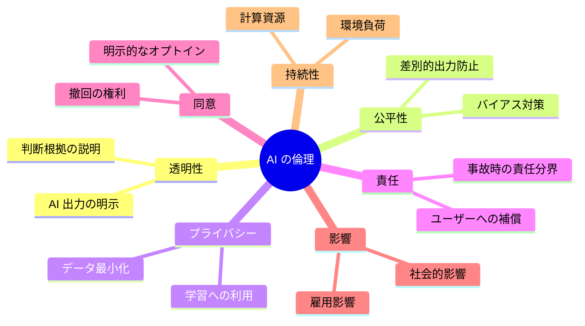
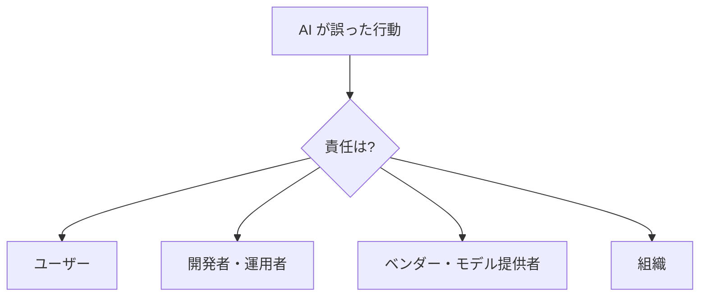
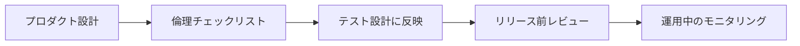

---
tags:
  - ethics
  - governance
  - concept
  - responsibility
---

# AI プロダクトと倫理 — 7 つの観点

Concepts
#ethics
#governance
#concept
#responsibility
updated 2026-04-13
5 min read

AI を組み込んだプロダクトを作る際、技術・コスト・品質だけでなく、**倫理的な考慮**を避けられない論点として扱う必要がある。具体的な 7 つの観点を示す。

### 7 つの倫理的論点

### 1. 透明性（Transparency）

**ユーザーが AI と対話していることを明示する**。AI と人間を区別できない UI は、長期的に信頼を失う。

- 「AI が生成しました」の表示
- AI の信頼度（推測か確信か）を示す
- 判断根拠を求められたら説明できる設計

### 2. 公平性（Fairness）

学習データに含まれる**偏見が出力に反映される**可能性がある。

- 性別・人種・地域による差別的出力を防ぐテストケース
- 特定属性に対する推論精度の差を計測
- レッドチーミングで差別表現を検出

### 3. プライバシー

ユーザーデータの扱いを明確化する。

- **データ最小化**: 必要な情報だけ収集・利用する
- **学習への利用**: ユーザー入力を学習に使うなら、必ず同意を取る
- **保存期間**: 明示し、過ぎたら自動削除
- **開示請求**: ユーザーが自分のデータを確認・削除できる経路

### 4. 責任分界（Accountability）

AI が間違えたときの責任が誰にあるかを明確にする。

法的・契約的な整理が必要。曖昧なまま運用しない。

### 5. 同意（Consent）

**機能の中で AI が使われていることをユーザーが知り、選べる**ようにする。

- オプトイン・オプトアウトの選択肢
- 「AI なしで使う」経路がある（縮退運転）
- 同意を撤回できる

### 6. 影響（Impact）

**AI の導入が社会・雇用・利用者に与える影響**を考慮する。

- 自動化による雇用影響を過小評価しない
- 特定集団に不利にならないか検証
- 誤情報が拡散する経路を塞ぐ

### 7. 持続性（Sustainability）

AI の計算コストは環境負荷も大きい。**「本当に必要か」**を問う姿勢。

- 巨大モデルを必要以上に呼ばない
- 小さいモデルで足りるタスクは小さいモデルで
- キャッシュ活用

### 実務への落とし込み

**プロダクト設計時のチェックリスト**:

- [ ] AI が使われていることが UI で明示される
- [ ] バイアス検出テストを評価セットに含める
- [ ] プライバシーポリシーが更新されている
- [ ] 失敗時の責任分界が文書化されている
- [ ] ユーザーが AI 機能を使わない選択ができる
- [ ] 導入による影響（雇用・利用者）を検討した
- [ ] モデルサイズはタスクに見合っている

### アンチパターン

**1. 「技術的に可能だから」で進める**

技術的実現可能性と、倫理的・社会的妥当性は別。**両方を評価**する。

**2. 利用規約に書いて終わり**

「同意した」の一行で済ませず、**UI で明示的に**伝える。

**3. 「後で対応する」**

倫理対応は後付けが難しい。**設計段階から**組み込む。

**4. ベンダー任せ**

モデル提供者の責任にして自分の責任を放棄しない。**統合する側の責任**として扱う。

### 参考枠組み

- OECD AI 原則
- EU AI Act
- NIST AI Risk Management Framework
- Anthropic の Responsible Scaling Policy
- OpenAI の Preparedness Framework

組織規模に応じて、これらの枠組みを参考に自組織のポリシーを作る。

### まとめ

AI プロダクトの倫理は**後回しにできない必須要件**。7 つの論点（透明性・公平性・プライバシー・責任・同意・影響・持続性）を**設計段階から**組み込む。これをやれば、長期的な信頼と安全な運用の両方が得られる。

## 関連エントリ

- [AI エージェントと人間の責任分界](ai-エージェントと人間の責任分界.md)
- [AI プロダクト設計の 3 つの基本原則](ai-プロダクト設計の-3-つの基本原則.md)
- [Drift Detection — 実装が意図から乖離する現象を検出する](drift-detection-実装が意図から乖離する現象を検出する.md)

  <a class="prev" href="../ai-エージェントと人間の責任分界/">←AI エージェントと人間の責任分界</a>
  <a class="next" href="../eval-driven-development-llm-機能開発は評価から始める/">Eval-Driven Development — LLM 機能開発は評価から始める→</a>

