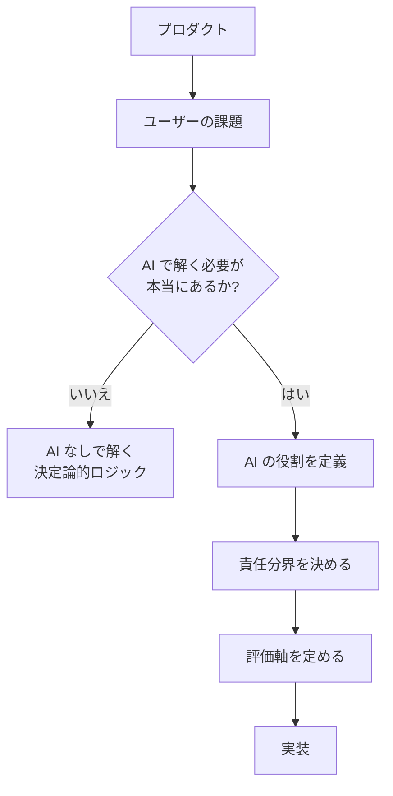
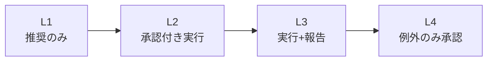

---
tags:
  - product-design
  - philosophy
  - concept
  - ai
---

# AI プロダクト設計の 3 つの基本原則

Concepts
#product-design
#philosophy
#concept
#ai
updated 2026-04-13
4 min read

AI を組み込んだプロダクトを設計するとき、**「AI にどこを任せるか」**の判断が本質的に重要。ここが曖昧だと、どれだけ頑張っても良い製品にならない。

### 設計の出発点

### 3 つの基本原則

**1. AI は最後の選択肢**

AI でなくても解ける問題は、AI を使わない。ルールベース・決定論的ロジック・既存 API で解ける部分は、**そちらが速くて安くて信頼できる**。

AI が真価を発揮するのは:

- 自然言語の理解・生成
- 非定型データの解釈
- 創造的な組み合わせ
- 曖昧な入力の扱い

それ以外は、AI を使わない方が良い。

**2. 人間が主役**

AI はあくまで**道具・助手**。主役はユーザー（と、提供する人間）。

- AI の出力はユーザーが確認できる形で提示する
- 重要な判断は人間が握る
- AI が間違えたときの救済経路を用意する

AI 中心の設計（ユーザーが AI の決定に従う構造）は、短期的には楽に見えるが、長期的に破綻する。

**3. 段階的な信頼構築**

新しく AI を導入する機能は、**最初から完全自動化しない**。人間の監督付き → 推奨のみ → 部分自動化 → 完全自動化、と段階を踏む。

### 良い AI プロダクトの共通項

- **AI が使われていることが分かる**: ユーザーが「これは AI の出力」と認識できる
- **失敗の影響が限定的**: AI が間違えても、大きな損失にならない構造
- **ユーザーが修正できる**: AI の出力をユーザーが直せる UI がある
- **フィードバックを取る**: 改善の経路がある
- **AI なしでも機能する**: AI が停止しても、最低限の機能は動く

### 悪い AI プロダクトの兆候

- AI の使い方を示す明確な例がない（「何でもできます」系）
- AI が間違えたときの対処が書かれていない
- ユーザーが AI の出力を修正できない
- フィードバック経路がない
- AI に全て任せている（人間の関与がゼロ）

### 設計時に必ず問うべきこと

1. **この機能で AI を使わないとしたらどう作るか?** 答えられないなら、AI を使う理由が弱い
2. **AI が 30% 失敗したら、ユーザーは満足するか?** 失敗を前提にした UX 設計が要る
3. **ユーザーはどうやって間違いに気付くか?** 気付けない設計は危険
4. **誰が最終判断をするか?** AI か人間かを明確にする
5. **AI が止まったらどうなるか?** 縮退運転の設計がないと運用で詰む

### トレードオフ

AI を使う利点と欠点を天秤にかける。

| 観点 | AI あり | AI なし |
|------|--------|--------|
| 柔軟性 | ◎ | △ |
| 再現性 | △ | ◎ |
| コスト（運用） | 高い | 低い |
| 開発速度 | 速い（初期） | 遅い（初期） |
| デバッグ容易性 | 難しい | 易しい |
| 説明責任 | 難しい | 易しい |

目的に対して、**どの軸が重要か**を整理してから選ぶ。

### まとめ

AI プロダクトの設計は**「どこで AI を使わないか」から始める**。AI は最後の選択肢、人間が主役、信頼は段階的に、の 3 原則を押さえると、AI を組み込んでも破綻しない。

### 関連

- [エージェントと人間の責任分界](ai-エージェントと人間の責任分界.md)
- [エージェントの自律度レベル](エージェントの自律度レベルと昇格基準.md)
- [LLM の非決定性を前提に設計する](llm-の非決定性を前提に設計する.md)

## 関連エントリ

- [AI エージェントと人間の責任分界](ai-エージェントと人間の責任分界.md)
- [AI プロダクトと倫理 — 7 つの観点](ai-プロダクトと倫理-7-つの観点.md)
- [AI 開発の速度と品質は両立できる](ai-開発の速度と品質は両立できる.md)

  <a class="prev" href="../技術選定の5軸評価フレームワーク/">←技術選定の5軸評価フレームワーク</a>

