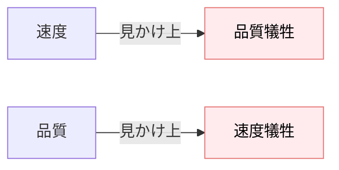
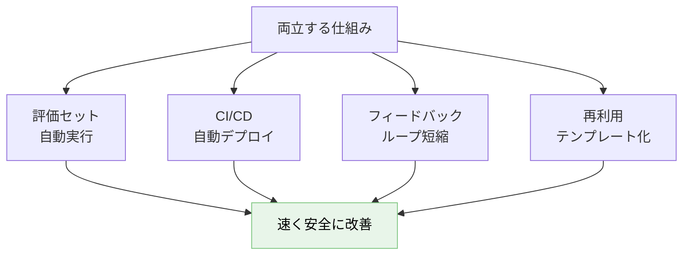
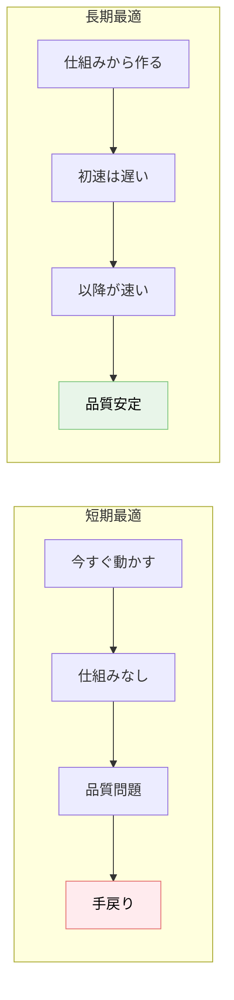

---
tags:
  - speed
  - quality
  - philosophy
  - workflow
---

# AI 開発の速度と品質は両立できる

Concepts
#speed
#quality
#philosophy
#workflow
updated 2026-04-13
5 min read

AI 開発では「速く作る」と「品質を担保する」が**トレードオフに見える**が、実は**両立可能**。評価セット・自動化・仕組みが速度を下げず、品質を上げる。

### 見かけのトレードオフ

「速く作ると雑」「丁寧にやると遅い」と思いがち。

### 実態: 両立の仕組み

### 4 つの両立策

**1. 評価セットで「速く安全に」改善する**

プロンプトを変えたら自動で評価セットを回す。**人間の目視確認を待たない**。

- 改善案を即試せる（速度↑）
- 回帰が自動検出される（品質↑）

**2. CI/CD で自動化**

PR 提出 → 評価 → マージ → デプロイを自動化。人間の手間を減らす。

- リリース頻度が上がる（速度↑）
- 手順の抜け漏れがない（品質↑）

**3. フィードバックループを短く**

本番の失敗 → 評価セットに追加 → 修正 → 自動デプロイの**サイクルを速く**。

**サイクルが 1 週間以下**で回れば、品質改善が加速する。

**4. 再利用できる形で設計**

プロンプト・評価セット・エージェント定義をモジュール化。**一度作ったものを他でも使う**。

- 初速は遅いが、2 個目以降は速い
- モジュールごとに品質が積み上がる

### 短期 vs 長期

**短期最適 = 長期不利**。AI 開発は特に、**仕組みから作る**のが結果的に速い。

### アンチパターン

**1. 「MVP だから評価は後で」**

MVP でこそ評価セットが必要。雑な MVP はユーザー信頼を失う。

**2. 「今回だけ手動で」が常態化**

1 回の手動は 1 回でも、習慣化すると積み上がる。**自動化の閾値を下げる**。

**3. 仕組み化を「後工程」に押し付ける**

「まず動くものを」で後工程に負債を渡す。**最初から仕組み込み**で作る。

**4. 品質を犠牲にして速度を優先**

一時的には速いが、**後の手戻り**で遅くなる。早い段階での品質確保が結果的に速い。

### 具体的なスピード X 品質の組み合わせ

| 時期 | 優先 | 具体策 |
|------|------|--------|
| 構想段階 | 速度 | 最低限動くものを作り、学ぶ |
| β 前 | 品質 | 評価セット・CI を整備 |
| β〜GA | 両立 | 評価付き高速反復 |
| 本番運用 | 品質 | 監視・インシデント対応・改善サイクル |

**段階によって優先が変わる**ことを意識する。

### チェックリスト

- [ ] 評価セットを持っている
- [ ] PR ごとに自動評価が回る
- [ ] 本番失敗をフィードバックに組み込む仕組みがある
- [ ] プロンプト・評価セットが再利用可能な形で管理されている
- [ ] 開発段階に応じた優先順位を意識している

### まとめ

AI 開発の速度と品質は**仕組み化で両立できる**。評価・自動化・フィードバック・再利用の 4 本柱を整えると、**速くて質の高い開発**が可能になる。トレードオフと諦めない。

## 関連エントリ

- [AI プロダクト設計の 3 つの基本原則](ai-プロダクト設計の-3-つの基本原則.md)
- [Claude Code を使った効率的な不具合調査](../case-studies/claude-code-を使った効率的な不具合調査.md)
- [Claude Code を日々使い倒す 10 の小技](../techniques/claude-code-を日々使い倒す-10-の小技.md)

  
← [LLM アプリの 5 つの典型アーキテクチャパターン](llm-アプリの-5-つの典型アーキテクチャパターン.md)

  
[技術選定の5軸評価フレームワーク](技術選定の5軸評価フレームワーク.md) →

