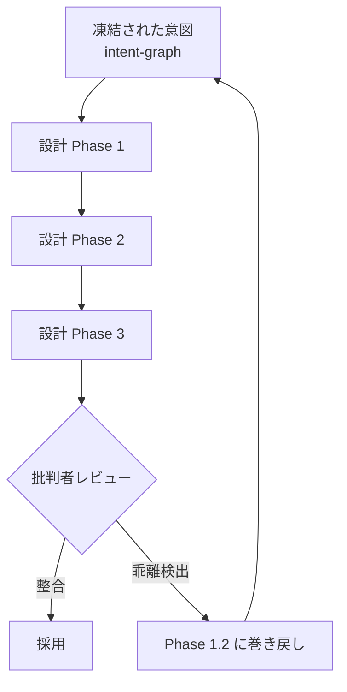
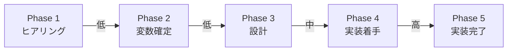

---
tags:
  - drift
  - review
  - concept
---

# Drift Detection — 実装が意図から乖離する現象を検出する

Concepts
#drift
#review
#concept
updated 2026-04-13
2 min read

AI エージェントによる実装が、当初の意図・仕様から徐々に乖離していく現象。これを検出して巻き戻す仕組みが **drift-detection**。

### 発生と検出のメカニズム

### なぜ drift が起きるか

- **実装者 LLM の完了バイアス**: 指示の曖昧さが残っていても、完了しやすい解釈を選んで前進する
- **比喩語のリテラル解釈違い**: 「データベース」「フォルダ」「箱」等、リテラルにも比喩にも取れる語の解釈が発注側と実装側で異なる
- **中間判断の積み重ね**: 各ステップで小さな判断を重ねるうちに、元の方向から離れていく
- **自己整合性による見逃し**: 実装物は自分自身の内部では整合している。実装者本人のレビューでは違和感に気づけない

### 検出の仕組み

1. **凍結された意図グラフを持つ**
2. **別軸からのレビュアーを設置**: 実装者と同一モデルではなく、別ロール・別視点のレビュアーが設計・実装を評価する
3. **意図グラフとの突き合わせを明示的にする**: レビュアーは凍結された意図と現在の成果物を比較する
4. **乖離が見つかったら上流に巻き戻す**: 修正ではなく、意図解釈の段階まで戻って再設計する

### 発動タイミングとコストの関係

drift は早期に検出するほど修復コストが低い。設計段階（Phase 3 相当）まで進んでから検出されると、それまでの設計作業をやり直す必要がある。理想はヒアリング直後（Phase 1.2 相当）で、意図グラフと設計方針の突き合わせを済ませること。

## 関連エントリ

- [Intent Engineering — 意図を凍結してから設計する](intent-engineering-意図を凍結してから設計する.md)
- [AI エージェントと人間の責任分界](ai-エージェントと人間の責任分界.md)
- [AI プロダクトと倫理 — 7 つの観点](ai-プロダクトと倫理-7-つの観点.md)

  <a class="prev" href="../intent-engineering-意図を凍結してから設計する/">←Intent Engineering — 意図を凍結してから設計する</a>
  <a class="next" href="../エージェントの自律度レベルと昇格基準/">エージェントの自律度レベルと昇格基準→</a>

