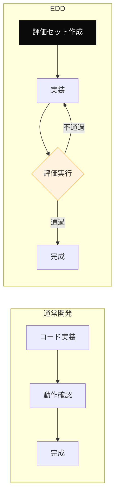
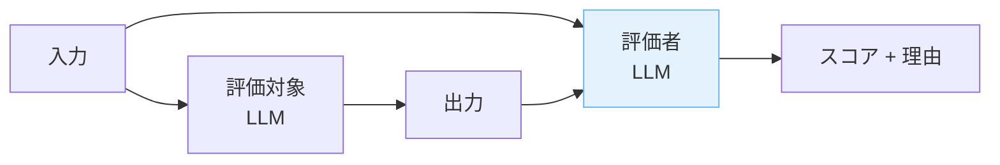

---
tags:
  - eval
  - llm
  - tdd
  - concept
---

# Eval-Driven Development — LLM 機能開発は評価から始める

Concepts
#eval
#llm
#tdd
#concept
updated 2026-04-13
3 min read

LLM を使った機能を作る際、目視確認だけに頼ると品質が安定しない。**評価を先に書き、評価が通ることを目指して実装する**という進め方が、LLM 時代の TDD に相当する。Eval-Driven Development（EDD）と呼ばれる。

### 通常の開発との違い

### 評価セットの作り方

**1. 成功例と失敗例を両方用意する**

期待する入力に対する期待出力だけでなく、**失敗すべき入力**（例: 悪意のあるプロンプト、曖昧な依頼）も用意する。

**2. 評価軸を分離する**

1 つの出力に複数の評価軸が絡む場合、軸ごとに別評価にする。

- 事実正確性: 答えが事実として正しいか
- 形式遵守: 指定フォーマットを守っているか
- 安全性: 有害な出力を返していないか
- スタイル: 期待する口調・トーンか

**3. LLM-as-Judge を使う**

評価者役の LLM を別途立てて、出力の品質を評価させる。主観的な軸（スタイル等）はこの方式が向いている。

### 評価の運用

**1. 回帰検出**

プロンプトを書き換えたり、モデルをアップデートしたら、評価セットを再実行して回帰がないか確認する。

**2. 閾値設定**

合格ライン（例: 成功例 90% 通過、失敗例 100% 検出）を事前に決めておく。主観で「なんとなく良くなった気がする」を避ける。

**3. 評価セットの拡張**

本番で見つかった失敗ケースは、評価セットに追加する。同じ失敗を二度繰り返さない仕組みにする。

### アンチパターン

- **評価を書かない**: 目視だけで「良くなった」と判断する。再現性が保てない
- **評価セットが小さすぎる**: 5 件しかないセットで通ったと喜ぶ。本番では 1000 パターンの入力が来る
- **評価セットを更新しない**: 最初に作ったまま放置すると、本番で起きている失敗を捕捉できない
- **LLM-as-Judge を盲信**: 評価者 LLM 自身がバイアスを持つことがある。人間によるスポットチェックを挟む

### まとめ

LLM を使った機能の品質を担保するには、**評価を仕組み化**するしかない。評価があれば、プロンプトの改善も、モデルの変更も、安心して進められる。評価がなければ、すべて祈りになる。

## 関連エントリ

- [Drift Detection — 実装が意図から乖離する現象を検出する](drift-detection-実装が意図から乖離する現象を検出する.md)
- [Intent Engineering — 意図を凍結してから設計する](intent-engineering-意図を凍結してから設計する.md)
- [エージェントの自律度レベルと昇格基準](エージェントの自律度レベルと昇格基準.md)

  
← [エージェントの自律度レベルと昇格基準](エージェントの自律度レベルと昇格基準.md)

  
[プロンプトインジェクション — LLM アプリの最重要セキュリティ論点](プロンプトインジェクション-llm-アプリの最重要セキュリティ論点.md) →

