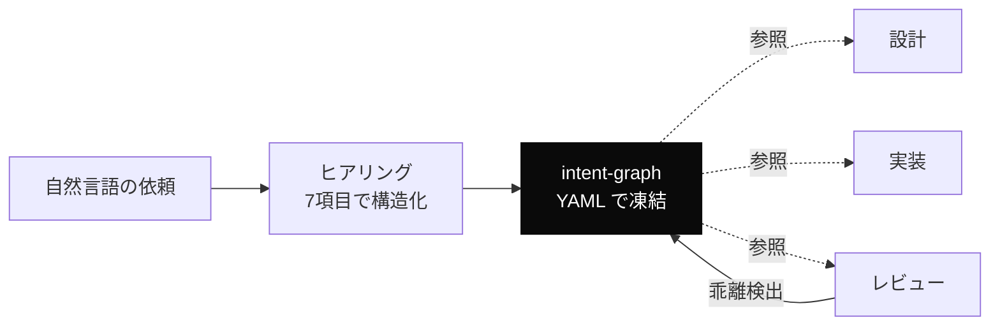

---
tags:
  - intent
  - drift
  - concept
---

# Intent Engineering — 意図を凍結してから設計する

Concepts
#intent
#drift
#concept
updated 2026-04-13

AI エージェントへの依頼で、実装が意図から乖離する問題を減らす考え方。**意図（intent）を明文化された中間表現に凍結してから設計・実装に進む**というアプローチ。

### 全体フロー

### なぜ必要か

自然言語の指示は多義的・暗黙の前提を含む。実装者（LLM）は曖昧さが残ったまま「完了しやすい解釈」で前進するバイアスを持つため、本来の意図と成果物が食い違うことが頻繁に起きる。

### 構成要素

1. **ヒアリング**: 目的・成果物・品質基準・制約・関係者を定型の質問セットで抽出する
2. **意図グラフの凍結**: 抽出結果を YAML などの構造化された中間表現に固めて、改変禁止ドキュメントとして保存する
3. **下流工程での突き合わせ**: 設計・実装フェーズでは、凍結された意図グラフに照らして判断する
4. **乖離の検出**: 成果物が意図から離れたら、下流工程を巻き戻して意図凍結段階に戻る（drift-detection）

### 得られる効果

- 意図が文章として残るため、セッション再開時や別エージェントへの引き継ぎでも前提を共有できる
- 「なぜこの設計になったのか」を凍結 intent 起点で説明できる
- 変更の影響範囲を判断しやすい

### 実装パターン

Dinekt では forge というハーネス設計フレームワークで実装している。他にも具体的な実装は可能で、最小構成は次の 3 点で成立する。

- 意図のヒアリングテンプレート（質問セット）
- 中間表現のスキーマ（YAML 等）
- 凍結版を改変禁止で保管するルール

## 関連エントリ

- [Drift Detection — 実装が意図から乖離する現象を検出する](drift-detection-実装が意図から乖離する現象を検出する.md)
- [比喩的な指示が実装の食い違いを生む — 二役レビューで救われた事例](../case-studies/比喩的な指示が実装の食い違いを生む-二役レビューで救われた事例.md)
- [コンテキストは有限で劣化する資源である](コンテキストは有限で劣化する資源である.md)
