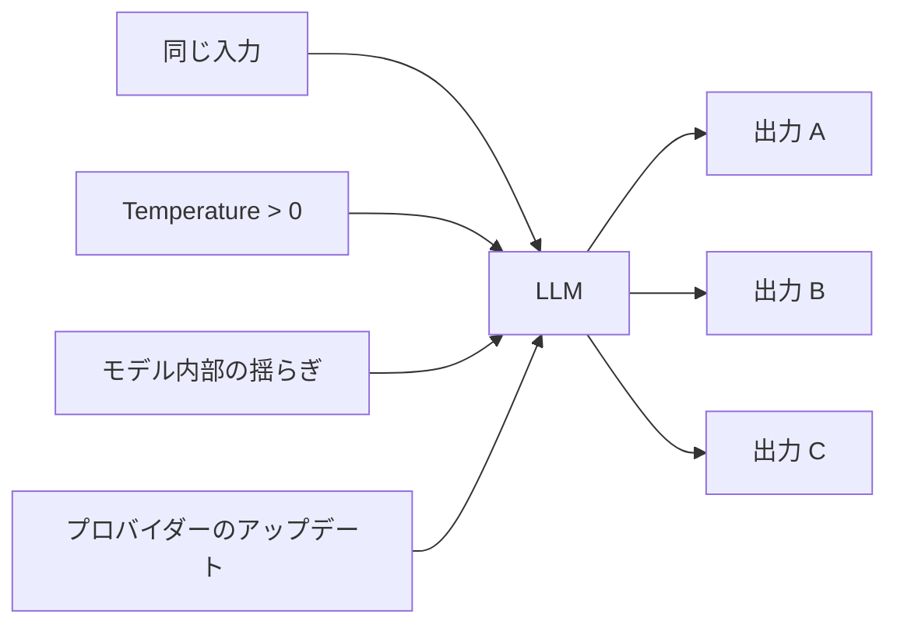
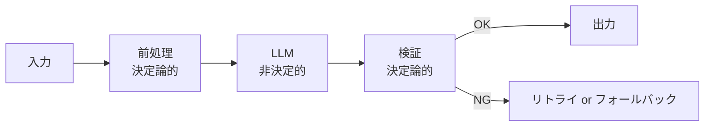

---
tags:
  - non-determinism
  - design
  - concept
  - llm
---

# LLM の非決定性を前提に設計する

Concepts
#non-determinism
#design
#concept
#llm
updated 2026-04-13
4 min read

LLM の出力は**本質的に非決定的**。同じ入力でも呼び出しごとに違う結果が返る。これを「バグ」として扱うと無限に消耗する。**前提として受け入れ、その上で設計する**のが実用的な態度。

### 非決定性の源

- **サンプリング**: Temperature・top-p・top-k による確率的選択
- **モデル内部の微小な揺らぎ**: ハードウェアやタイミング依存
- **プロバイダー側の変更**: ファインチューニング・モデル差し替え

Temperature=0 にしても完全な決定性は得られない。

### 戦ってはいけない戦い

以下を「完全に解決」しようとすると失敗する。

- 「毎回必ず同じ回答が欲しい」
- 「絶対にハルシネーションさせない」
- 「同じプロンプトで 100% 同じフォーマット」

**受け入れて設計する**方向に発想転換する。

### 設計方針

**1. 決定論的な層でサンドイッチする**

LLM を「非決定的な中間処理」として扱い、前後を決定論的ロジックで挟む。

- **前処理**: 入力の正規化、バリデーション、コンテキスト組み立て
- **LLM**: 推論・生成・判断
- **検証**: 出力のスキーマチェック、禁止語チェック、事実確認

**2. 複数回実行してサンプリング**

重要な判断は、同じプロンプトで複数回実行し、多数決や統計的手法で集約する。

    results = [llm.generate(prompt) for _ in range(5)]
    # 多数決、平均、最頻値 等で集約

- 信頼性が上がる
- コストは N 倍

**3. 評価セットで期待値を測る**

決定論を求めず、**期待値**（平均スコア）を指標にする。個別の失敗を気にせず、分布の改善を目指す。

**4. フォールバックを用意する**

LLM が期待した出力を返さなかったときの代替パスを必ず持つ。

- デフォルト値を返す
- ルールベースのフォールバック
- ユーザーに再試行を促す

### 得られる考え方の転換

| Before | After |
|--------|-------|
| 「バグを直す」 | 「統計的に改善する」 |
| 「100% を目指す」 | 「95% を狙い、5% はフォールバック」 |
| 「単発の成功」 | 「評価セット平均の向上」 |
| 「絶対に失敗させない」 | 「失敗しても影響を最小化」 |

### アンチパターン

- **決定論を要求する仕様書**: 仕様側で「100% 正確」「同じ出力」を要求すると、実装が破綻する
- **単発の成功で満足する**: 1 回動いたから OK と判断。評価セットで再現性を測らない
- **失敗時のフォールバックなし**: 失敗すれば即エラー。リカバリー経路を作らない
- **エラーログを残さない**: 非決定的な失敗は再現が難しい。全量ログが必要

### 関連する概念

- EDD（Eval-Driven Development）: 評価セットで期待値を測る
- プロンプトインジェクション: 非決定性を悪用する攻撃
- コンテキストは有限で劣化する資源: 長いセッションほど非決定性が増す

### まとめ

LLM の非決定性は**治すべきバグではなく、前提条件**。前提として受け入れ、決定論的ロジックで挟む・統計的に改善する・フォールバックを用意する、の 3 点で設計する。

## 関連エントリ

- [Eval-Driven Development — LLM 機能開発は評価から始める](eval-driven-development-llm-機能開発は評価から始める.md)
- [LLM アプリの 5 つの典型アーキテクチャパターン](llm-アプリの-5-つの典型アーキテクチャパターン.md)
- [AI エージェントと人間の責任分界](ai-エージェントと人間の責任分界.md)

  

  
[コンテキストは有限で劣化する資源である](コンテキストは有限で劣化する資源である.md) →

