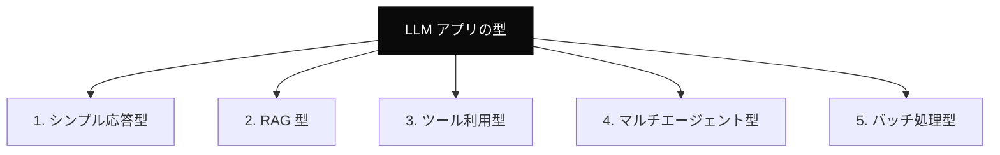
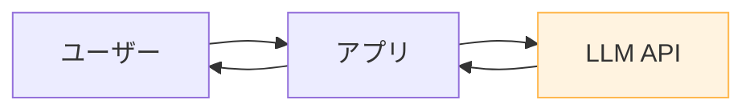
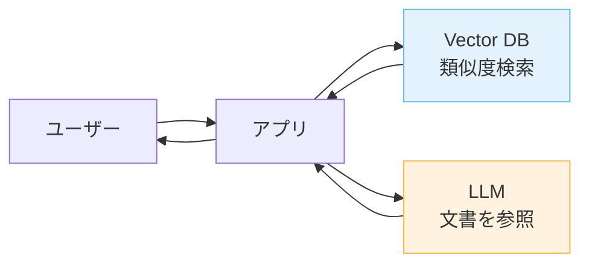
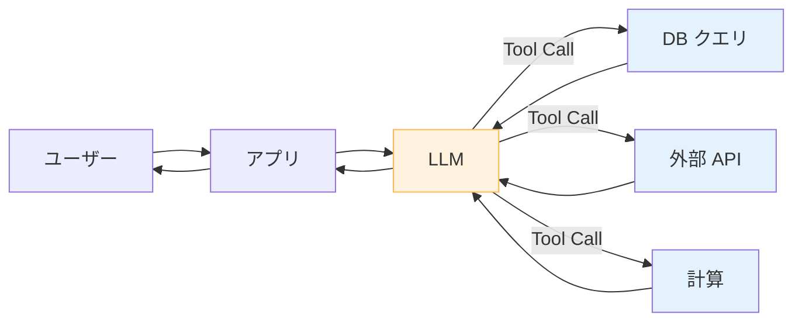
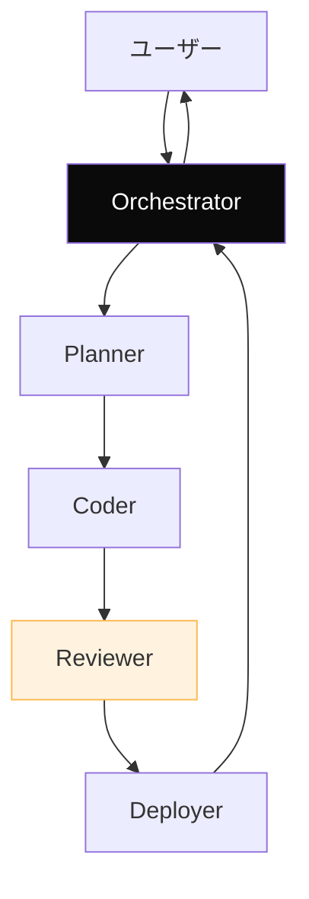
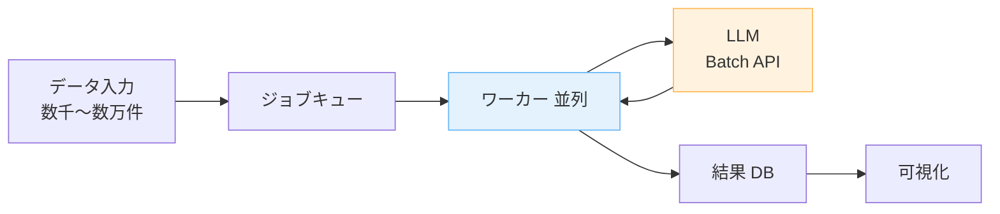
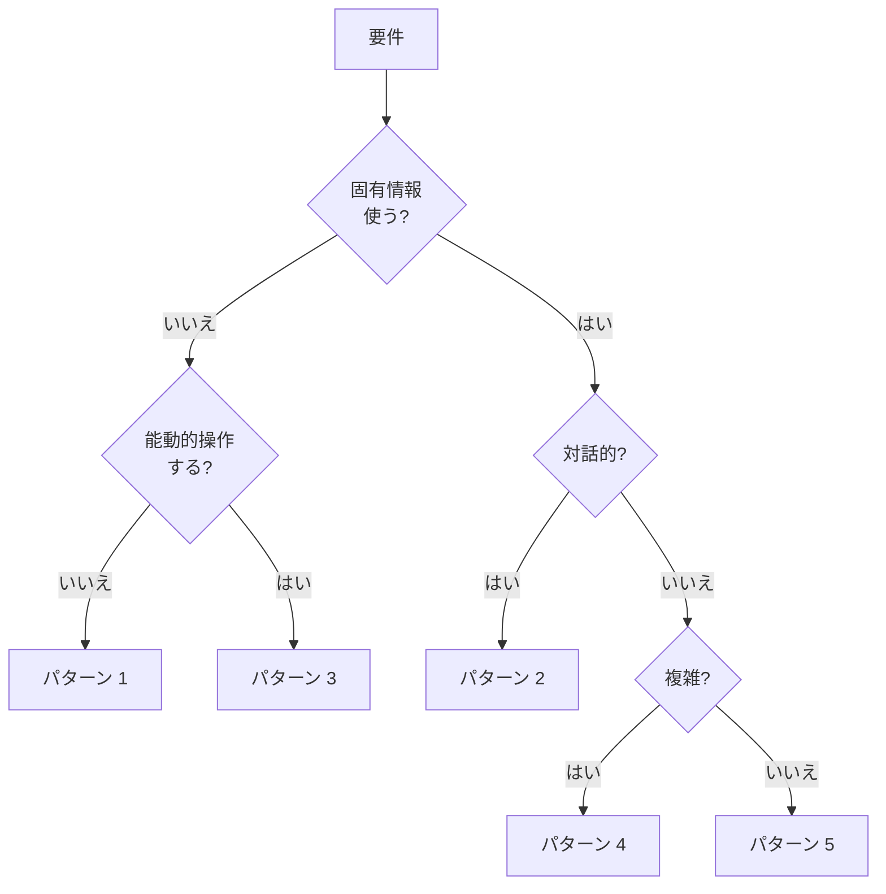

---
tags:
  - architecture
  - patterns
  - concept
  - design
---

# LLM アプリの 5 つの典型アーキテクチャパターン

Concepts
#architecture
#patterns
#concept
#design
updated 2026-04-13
6 min read

LLM を組み込んだアプリのアーキテクチャは、用途によって大きく 5 パターンに分類できる。**自分のアプリがどのパターンか**を意識すると、設計判断が迷わない。

### パターンマップ

### パターン 1: シンプル応答型

ユーザー入力に対して、LLM が直接回答する最小構成。

**例**: チャットボット、翻訳、要約

**向く**: 単純な問答、固有情報が不要な用途

**注意**: ハルシネーション対策を基本層で組み込む

### パターン 2: RAG 型

関連文書を検索してコンテキストに含めて回答。

**例**: 社内ドキュメント QA、サポート自動化

**向く**: 固有情報・動的情報を扱う用途

**注意**: チャンク設計、関連度スコアの調整

### パターン 3: ツール利用型

LLM が外部ツールを呼び出して情報取得・アクション実行。

**例**: スマート予約システム、AI アシスタント、調査エージェント

**向く**: 能動的な情報取得や操作が必要な用途

**注意**: ツール定義の品質、無限ループ防止

### パターン 4: マルチエージェント型

役割分担した複数のエージェントが協調。

**例**: 自律的なコード生成、リサーチエージェント

**向く**: 複雑・長期・多段階のタスク

**注意**: エージェント間の情報伝達、並行処理の競合

### パターン 5: バッチ処理型

ユーザーインタラクションなしで、大量データを非同期に処理。

**例**: レビュー分析、大量タグ付け、文書分類

**向く**: オフライン処理でコストを抑えたい用途

**注意**: 失敗時のリトライ、進捗可視化

### パターン選択ガイド

### 組み合わせ

実際のプロダクトは**複数パターンの組み合わせ**が多い。

- RAG 型 + ツール利用型: 文書検索 + 実行
- シンプル応答型 + バッチ処理型: 対話と分析の並行
- マルチエージェント型 + RAG: 調査エージェントが各自 RAG を使う

### アンチパターン

**1. パターン 4 を最初から選ぶ**

マルチエージェントは複雑。**シンプルな構成で試してから**、必要性を判断する。

**2. RAG なしで固有情報を回答**

LLM が記憶だけで答えようとして**ハルシネーション頻発**。情報取得経路を作る。

**3. ツール利用に制限なし**

無限にツールを呼ぶ。**最大呼び出し回数**を設定する。

**4. バッチ処理を同期 API で**

数千件を同期で回すと、タイムアウト・レート制限に引っかかる。**Batch API**を使う。

### チェックリスト

- [ ] 自分のアプリのパターンを識別できる
- [ ] パターンの典型的な注意点を知っている
- [ ] 必要なら複数パターンを組み合わせる設計にしている
- [ ] 複雑なパターンに飛びつかず、シンプルから始めている

### まとめ

LLM アプリは**5 つの基本パターン**に大別できる。自分のアプリの型を理解すると、設計判断・デバッグ・最適化が速くなる。**シンプルな型から始めて、必要に応じて進化**させる。

## 関連エントリ

- [LLM の非決定性を前提に設計する](llm-の非決定性を前提に設計する.md)
- [AI エージェントと人間の責任分界](ai-エージェントと人間の責任分界.md)
- [AI プロダクトと倫理 — 7 つの観点](ai-プロダクトと倫理-7-つの観点.md)

  
← [ファインチューニング vs プロンプト — どちらを選ぶか](ファインチューニング-vs-プロンプト-どちらを選ぶか.md)

  
[技術選定の5軸評価フレームワーク](技術選定の5軸評価フレームワーク.md) →

