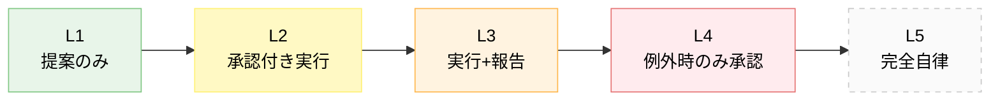
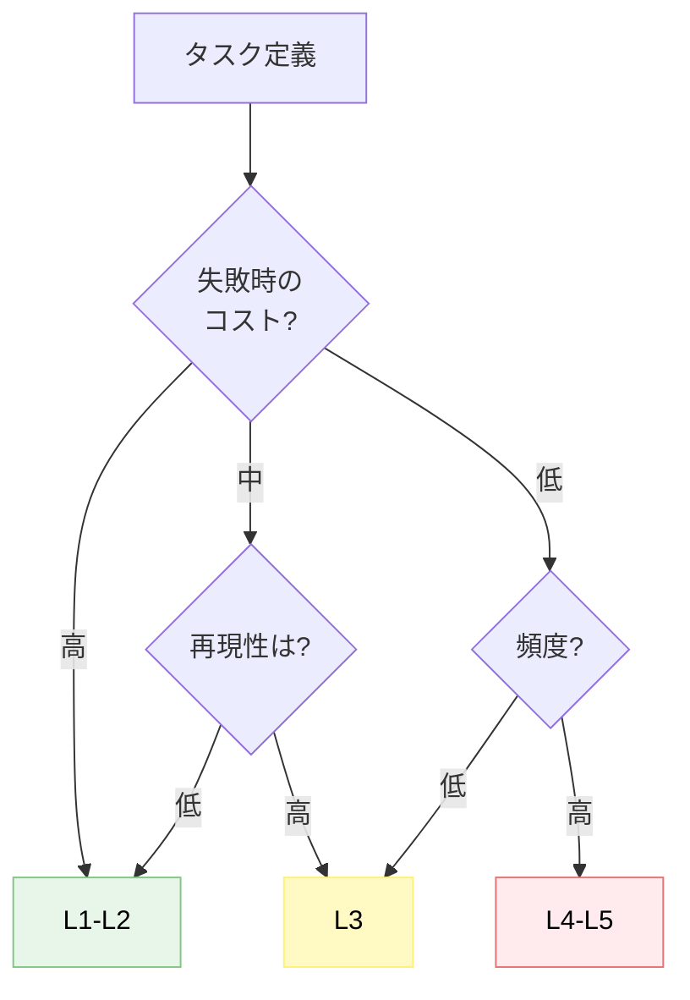

---
tags:
  - autonomy
  - agent-design
  - concept
---

# エージェントの自律度レベルと昇格基準

Concepts
#autonomy
#agent-design
#concept
updated 2026-04-13
4 min read

AI エージェントを運用する際、「どこまで自律的に動かしていいか」は設計の根本に関わる決定。エージェントの**自律度レベル**を段階として捉えると、判断がぶれない。

### 5 段階の自律度

**L1: 提案のみ**

エージェントは提案を返すだけ。実行は全て人間が行う。

- 例: 「このコードはこう直したほうが良いです」という提案
- 適したタスク: 初期段階、信頼構築前

**L2: 承認付き実行**

エージェントが計画を提示し、**人間が承認したら実行**する。

- 例: 「このファイルを編集します、よろしいですか?」
- 適したタスク: 破壊的操作、コスト発生、外部送信

**L3: 実行 + 事後報告**

エージェントが判断して実行。**結果を必ず報告**する。問題があれば人間が介入。

- 例: テスト実行、ログ収集、検索
- 適したタスク: 非破壊的・低リスク・反復的

**L4: 例外時のみ承認**

通常は完全自律。**例外的な判断が必要な場合のみ人間に問い合わせ**。

- 例: 定型業務の自動化、定期チェック
- 適したタスク: 長期運用で信頼を積んだ定型タスク

**L5: 完全自律**

人間の介入なしで動き続ける。**停止条件と例外処理が明確**であることが前提。

- 例: バックグラウンド監視、定期レポート生成
- 適したタスク: 完全に予測可能・失敗コストが低いタスク

### どのレベルを選ぶかの判断軸

- **失敗コストが高い**（本番 DB 操作、外部送信、決済）: L1-L2
- **失敗コストが低い + 再現性が高い**（情報収集、分析）: L3
- **頻度が高く定型化された**: L4-L5

### 昇格の条件

L1 → L2 → L3 → L4 のように**段階的に信頼を上げる**。一気に自律度を上げない。

**昇格基準の例**:

- 3 セッション連続で採用率 70% 以上 → L1 から L2 に昇格
- エラー率 5% 以下が 1 ヶ月継続 → L3 から L4 に昇格

### 降格の条件

事故が起きたら**必ず 1 段階以上降格**させる。

- 誤作動でデータを壊した → 即 L1 に戻す
- 例外処理が抜けていた → 1 段階下げる

### アンチパターン

- **最初から L5 にする**: 信頼構築前の完全自律は事故のもと
- **レベルを明示しない**: チーム内で認識が揃わない。コードコメントや README に明記する
- **昇格基準がない**: 感覚で上げると、根拠なく戻せない

### まとめ

自律度は**一度決めて固定**するものではなく、**タスク単位で設定し、実績に応じて動かす**もの。段階的に上げて、事故時は即降格。

## 関連エントリ

- [AI エージェントと人間の責任分界](ai-エージェントと人間の責任分界.md)
- [AI プロダクトと倫理 — 7 つの観点](ai-プロダクトと倫理-7-つの観点.md)
- [AI プロダクト設計の 3 つの基本原則](ai-プロダクト設計の-3-つの基本原則.md)

  
← [Drift Detection — 実装が意図から乖離する現象を検出する](drift-detection-実装が意図から乖離する現象を検出する.md)

  
[AI エージェントと人間の責任分界](ai-エージェントと人間の責任分界.md) →

