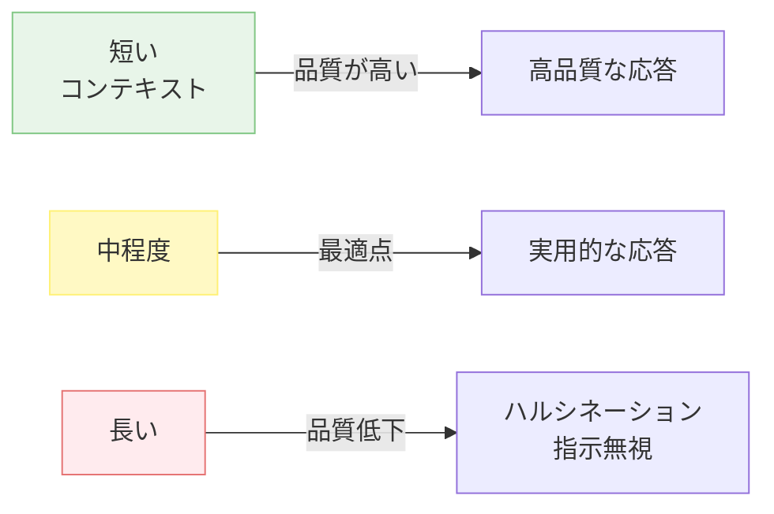
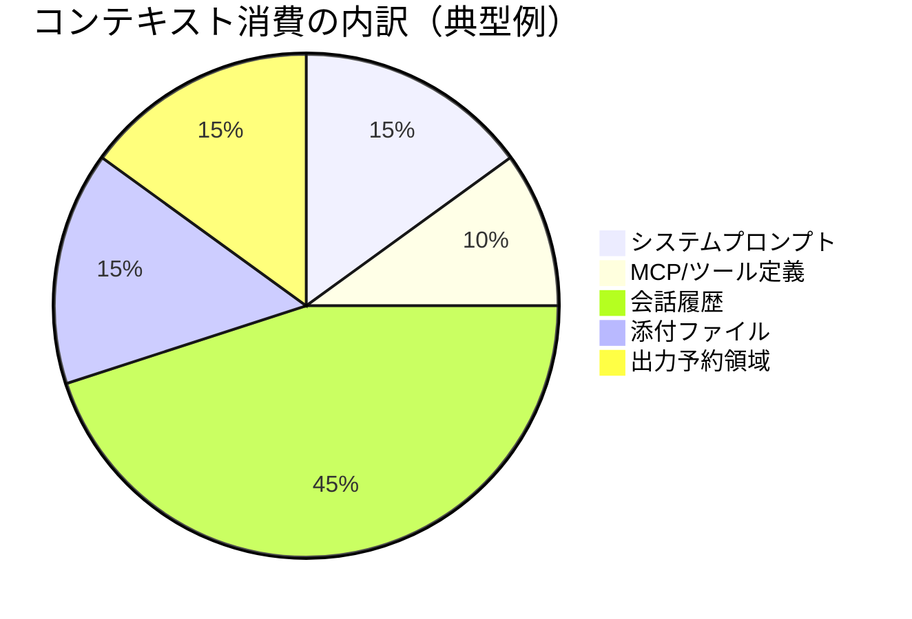

---
tags:
  - context
  - concept
  - prompt-design
---

# コンテキストは有限で劣化する資源である

Concepts
#context
#concept
#prompt-design
updated 2026-04-13
3 min read

LLM エージェントの回答品質は、渡されたコンテキスト量に比例しない。むしろ反比例する場面が多い。**コンテキストは有限かつ劣化する資源**として扱うのが、実運用での正しい前提。

### コンテキスト量と品質の関係

### 観察される事実

- **長いセッションほど品質が落ちる**: ハルシネーションや指示無視が増え、前のターンで決めたことが次のターンで覆る
- **指示予算には実効上限がある**: システムプロンプトに書く指示は、体感で 100〜150 命令あたりから遵守率が急落する
- **ツール定義もコンテキストを食う**: MCP や関数ツールの定義がコンテキストの 10% を超えると、ツール選択の精度が下がる
- **コンテキスト圧縮は情報を失う**: 自動圧縮が走ると、重要な決定や前提が静かに消える

### コンテキストの消費構造

比率は状況で変動するが、会話が長くなるほど「会話履歴」が全体を圧迫する。ツール定義やシステムプロンプトを減らすより、セッションを区切る方が効果的な局面が多い。

### 扱い方の原則

1. **使う分だけ積む**: 関連 ADR・関連ファイルだけを作業開始時に読ませる。関係ないものは読ませない
2. **索引と本体を分ける**: システムプロンプトは索引（どこに何があるか）に徹し、詳細は必要時に参照する構造にする
3. **外部永続化を前提にする**: 重要な決定は MEMORY.md / ADR / TODO ファイル等に外出しし、コンテキストから逃がす
4. **セッションを区切る**: 長く引っ張らず、1 セッション 1 目的で切り上げる。チェックポイントで明示的に終わらせる
5. **ハーネスで節約する仕組みを組み込む**: タイムスタンプを動かさないようにする、ツール数を絞る等、キャッシュを活かす設計にする

### 影響する他のトピック

- システムプロンプトの行数上限（パターン：「システムプロンプトを 200 行以上書く」）
- ADR 分離パターン（ケーススタディ：「CLAUDE.md 肥大化を ADR 分離で回復した事例」）
- セッションを跨いだ情報保持（Patterns の Context Compression Amnesia など）

コンテキストを「潤沢な作業領域」と誤解すると、ほぼ全ての設計判断がズレる。**有限で劣化する資源**として扱うのが出発点になる。

## 関連エントリ

- [AI エージェントと人間の責任分界](ai-エージェントと人間の責任分界.md)
- [Drift Detection — 実装が意図から乖離する現象を検出する](drift-detection-実装が意図から乖離する現象を検出する.md)
- [Eval-Driven Development — LLM 機能開発は評価から始める](eval-driven-development-llm-機能開発は評価から始める.md)

  
← [LLM の非決定性を前提に設計する](llm-の非決定性を前提に設計する.md)

  
[Intent Engineering — 意図を凍結してから設計する](intent-engineering-意図を凍結してから設計する.md) →

