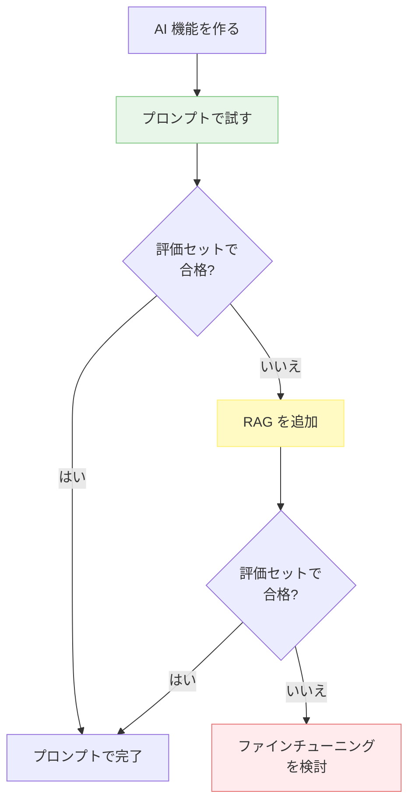
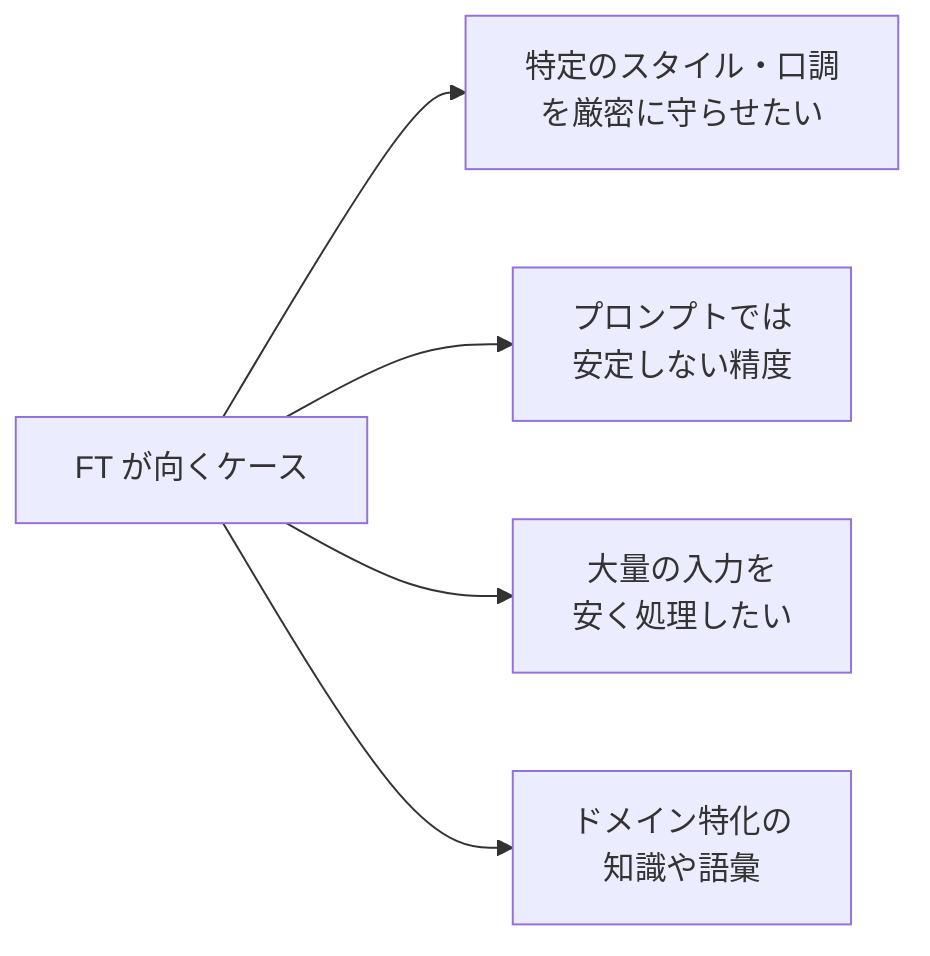

---
tags:
  - fine-tuning
  - prompt
  - rag
  - decision
---

# ファインチューニング vs プロンプト — どちらを選ぶか

Concepts
#fine-tuning
#prompt
#rag
#decision
updated 2026-04-13
5 min read

「モデルをファインチューニングすべきか、プロンプトで頑張るか」は AI 機能開発でよく議論になる。**結論から言うと、プロンプトエンジニアリングで行けるところまで行くのが基本**。ファインチューニングは最後の手段。

### 判断フロー

**ファインチューニングに進む前に、必ずプロンプト + RAG で試す**。この順序を守ると、大半のケースは FT なしで済む。

### それぞれの特徴

| 観点 | プロンプト | RAG | ファインチューニング |
|------|---------|-----|-------------------|
| 初期コスト | 低い | 中 | 高い |
| 運用コスト | 中（トークン代） | 中（トークン代） | 低（推論は安い） |
| 更新の容易さ | ◎ | ◎ | △（再学習必要） |
| 動的情報対応 | ◎ | ◎ | △ |
| 固有スタイル・知識の習得 | △ | ○ | ◎ |
| データ量の要件 | 少ない | 中 | 多い（数百件以上） |
| 技術的ハードル | 低い | 中 | 高い |

### プロンプトで十分なケース

- タスクの規模が小さい
- 外部知識が頻繁に更新される
- 評価セットで十分な精度が出ている
- データを集めるのが難しい

### RAG が向くケース

- 最新情報・固有情報を使う必要がある
- ドキュメント量が大きい
- 答えに根拠を示す必要がある
- 情報の権限管理が要る（ユーザーごとに見える文書が違う）

### ファインチューニングが向くケース

- **特定スタイルの厳守**: 会社の語調を完璧に守らせる
- **安定性の要求**: 金融・医療等、ぶれが許されない
- **大量処理のコスト削減**: 小さいモデルを FT して推論コストを下げる
- **ドメイン知識**: 一般知識では扱えない専門用語・概念

### ファインチューニング着手時の注意

**1. データ収集が最重要**

FT の品質は**学習データの質と量**で決まる。プロンプトで試行錯誤した結果を、**成功例ログ**として蓄積しておくと、後で FT データに流用できる。

**2. ベースモデルを評価する**

FT は基盤モデルに上書きされるので、**基盤の出来**で天井が決まる。最新の強いモデルから始める。

**3. 失敗パターンも学習させる**

成功例だけでなく、「こういう入力ではこう答える」「こういう入力は拒否する」という**失敗例も学習データに入れる**。

**4. 評価セットでビフォーアフター**

FT 前後で同じ評価セットを回し、スコア差を定量化する。**改善してない FT は採用しない**。

**5. コストを見積もる**

- 初期学習コスト
- 再学習（データ更新時）のコスト
- FT モデルの推論コスト（通常より安い場合も高い場合もある）
- 運用・監視の工数

すべて含めて、プロンプト運用より安くなるか確認。

### アンチパターン

**1. 「FT すれば精度が上がる」と盲信**

データが少ない・質が悪いと、FT して**かえって悪化**することもある。

**2. ドメイン知識を FT で詰め込もうとする**

動的情報・最新情報は RAG のほうが向く。FT に頼ると更新コストが膨大。

**3. プロンプトの試行錯誤を省く**

いきなり FT に行くと、プロンプトで解けたはずの問題も「FT が足りないから」と誤認しがち。

**4. 評価なしで FT**

FT したら終わりではなく、評価セットで合格するまで続く。

### チェックリスト

- [ ] プロンプトエンジニアリングで十分試した
- [ ] RAG を試して、それでも不足か確認した
- [ ] FT に進むなら、データ量と質が十分か
- [ ] ベースモデルは最新の強いものを選んでいる
- [ ] 評価セットでビフォーアフター比較する準備がある
- [ ] 総コストでプロンプト運用より安くなるか試算した

### まとめ

**プロンプト → RAG → FT** の順で試す。多くのケースは FT まで行かずに済む。FT を始める判断は、**データ・コスト・スケール**の 3 点が揃ってから。

## 関連エントリ

- [技術選定の5軸評価フレームワーク](技術選定の5軸評価フレームワーク.md)
- [RAG のチャンクサイズを選ぶ基準](../techniques/rag-のチャンクサイズを選ぶ基準.md)
- [ハルシネーションを抑える 7 つの手法](../techniques/ハルシネーションを抑える-7-つの手法.md)

  
← [プロンプトインジェクション — LLM アプリの最重要セキュリティ論点](プロンプトインジェクション-llm-アプリの最重要セキュリティ論点.md)

  
[LLM アプリの 5 つの典型アーキテクチャパターン](llm-アプリの-5-つの典型アーキテクチャパターン.md) →

