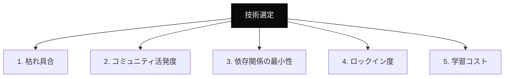

---
tags:
  - tech-selection
  - decision
  - concept
---

# 技術選定の5軸評価フレームワーク

Concepts
#tech-selection
#decision
#concept
updated 2026-04-13
3 min read

新しいプロジェクトで技術スタックを選ぶ際、場当たり的に「流行ってるから」「使ったことあるから」で選ぶと後で痛い目を見る。判断軸を言語化しておくと、同じ失敗を繰り返さずに済む。

### 5 つの判断軸

### 軸ごとの判断基準

**1. 枯れ具合**

新しすぎる技術は検証コストが高い。破壊的変更も多い。リリースから 2〜3 年経ち、LTS バージョンがある技術を優先する。

- 避けるもの: メジャーバージョン 0.x、直近 6 ヶ月以内の破壊的変更
- 好むもの: v2 以降、過去 12 ヶ月で破壊的変更がない、LTS あり

**2. コミュニティ活発度**

コミュニティが活発だと、ハマったときの情報が手に入る。Stack Overflow / GitHub Issues / 技術ブログが充実しているか確認する。

- 目安: GitHub スター数より Issue の応答速度を見る
- 目安: 過去 3 ヶ月のコミット頻度

**3. 依存関係の最小性**

依存ライブラリは少ないほど安全。サプライチェーン攻撃・バージョン競合・ライセンス問題のリスクが減る。

- 目安: `npm ls` / `pip show` で依存の深さを確認
- 目安: 必須依存が 10 以下のライブラリを優先

**4. ロックイン度**

特定のクラウドやベンダーに縛られる技術は、撤退コストが高い。**抜け道があるか**を先に確認する。

- 目安: 標準的な代替手段があるか
- 目安: データのエクスポート経路があるか

**5. 学習コスト**

チーム（または自分）が実戦投入までにかかる時間。公式ドキュメントの質とチュートリアルの有無で判断する。

### 判断マトリクス例

| 技術 | 枯れ | コミュニティ | 依存最小 | ロックイン低 | 学習容易 | 合計 |
|------|-----|-------------|---------|------------|----------|------|
| Next.js 14 LTS | ◎ | ◎ | △ | △ | ◎ | 高 |
| Bun 最新版 | △ | ○ | ◎ | ○ | ○ | 中 |
| Deno | ○ | ○ | ◎ | ○ | △ | 中 |

5 軸それぞれを ◎ ○ △ × で評価し、合計で判断する。重み付けは案件によって変える。

### アンチパターン

- **「なんとなく新しいから」で選ぶ**: 新しさは価値だが、検証済みであることとは別
- **「みんな使ってるから」で選ぶ**: みんなが使っていても、自分のユースケースに合うとは限らない
- **「一度にすべて切り替える」**: 新技術は周辺から試す。コアから一気に入れ替えない
- **「撤退戦略を考えない」**: ロックインを軽視すると、3 年後に身動きが取れなくなる

### 判断を残す

選定理由は ADR に書き、合わせて**「この選定を間違ったと感じる条件」**も明記する。未来の自分が判断を見直すときの目安になる。

## 関連エントリ

- [AI エージェントと人間の責任分界](ai-エージェントと人間の責任分界.md)
- [AI プロダクトと倫理 — 7 つの観点](ai-プロダクトと倫理-7-つの観点.md)
- [AI プロダクト設計の 3 つの基本原則](ai-プロダクト設計の-3-つの基本原則.md)

  
← [ファインチューニング vs プロンプト — どちらを選ぶか](ファインチューニング-vs-プロンプト-どちらを選ぶか.md)

  
[AI プロダクト設計の 3 つの基本原則](ai-プロダクト設計の-3-つの基本原則.md) →

