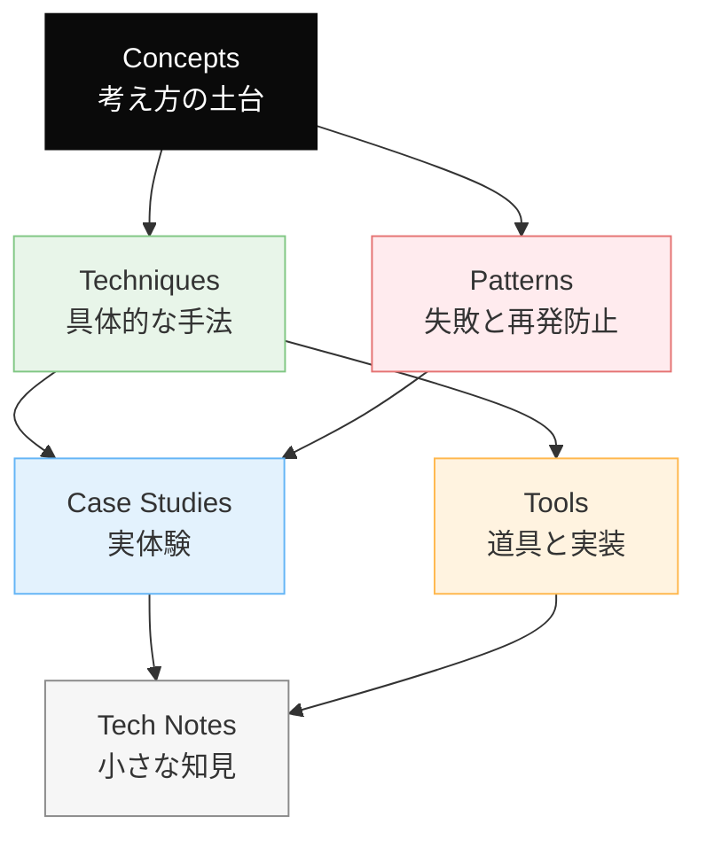

# Dinekt Knowledge Wiki

Claude Code と AI エージェントの設計・運用を続けるなかで積み上げてきた知見を、他のプロジェクトでも参照できる形でまとめたナレッジベースです。概念・手法・失敗パターン・道具・実際のケーススタディまでを横断して扱います。

  31 entries
  6 categories
  auto-generated

## カテゴリ構成

## はじめての方へ

**推奨の読み順**:

1. [Concepts](concepts/index.md) — 背景にある考え方を掴む
2. [Patterns](patterns/index.md) — 典型的な失敗と対策をチェックリストとして読む
3. [Techniques](techniques/index.md) — 設計手法として応用する
4. [Case Studies](case-studies/index.md) — 実例で理解を補強する

必要に応じて [Tools](tools/index.md) と [Tech Notes](tech-notes/index.md) を辞書的に参照してください。

## カテゴリ

-   __[Concepts](concepts/index.md)__

    ---

    AI 開発の根底にある概念・思想

    _5 entries_

-   __[Techniques](techniques/index.md)__

    ---

    エージェントやプロンプトの設計手法

    _7 entries_

-   __[Patterns](patterns/index.md)__

    ---

    失敗モードと再発防止のパターン集

    _3 entries_

-   __[Case Studies](case-studies/index.md)__

    ---

    実際に遭遇したケースと対応の記録

    _7 entries_

-   __[Tools](tools/index.md)__

    ---

    Dinekt が設計・運用している道具と実装

    _3 entries_

-   __[Tech Notes](tech-notes/index.md)__

    ---

    技術仕様・Tips・検証メモ

    _6 entries_

## 最近のエントリ

-   __[Edge Runtime vs Node Runtime の使い分け](tech-notes/edge-runtime-vs-node-runtime-の使い分け.md)__

    ---

    Vercel（や Cloudflare Workers）の Edge Runtime は起動が速くグローバル分散できるが、Node.js API の大半が使えない。Node Runtime との使い分…

-   __[LLM-as-Judge — 評価者 LLM の組み立て方](techniques/llm-as-judge-評価者-llm-の組み立て方.md)__

    ---

    LLM の出力品質を別の LLM に評価させる手法。主観的な評価軸（トーン、読みやすさ、含意の適切さ）を自動化できる。ただし評価者自身にバイアスがあるため、実装には注意が要る。 基本構造 mermai…

-   __[RAG のチャンクサイズを選ぶ基準](techniques/rag-のチャンクサイズを選ぶ基準.md)__

    ---

    RAG（RetrievalAugmented Generation）で文書をベクトル検索用にチャンク分割する際、チャンクサイズの選定は検索精度と応答品質に直結する。大きすぎても小さすぎても失敗する。…

-   __[プロンプトキャッシュを壊さない書き方](techniques/プロンプトキャッシュを壊さない書き方.md)__

    ---

    LLM API の多くは同じ先頭プロンプトを再利用することでプロンプトキャッシュを効かせ、レイテンシとコストを劇的に下げられる。ただしキャッシュは「先頭から完全一致」が前提なので、わずかな変動で無効化…

-   __[マルチエージェント組織の4つの設計教訓](techniques/マルチエージェント組織の4つの設計教訓.md)__

    ---

    AI エージェントを複数ロールで運用する際に得た設計上の教訓。 組織構造の比喩 mermaid flowchart TD H[ユーザー / 発注者] I[索引エージェント<br/index only]…

-   __[Next.js で LLM のストリーミング応答を扱う実装パターン](case-studies/nextjs-で-llm-のストリーミング応答を扱う実装パターン.md)__

    ---

    OpenAI（や Anthropic）の Chat Completions API でストリーミング応答を Next.js サーバーから受けて、ブラウザにリアルタイム表示する実装パターン。Server…

## 関連リンク

- [用語集](glossary.md)
- [タグ一覧](tags.md)
- [Dinekt 公式サイト](https://dinekt.com)
