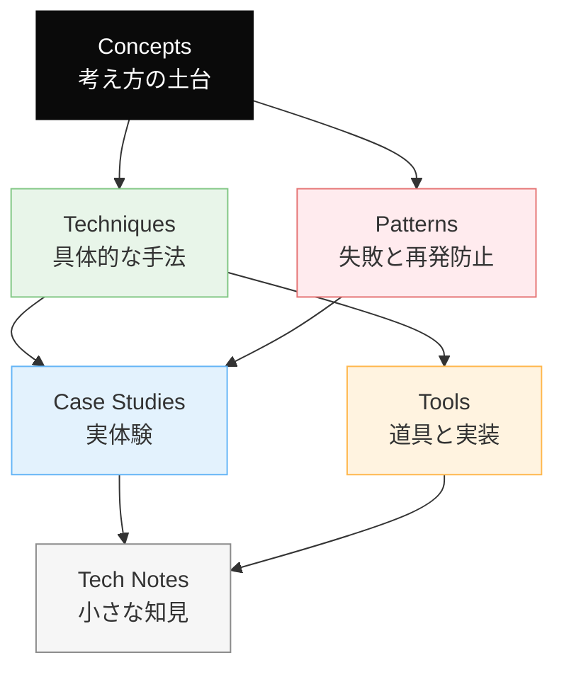
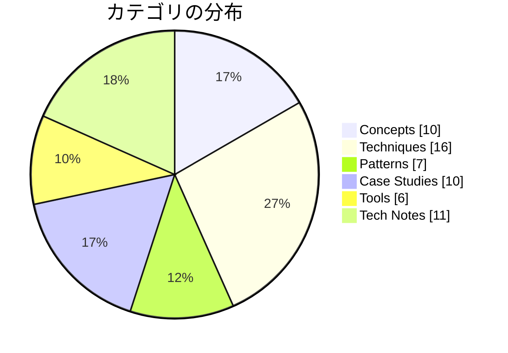

# Dinekt Knowledge Wiki

Claude Code と AI エージェントの設計・運用を続けるなかで積み上げてきた知見を、他のプロジェクトでも参照できる形でまとめたナレッジベースです。概念・手法・失敗パターン・道具・実際のケーススタディまでを横断して扱います。

  60 entries
  6 categories
  updated 2026-04-13

## カテゴリ構成

## カテゴリ別エントリ数

## はじめての方へ

**推奨の読み順**:

1. [Concepts](concepts/index.md) — 背景にある考え方を掴む
2. [Patterns](patterns/index.md) — 典型的な失敗と対策をチェックリストとして読む
3. [Techniques](techniques/index.md) — 設計手法として応用する
4. [Case Studies](case-studies/index.md) — 実例で理解を補強する

必要に応じて [Tools](tools/index.md) と [Tech Notes](tech-notes/index.md) を辞書的に参照してください。

## カテゴリ

-   __[Concepts](concepts/index.md)__

    ---

    AI 開発の根底にある概念・思想

    _10 entries_

-   __[Techniques](techniques/index.md)__

    ---

    エージェントやプロンプトの設計手法

    _16 entries_

-   __[Patterns](patterns/index.md)__

    ---

    失敗モードと再発防止のパターン集

    _7 entries_

-   __[Case Studies](case-studies/index.md)__

    ---

    実際に遭遇したケースと対応の記録

    _10 entries_

-   __[Tools](tools/index.md)__

    ---

    Dinekt が設計・運用している道具と実装

    _6 entries_

-   __[Tech Notes](tech-notes/index.md)__

    ---

    技術仕様・Tips・検証メモ

    _11 entries_

## 最近のエントリ

-   __[LLM API キーの管理と漏洩防止](tech-notes/llm-api-キーの管理と漏洩防止.md)__

    ---

    LLM の API キー（OpenAI, Anthropic 等）は高価・攻撃対象・漏洩時の影響が大きい。最初から管理の仕組みを整えないと、事故を起こす。 漏洩の主な経路 基本の守り方 1. 環境変数…

-   __[CoT・ToT・ReAct — 推論パターンの使い分け](techniques/cottotreact-推論パターンの使い分け.md)__

    ---

    LLM の推論能力を引き出すパターンとして、Chain-of-Thought (CoT)、Tree-of-Thoughts (ToT)、ReAct が筆者的。用途に応じて使い分ける。 3 つのパターン…

-   __[AI プロダクト設計の 3 つの基本原則](concepts/ai-プロダクト設計の-3-つの基本原則.md)__

    ---

    AI を組み込んだプロダクトを設計するとき、「AI にどこを任せるか」の判断が本質的に重要。ここが曖昧だと、どれだけ頑張っても良い製品にならない。 設計の出発点 3 つの基本原則 1. AI は最後の…

-   __[長い出力を生成させるときの 5 つの失敗](patterns/長い出力を生成させるときの-5-つの失敗.md)__

    ---

    LLM に長文（ブログ記事、ドキュメント、レポート等）を書かせる際、短い出力より桁違いに失敗する。中途終了・繰り返し・矛盾・尻すぼみなどの失敗モードが典型。 5 つの典型的な失敗 1. 尻すぼみ 症状…

-   __[Claude Code を使った効率的な不具合調査](case-studies/claude-code-を使った効率的な不具合調査.md)__

    ---

    不具合調査で Claude Code を使うと、「何となく修正して動いた」では終わらず、根本原因まで特定できる確率が大きく上がる。ただしやり方を間違えるとむしろ遅くなる。効率的な進め方を整理。 調査フ…

-   __[評価ハーネスの設計 — プロンプトを育てる仕組み](tools/評価ハーネスの設計-プロンプトを育てる仕組み.md)__

    ---

    LLM 機能の評価セットを継続運用するには、専用のハーネス（実行基盤）が要る。評価セットの作成・実行・スコアリング・比較を 1 つの仕組みに集約する。 評価ハーネスの全体像 最低限の構成要素 1. 評…

## 関連リンク

- [用語集](glossary.md)
- [タグ一覧](tags.md)
- [Dinekt 公式サイト](https://dinekt.com)
