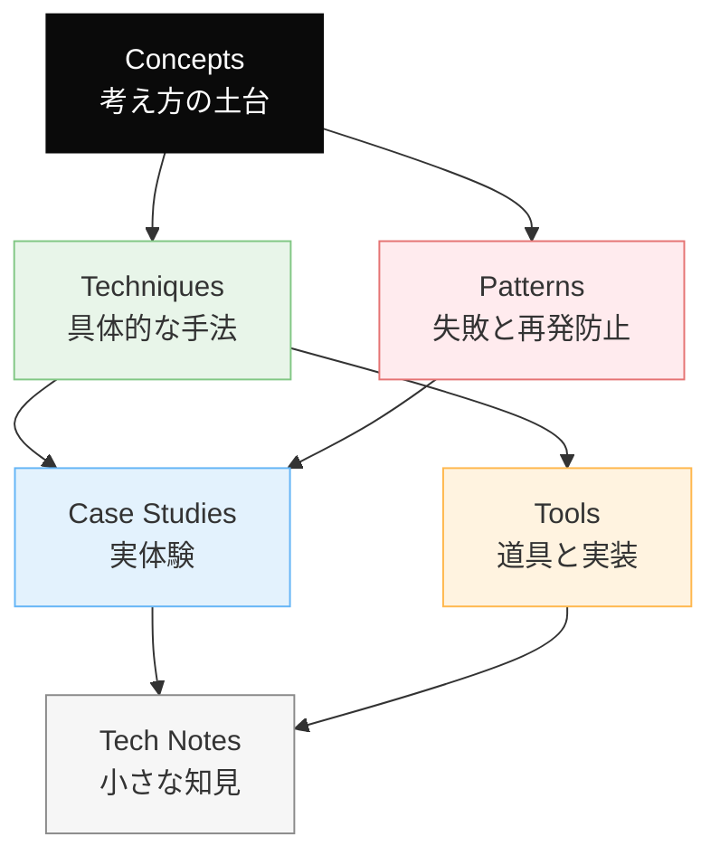

# Dinekt Knowledge Wiki

Claude Code と AI エージェントの設計・運用を続けるなかで積み上げてきた知見を、他のプロジェクトでも参照できる形でまとめたナレッジベースです。概念・手法・失敗パターン・道具・実際のケーススタディまでを横断して扱います。

  50 entries
  6 categories
  updated 2026-04-13

## カテゴリ構成

## はじめての方へ

**推奨の読み順**:

1. [Concepts](concepts/index.md) — 背景にある考え方を掴む
2. [Patterns](patterns/index.md) — 典型的な失敗と対策をチェックリストとして読む
3. [Techniques](techniques/index.md) — 設計手法として応用する
4. [Case Studies](case-studies/index.md) — 実例で理解を補強する

必要に応じて [Tools](tools/index.md) と [Tech Notes](tech-notes/index.md) を辞書的に参照してください。

## カテゴリ

-   __[Concepts](concepts/index.md)__

    ---

    AI 開発の根底にある概念・思想

    _9 entries_

-   __[Techniques](techniques/index.md)__

    ---

    エージェントやプロンプトの設計手法

    _13 entries_

-   __[Patterns](patterns/index.md)__

    ---

    失敗モードと再発防止のパターン集

    _5 entries_

-   __[Case Studies](case-studies/index.md)__

    ---

    実際に遭遇したケースと対応の記録

    _9 entries_

-   __[Tools](tools/index.md)__

    ---

    Dinekt が設計・運用している道具と実装

    _5 entries_

-   __[Tech Notes](tech-notes/index.md)__

    ---

    技術仕様・Tips・検証メモ

    _9 entries_

## 最近のエントリ

-   __[LLM 機能を本番リリースする前のチェックリスト](tech-notes/llm-機能を本番リリースする前のチェックリスト.md)__

    ---

    LLM を組み込んだ機能を本番にリリースする前に、従来のアプリと違う観点でチェックする項目がある。見落とすと、本番で想定外の事故を起こす。 リリース前チェックの構造 カテゴリ別チェックリスト 評価 -…

-   __[ハルシネーションを抑える 7 つの手法](techniques/ハルシネーションを抑える-7-つの手法.md)__

    ---

    LLM のハルシネーション（事実に基づかない生成）を完全に防ぐことはできないが、運用上許容できるレベルまで抑えることは可能。7 つの手法を効果順に紹介。 効果の優先度 1. RAG で文脈を足す（効果…

-   __[Claude Code のサブエージェント活用法](tools/claude-code-のサブエージェント活用法.md)__

    ---

    Claude Code のサブエージェント機能は、専門分野に特化した別エージェントを呼び出す仕組み。うまく使えばメインのコンテキストを節約しつつ、専門的な判断を得られる。 基本構造 メインはオーケスト…

-   __[AI エージェントと人間の責任分界](concepts/ai-エージェントと人間の責任分界.md)__

    ---

    AI エージェントに仕事を任せる際、「誰が何の責任を持つか」を曖昧にすると、事故時に収拾がつかなくなる。責任分界を明示的に設計する。 責任の 3 層 - 判断層: 何をどうするか決める - 実行層:…

-   __[LLM モデル / プロバイダー切り替え時の互換性問題と段階移行](case-studies/llm-モデル-プロバイダー切り替え時の互換性問題と段階移行.md)__

    ---

    コストや性能を理由に、運用中の LLM を別のモデル・プロバイダーに切り替える場面は増えている。互換性は完全ではない。事前に想定すべき差分と、段階的な移行手順。 遭遇しうる差分 よく遭遇する具体的な問…

-   __[評価セット設計の 6 つのアンチパターン](patterns/評価セット設計の-6-つのアンチパターン.md)__

    ---

    LLM 機能の品質を保つには評価セットが要だが、評価セットの設計自体にアンチパターンがある。よく遭遇する 6 つを挙げる。 典型的な失敗の分類 1. サンプルが少なすぎる 症状: 評価セットが 5〜1…

## 関連リンク

- [用語集](glossary.md)
- [タグ一覧](tags.md)
- [Dinekt 公式サイト](https://dinekt.com)
