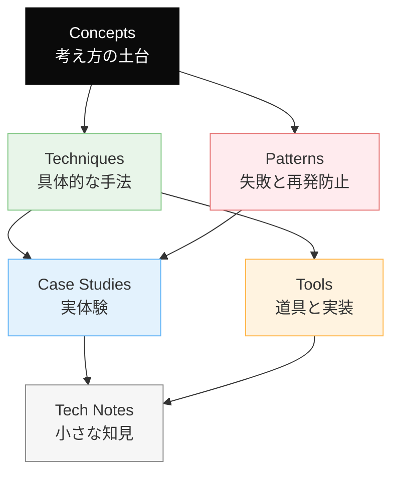
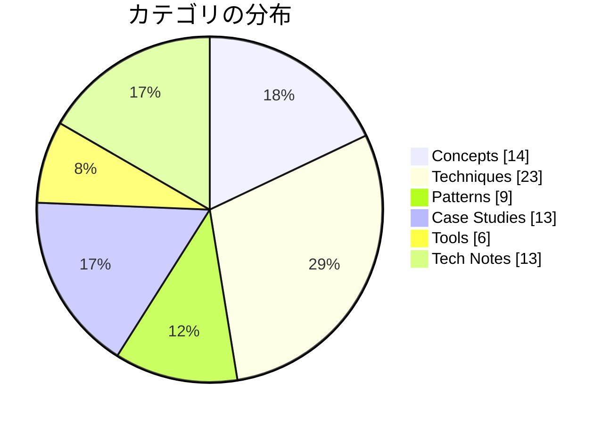

# Dinekt Knowledge Wiki

Claude Code と AI エージェントの設計・運用を続けるなかで積み上げてきた知見を、他のプロジェクトでも参照できる形でまとめたナレッジベースです。概念・手法・失敗パターン・道具・実際のケーススタディまでを横断して扱います。

  78 entries
  6 categories
  updated 2026-04-13

## カテゴリ構成

## カテゴリ別エントリ数

## はじめての方へ

**推奨の読み順**:

1. [Concepts](concepts/index.md) — 背景にある考え方を掴む
2. [Patterns](patterns/index.md) — 典型的な失敗と対策をチェックリストとして読む
3. [Techniques](techniques/index.md) — 設計手法として応用する
4. [Case Studies](case-studies/index.md) — 実例で理解を補強する

必要に応じて [Tools](tools/index.md) と [Tech Notes](tech-notes/index.md) を辞書的に参照してください。

## カテゴリ

-   __[Concepts](concepts/index.md)__

    ---

    AI 開発の根底にある概念・思想

    _14 entries_

-   __[Techniques](techniques/index.md)__

    ---

    エージェントやプロンプトの設計手法

    _23 entries_

-   __[Patterns](patterns/index.md)__

    ---

    失敗モードと再発防止のパターン集

    _9 entries_

-   __[Case Studies](case-studies/index.md)__

    ---

    実際に遭遇したケースと対応の記録

    _13 entries_

-   __[Tools](tools/index.md)__

    ---

    Dinekt が設計・運用している道具と実装

    _6 entries_

-   __[Tech Notes](tech-notes/index.md)__

    ---

    技術仕様・Tips・検証メモ

    _13 entries_

## 最近のエントリ

-   __[Guardrails — LLM 出力を決定論的に制御する仕組み](techniques/guardrails-llm-出力を決定論的に制御する仕組み.md)__

    ---

    LLM の出力を決定論的に制御するための仕組みを総称して Guardrails（ガードレール）と呼ぶ。自由な生成と安全な運用の両立に必須。 Guardrails の 3 層 1. Input Guar…

-   __[エージェント専用ワークスペースのディレクトリ設計](techniques/エージェント専用ワークスペースのディレクトリ設計.md)__

    ---

    エージェントに仕事を任せる際、作業する専用のディレクトリ構造を設計すると、混乱が減り、追跡性が上がる。「ワークスペース」という発想で整理する。 基本構造 各ディレクトリの役割 tasks/ — 1 タ…

-   __[LLM 開発で避けるべき落とし穴 TOP 10](patterns/llm-開発で避けるべき落とし穴-top-10.md)__

    ---

    本 Wiki の各エントリから抽出した、LLM / AI エージェント開発で絶対に避けるべき落とし穴を 10 個に絞ってまとめる。新規プロジェクト開始時のチェックリストとして使える。 TOP 10 1…

-   __[評価駆動で LLM 機能をゼロから作った 5 日間の流れ](case-studies/評価駆動で-llm-機能をゼロから作った-5-日間の流れ.md)__

    ---

    評価駆動開発（EDD）で LLM 機能をゼロから作った際の、実際の時系列と意思決定。新規機能をどう立ち上げるかの雛形として使える。 開発する機能 ユーザーが入力した商品レビューから、改善ポイントを 3…

-   __[AI 開発の速度と品質は両立できる](concepts/ai-開発の速度と品質は両立できる.md)__

    ---

    AI 開発では「速く作る」と「品質を担保する」がトレードオフに見えるが、実は両立可能。評価セット・自動化・仕組みが速度を下げず、品質を上げる。 見かけのトレードオフ 「速く作ると雑」「丁寧にやると遅い…

-   __[LLM アプリのインシデント対応](tech-notes/llm-アプリのインシデント対応.md)__

    ---

    LLM アプリでインシデントが発生したときの初動対応を、事前に決めておく。インシデントの種類ごとに異なる対応手順を持つのが鉄則。 インシデントの分類 共通の初動フロー 1. 検知: アラート or ユ…

## 関連リンク

- [ナレッジマップ](map.md) — 概念の全体像を俯瞰する
- [チートシート](cheatsheet.md) — 忙しいときの早見表
- [用語集](glossary.md)
- [タグ一覧](tags.md)
- [Dinekt 公式サイト](https://dinekt.com)
