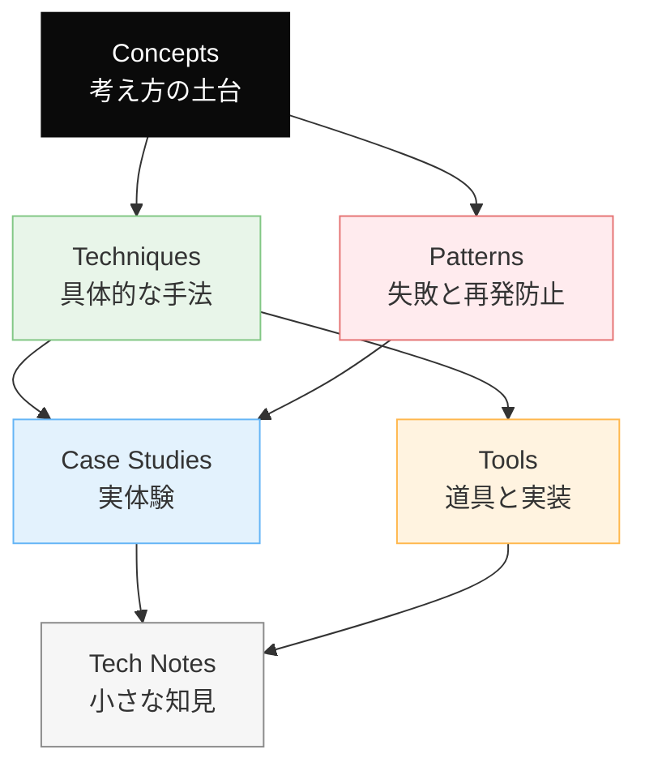

# Dinekt Knowledge Wiki

Claude Code と AI エージェントの設計・運用を続けるなかで積み上げてきた知見を、他のプロジェクトでも参照できる形でまとめたナレッジベースです。概念・手法・失敗パターン・道具・実際のケーススタディまでを横断して扱います。

  55 entries
  6 categories
  updated 2026-04-13

## カテゴリ構成

## はじめての方へ

**推奨の読み順**:

1. [Concepts](concepts/index.md) — 背景にある考え方を掴む
2. [Patterns](patterns/index.md) — 典型的な失敗と対策をチェックリストとして読む
3. [Techniques](techniques/index.md) — 設計手法として応用する
4. [Case Studies](case-studies/index.md) — 実例で理解を補強する

必要に応じて [Tools](tools/index.md) と [Tech Notes](tech-notes/index.md) を辞書的に参照してください。

## カテゴリ

-   __[Concepts](concepts/index.md)__

    ---

    AI 開発の根底にある概念・思想

    _9 entries_

-   __[Techniques](techniques/index.md)__

    ---

    エージェントやプロンプトの設計手法

    _15 entries_

-   __[Patterns](patterns/index.md)__

    ---

    失敗モードと再発防止のパターン集

    _6 entries_

-   __[Case Studies](case-studies/index.md)__

    ---

    実際に遭遇したケースと対応の記録

    _9 entries_

-   __[Tools](tools/index.md)__

    ---

    Dinekt が設計・運用している道具と実装

    _6 entries_

-   __[Tech Notes](tech-notes/index.md)__

    ---

    技術仕様・Tips・検証メモ

    _10 entries_

## 最近のエントリ

-   __[評価ハーネスの設計 — プロンプトを育てる仕組み](tools/評価ハーネスの設計-プロンプトを育てる仕組み.md)__

    ---

    LLM 機能の評価セットを継続運用するには、専用のハーネス（実行基盤）が要る。評価セットの作成・実行・スコアリング・比較を 1 つの仕組みに集約する。 評価ハーネスの全体像 最低限の構成要素 1. 評…

-   __[プロンプトのバージョン管理とデプロイ戦略](techniques/プロンプトのバージョン管理とデプロイ戦略.md)__

    ---

    プロンプトはコード同様にバージョン管理の対象。Git で管理するだけでは不十分で、評価・差分・ロールバックの仕組みが要る。 バージョン管理の基本構造 やるべきこと 1. ファイル分離 プロンプトをコー…

-   __[OpenAI と Anthropic API の主要差分](tech-notes/openai-と-anthropic-api-の主要差分.md)__

    ---

    OpenAI API と Anthropic API は多くの概念が共通するが、細かな仕様差がある。両方を扱う実装で引っかかるポイントを整理。 主要な差分マップ API 構造の違い メッセージとシステ…

-   __[エージェントのメモリ設計 (短期・中期・長期)](techniques/エージェントのメモリ設計-短期中期長期.md)__

    ---

    エージェントに「記憶」を持たせる設計は、セッションをまたいだ継続的な会話・学習・作業を実現するために必須。どこに・何を・どう保持するかを整理する。 メモリの 3 種類 短期メモリ（セッション中） 保存…

-   __[ツール実行の 5 つの失敗モード](patterns/ツール実行の-5-つの失敗モード.md)__

    ---

    LLM にツール（関数）を使わせる設計は、ツール呼び出し特有の失敗モードを抱える。筆者的な 5 パターンと対策を整理。 5 つの失敗モード 1. 無関係なツールを選ぶ 症状: 「天気を知りたい」と言わ…

-   __[LLM 機能を本番リリースする前のチェックリスト](tech-notes/llm-機能を本番リリースする前のチェックリスト.md)__

    ---

    LLM を組み込んだ機能を本番にリリースする前に、従来のアプリと違う観点でチェックする項目がある。見落とすと、本番で想定外の事故を起こす。 リリース前チェックの構造 カテゴリ別チェックリスト 評価 -…

## 関連リンク

- [用語集](glossary.md)
- [タグ一覧](tags.md)
- [Dinekt 公式サイト](https://dinekt.com)
