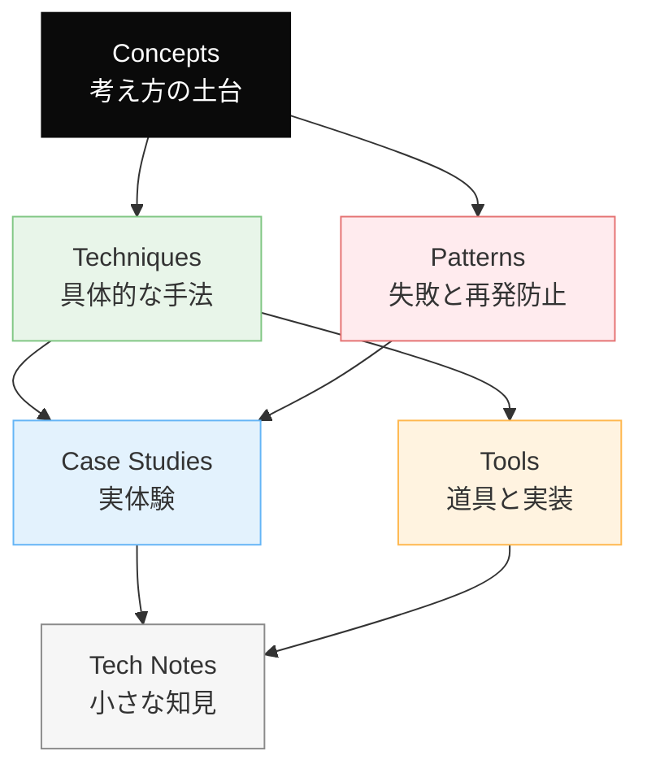

# Dinekt Knowledge Wiki

Claude Code と AI エージェントの設計・運用を続けるなかで積み上げてきた知見を、他のプロジェクトでも参照できる形でまとめたナレッジベースです。概念・手法・失敗パターン・道具・実際のケーススタディまでを横断して扱います。

  41 entries
  6 categories
  updated 2026-04-13

## カテゴリ構成

## はじめての方へ

**推奨の読み順**:

1. [Concepts](concepts/index.md) — 背景にある考え方を掴む
2. [Patterns](patterns/index.md) — 典型的な失敗と対策をチェックリストとして読む
3. [Techniques](techniques/index.md) — 設計手法として応用する
4. [Case Studies](case-studies/index.md) — 実例で理解を補強する

必要に応じて [Tools](tools/index.md) と [Tech Notes](tech-notes/index.md) を辞書的に参照してください。

## カテゴリ

-   __[Concepts](concepts/index.md)__

    ---

    AI 開発の根底にある概念・思想

    _7 entries_

-   __[Techniques](techniques/index.md)__

    ---

    エージェントやプロンプトの設計手法

    _10 entries_

-   __[Patterns](patterns/index.md)__

    ---

    失敗モードと再発防止のパターン集

    _4 entries_

-   __[Case Studies](case-studies/index.md)__

    ---

    実際に遭遇したケースと対応の記録

    _8 entries_

-   __[Tools](tools/index.md)__

    ---

    Dinekt が設計・運用している道具と実装

    _4 entries_

-   __[Tech Notes](tech-notes/index.md)__

    ---

    技術仕様・Tips・検証メモ

    _8 entries_

## 最近のエントリ

-   __[LLM エージェントに大規模リファクタリングを安全に任せる手順](case-studies/llm-エージェントに大規模リファクタリングを安全に任せる手順.md)__

    ---

    LLM エージェントに大規模な構造変更（リファクタリング）を任せる際、ナイーブに依頼すると既存挙動を壊す。段階分けと挙動保証の仕組みを先に作ってから進めるのが鉄則。 失敗パターン mermaid fl…

-   __[長時間セッションで遭遇する 6 つの失敗パターン](patterns/長時間セッションで遭遇する-6-つの失敗パターン.md)__

    ---

    LLM エージェントとのセッションが長時間化すると、品質が劣化し、コストが膨らみ、判断が不安定になる。長時間セッションで繰り返し遭遇する 6 つの失敗パターンと、対処方針。 6 パターンの分布 mer…

-   __[Claude Code settings.json を使いこなす](tools/claude-code-settingsjson-を使いこなす.md)__

    ---

    Claude Code は ~/.claude/settings.json でツール権限・hooks・環境変数・MCP サーバーを集中管理できる。この 1 ファイルを使いこなせるかで、日々の運用効率が…

-   __[エージェントの自律度レベルと昇格基準](concepts/エージェントの自律度レベルと昇格基準.md)__

    ---

    AI エージェントを運用する際、「どこまで自律的に動かしていいか」は設計の根本に関わる決定。エージェントの自律度レベルを段階として捉えると、判断がぶれない。 5 段階の自律度 mermaid flow…

-   __[LLM API のレート制限との付き合い方](tech-notes/llm-api-のレート制限との付き合い方.md)__

    ---

    LLM API（OpenAI・Anthropic 等）のレート制限は、負荷時に必ず遭遇する。事前にリトライ戦略・バックオフ・キューを組み込んでおかないと、本番で落ちる。 主なレート制限の種類 merm…

-   __[LLM ツール定義のスキーマ設計](techniques/llm-ツール定義のスキーマ設計.md)__

    ---

    LLM にツール（関数）を使わせる際、ツールのスキーマ（名前・説明・パラメータ）が LLM の使いこなしに直結する。プロンプトエンジニアリングと同じくらい重要。 良いツール定義の条件 mermaid…

## 関連リンク

- [用語集](glossary.md)
- [タグ一覧](tags.md)
- [Dinekt 公式サイト](https://dinekt.com)
