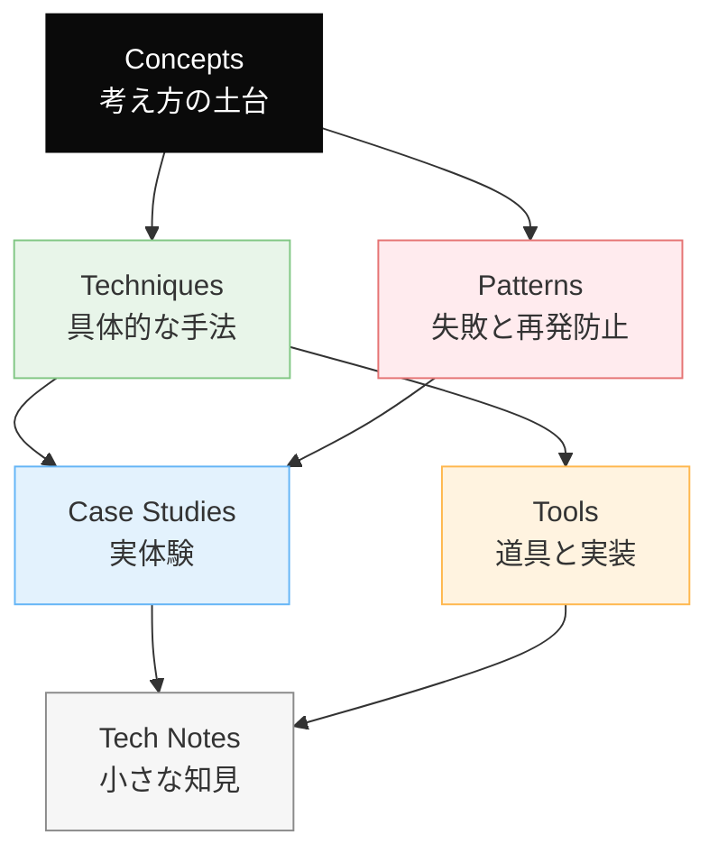
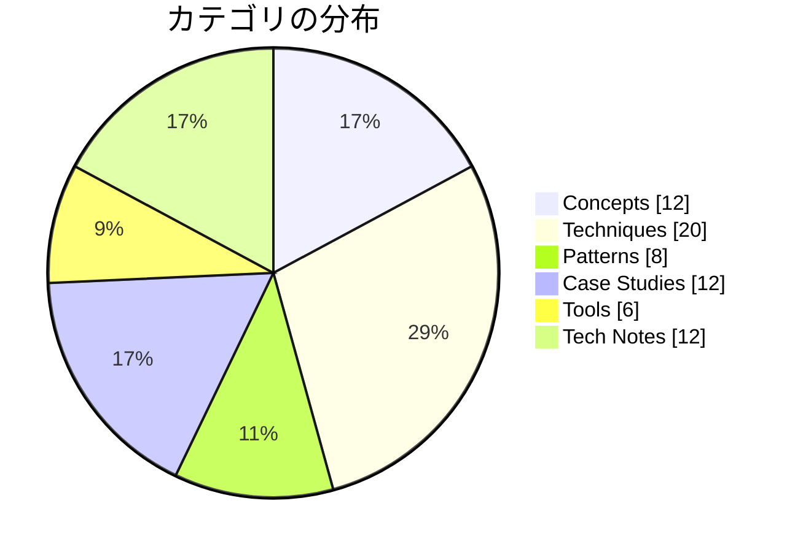

# Dinekt Knowledge Wiki

Claude Code と AI エージェントの設計・運用を続けるなかで積み上げてきた知見を、他のプロジェクトでも参照できる形でまとめたナレッジベースです。概念・手法・失敗パターン・道具・実際のケーススタディまでを横断して扱います。

  70 entries
  6 categories
  updated 2026-04-13

## カテゴリ構成

## カテゴリ別エントリ数

## はじめての方へ

**推奨の読み順**:

1. [Concepts](concepts/index.md) — 背景にある考え方を掴む
2. [Patterns](patterns/index.md) — 典型的な失敗と対策をチェックリストとして読む
3. [Techniques](techniques/index.md) — 設計手法として応用する
4. [Case Studies](case-studies/index.md) — 実例で理解を補強する

必要に応じて [Tools](tools/index.md) と [Tech Notes](tech-notes/index.md) を辞書的に参照してください。

## カテゴリ

-   __[Concepts](concepts/index.md)__

    ---

    AI 開発の根底にある概念・思想

    _12 entries_

-   __[Techniques](techniques/index.md)__

    ---

    エージェントやプロンプトの設計手法

    _20 entries_

-   __[Patterns](patterns/index.md)__

    ---

    失敗モードと再発防止のパターン集

    _8 entries_

-   __[Case Studies](case-studies/index.md)__

    ---

    実際に遭遇したケースと対応の記録

    _12 entries_

-   __[Tools](tools/index.md)__

    ---

    Dinekt が設計・運用している道具と実装

    _6 entries_

-   __[Tech Notes](tech-notes/index.md)__

    ---

    技術仕様・Tips・検証メモ

    _12 entries_

## 最近のエントリ

-   __[AI エージェント運用の 10 メトリクス](tech-notes/ai-エージェント運用の-10-メトリクス.md)__

    ---

    AI エージェントを本番運用する際、何を計測すべきかが曖昧だと改善できない。重要な 10 のメトリクスを 4 層で整理。 メトリクスの 4 層 品質層 1. 正答率（Accuracy） 評価セットでの…

-   __[情報過多コンテキストの 4 つの失敗モード](patterns/情報過多コンテキストの-4-つの失敗モード.md)__

    ---

    「コンテキストにたくさん情報を入れれば、精度が上がる」と思いがち。実は逆。情報過多のコンテキストは、かえって精度を落とす。 症状 4 つの失敗モード 1. 重要情報の見落とし (Lost in the…

-   __[AI プロダクトと倫理 — 7 つの観点](concepts/ai-プロダクトと倫理-7-つの観点.md)__

    ---

    AI を組み込んだプロダクトを作る際、技術・コスト・品質だけでなく、倫理的な考慮を避けられない論点として扱う必要がある。具体的な 7 つの観点を示す。 7 つの倫理的論点 1. 透明性（Transpa…

-   __[エージェントと協業する 1 日のワークフロー](techniques/エージェントと協業する-1-日のワークフロー.md)__

    ---

    AI エージェントと日常的に協業する開発者の、典型的な 1 日の流れ。実践的にエージェントをどう使いこなすかを時系列で示す。 1 日の流れ（俯瞰） 朝: ブリーフィング (30 分) 目的: 今日やる…

-   __[複雑なタスクを LLM に段階分解させて精度を上げた事例](case-studies/複雑なタスクを-llm-に段階分解させて精度を上げた事例.md)__

    ---

    「このデータから〇〇を抽出して」のような複雑な要求を 1 リクエストで処理しようとすると、精度が不安定になる。タスクを段階分解することで劇的に改善した事例。 発生した問題 ユーザーが「過去 3 ヶ月の…

-   __[AI エージェントが読みやすいドキュメントの書き方](techniques/ai-エージェントが読みやすいドキュメントの書き方.md)__

    ---

    AI エージェントが参照するドキュメントは、人間向けと書き方を変えると精度が大きく上がる。人間が読みやすい文章と、AI が解釈しやすい文章は、重なるが同じではない。 AI が解釈しやすい書き方 8 つ…

## 関連リンク

- [ナレッジマップ](map.md) — 概念の全体像を俯瞰する
- [チートシート](cheatsheet.md) — 忙しいときの早見表
- [用語集](glossary.md)
- [タグ一覧](tags.md)
- [Dinekt 公式サイト](https://dinekt.com)
