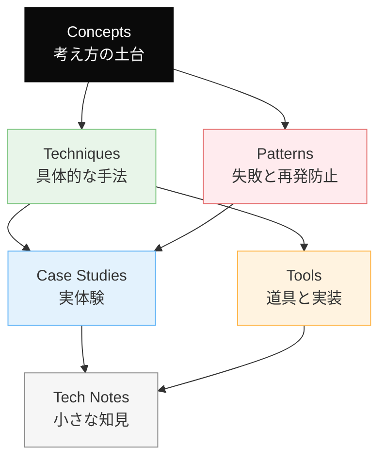
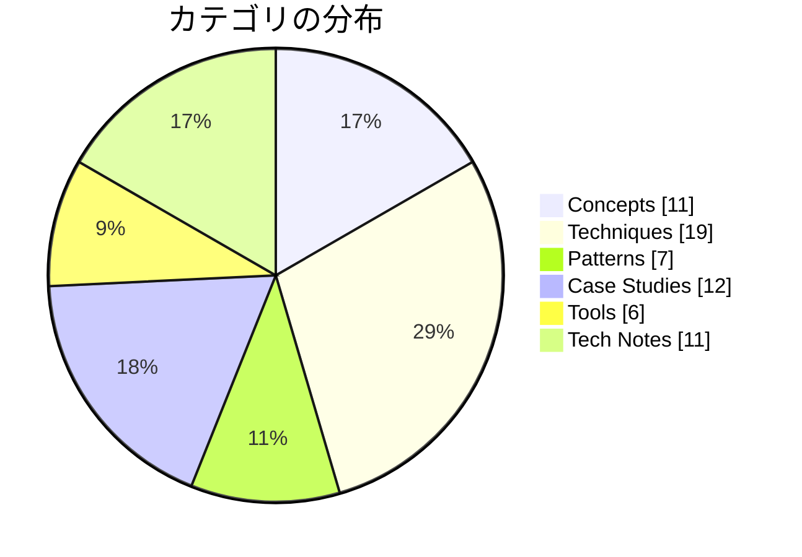

# Dinekt Knowledge Wiki

Claude Code と AI エージェントの設計・運用を続けるなかで積み上げてきた知見を、他のプロジェクトでも参照できる形でまとめたナレッジベースです。概念・手法・失敗パターン・道具・実際のケーススタディまでを横断して扱います。

  66 entries
  6 categories
  updated 2026-04-13

## カテゴリ構成

## カテゴリ別エントリ数

## はじめての方へ

**推奨の読み順**:

1. [Concepts](concepts/index.md) — 背景にある考え方を掴む
2. [Patterns](patterns/index.md) — 典型的な失敗と対策をチェックリストとして読む
3. [Techniques](techniques/index.md) — 設計手法として応用する
4. [Case Studies](case-studies/index.md) — 実例で理解を補強する

必要に応じて [Tools](tools/index.md) と [Tech Notes](tech-notes/index.md) を辞書的に参照してください。

## カテゴリ

-   __[Concepts](concepts/index.md)__

    ---

    AI 開発の根底にある概念・思想

    _11 entries_

-   __[Techniques](techniques/index.md)__

    ---

    エージェントやプロンプトの設計手法

    _19 entries_

-   __[Patterns](patterns/index.md)__

    ---

    失敗モードと再発防止のパターン集

    _7 entries_

-   __[Case Studies](case-studies/index.md)__

    ---

    実際に遭遇したケースと対応の記録

    _12 entries_

-   __[Tools](tools/index.md)__

    ---

    Dinekt が設計・運用している道具と実装

    _6 entries_

-   __[Tech Notes](tech-notes/index.md)__

    ---

    技術仕様・Tips・検証メモ

    _11 entries_

## 最近のエントリ

-   __[複雑なタスクを LLM に段階分解させて精度を上げた事例](case-studies/複雑なタスクを-llm-に段階分解させて精度を上げた事例.md)__

    ---

    「このデータから〇〇を抽出して」のような複雑な要求を 1 リクエストで処理しようとすると、精度が不安定になる。タスクを段階分解することで劇的に改善した事例。 発生した問題 ユーザーが「過去 3 ヶ月の…

-   __[AI エージェントが読みやすいドキュメントの書き方](techniques/ai-エージェントが読みやすいドキュメントの書き方.md)__

    ---

    AI エージェントが参照するドキュメントは、人間向けと書き方を変えると精度が大きく上がる。人間が読みやすい文章と、AI が解釈しやすい文章は、重なるが同じではない。 AI が解釈しやすい書き方 8 つ…

-   __[Claude Code を日々使い倒す 10 の小技](techniques/claude-code-を日々使い倒す-10-の小技.md)__

    ---

    Claude Code を日々の開発で使い倒している中で気付いた、小さいけど効く 10 の実践。1 つ 1 つは小さいが、合計すると体感が大きく変わる。 10 の小技 1. 最初に「役割」を明示する…

-   __[LLM レッドチーミング — 意図的な攻撃で安全性を検証する](techniques/llm-レッドチーミング-意図的な攻撃で安全性を検証する.md)__

    ---

    LLM を組み込んだアプリの安全性を検証するには、意図的に攻撃を試みるレッドチーミングが有効。実運用前に必ず通す工程にする。 レッドチーミングの位置づけ 評価セット（正常系の確認）と別物。攻撃者視点で…

-   __[評価セットを後回しにしてリリース後に立て直した事例](case-studies/評価セットを後回しにしてリリース後に立て直した事例.md)__

    ---

    新規の LLM 機能を作る際、評価セットを後回しにしたことで、本番リリース後に品質問題を抱えた事例と、そこからの立て直し。 発生した事象 新機能（ユーザー質問への自動回答）をリリース。開発中は目視確認…

-   __[ファインチューニング vs プロンプト — どちらを選ぶか](concepts/ファインチューニング-vs-プロンプト-どちらを選ぶか.md)__

    ---

    「モデルをファインチューニングすべきか、プロンプトで頑張るか」は AI 機能開発でよく議論になる。結論から言うと、プロンプトエンジニアリングで行けるところまで行くのが基本。ファインチューニングは最後の…

## 関連リンク

- [ナレッジマップ](map.md) — 概念の全体像を俯瞰する
- [チートシート](cheatsheet.md) — 忙しいときの早見表
- [用語集](glossary.md)
- [タグ一覧](tags.md)
- [Dinekt 公式サイト](https://dinekt.com)
