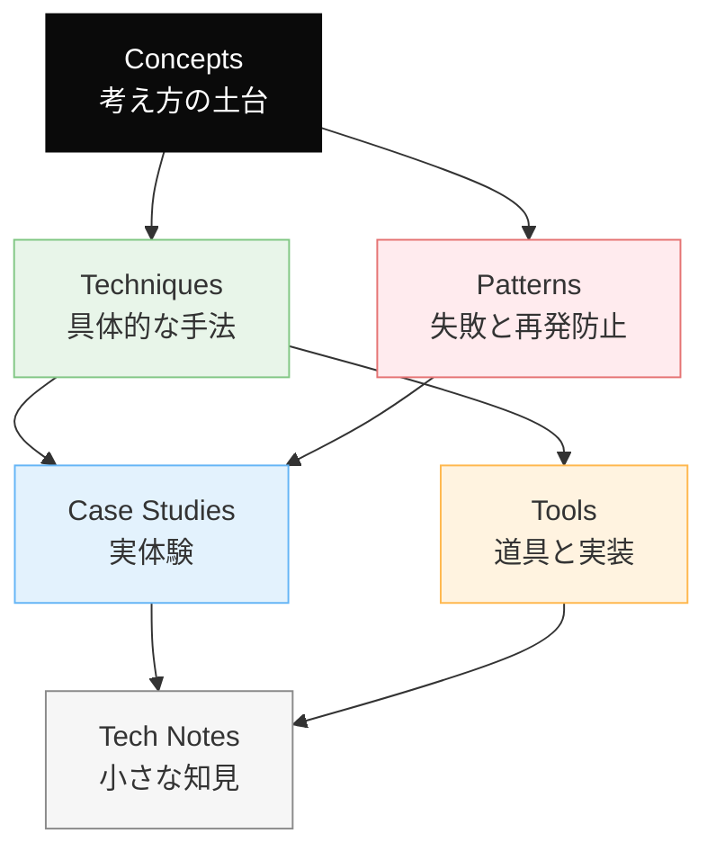

# Dinekt Knowledge Wiki

Claude Code と AI エージェントの設計・運用を続けるなかで積み上げてきた知見を、他のプロジェクトでも参照できる形でまとめたナレッジベースです。概念・手法・失敗パターン・道具・実際のケーススタディまでを横断して扱います。

  34 entries
  6 categories
  updated 2026-04-13

## カテゴリ構成

## はじめての方へ

**推奨の読み順**:

1. [Concepts](concepts/index.md) — 背景にある考え方を掴む
2. [Patterns](patterns/index.md) — 典型的な失敗と対策をチェックリストとして読む
3. [Techniques](techniques/index.md) — 設計手法として応用する
4. [Case Studies](case-studies/index.md) — 実例で理解を補強する

必要に応じて [Tools](tools/index.md) と [Tech Notes](tech-notes/index.md) を辞書的に参照してください。

## カテゴリ

-   __[Concepts](concepts/index.md)__

    ---

    AI 開発の根底にある概念・思想

    _6 entries_

-   __[Techniques](techniques/index.md)__

    ---

    エージェントやプロンプトの設計手法

    _9 entries_

-   __[Patterns](patterns/index.md)__

    ---

    失敗モードと再発防止のパターン集

    _3 entries_

-   __[Case Studies](case-studies/index.md)__

    ---

    実際に遭遇したケースと対応の記録

    _7 entries_

-   __[Tools](tools/index.md)__

    ---

    Dinekt が設計・運用している道具と実装

    _3 entries_

-   __[Tech Notes](tech-notes/index.md)__

    ---

    技術仕様・Tips・検証メモ

    _6 entries_

## 最近のエントリ

-   __[プロンプトインジェクション — LLM アプリの最重要セキュリティ論点](concepts/プロンプトインジェクション-llm-アプリの最重要セキュリティ論点.md)__

    ---

    LLM を組み込んだアプリで、ユーザー入力や外部データに仕込まれた悪意ある指示が LLM を操る攻撃。プロンプトインジェクションは LLM アプリのセキュリティで最も重要な論点。 攻撃パターン mer…

-   __[Few-shot Examples の効果的な設計](techniques/few-shot-examples-の効果的な設計.md)__

    ---

    LLM に「こういう形式で答えてほしい」と伝える最強の手段は、例を見せること。Fewshot examples を正しく設計すると、出力の品質と一貫性が大きく変わる。 なぜ例示が効くか 自然言語の指示…

-   __[LLM から構造化 JSON を確実に取り出す](techniques/llm-から構造化-json-を確実に取り出す.md)__

    ---

    LLM から構造化データ（JSON）を取り出す際、JSON Mode や Function Calling を使わないと、プレーンテキストの中に JSON が混じって返ってきて、パースに失敗しやすい。…

-   __[マルチエージェントの8つの失敗モード](patterns/マルチエージェントの8つの失敗モード.md)__

    ---

    複数のエージェントやセッションを同時・並列に運用する際に現れる筆者的な失敗モード。 8 つの失敗モード 一覧 mermaid mindmap root((マルチエージェント<br/失敗モード)) 記憶…

-   __[単一エージェントの7つのアンチパターン](patterns/単一エージェントの7つのアンチパターン.md)__

    ---

    Claude Code などシステムプロンプト主体のエージェント運用で繰り返し現れるアンチパターンと、その回避策。 7 つのアンチパターン 一覧 mermaid mindmap root((単一エージ…

-   __[Edge Runtime vs Node Runtime の使い分け](tech-notes/edge-runtime-vs-node-runtime-の使い分け.md)__

    ---

    Vercel（や Cloudflare Workers）の Edge Runtime は起動が速くグローバル分散できるが、Node.js API の大半が使えない。Node Runtime との使い分…

## 関連リンク

- [用語集](glossary.md)
- [タグ一覧](tags.md)
- [Dinekt 公式サイト](https://dinekt.com)
