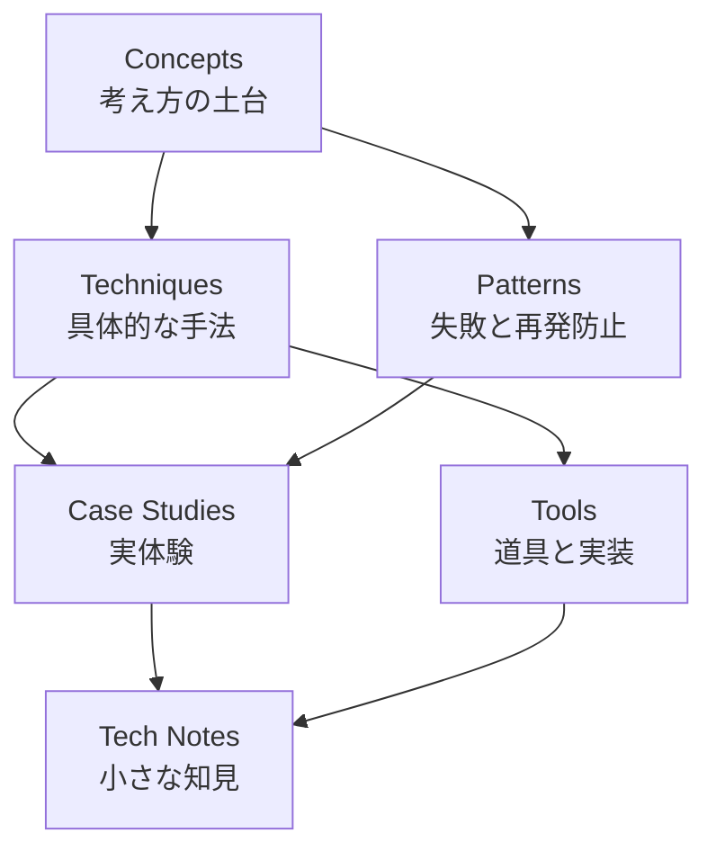
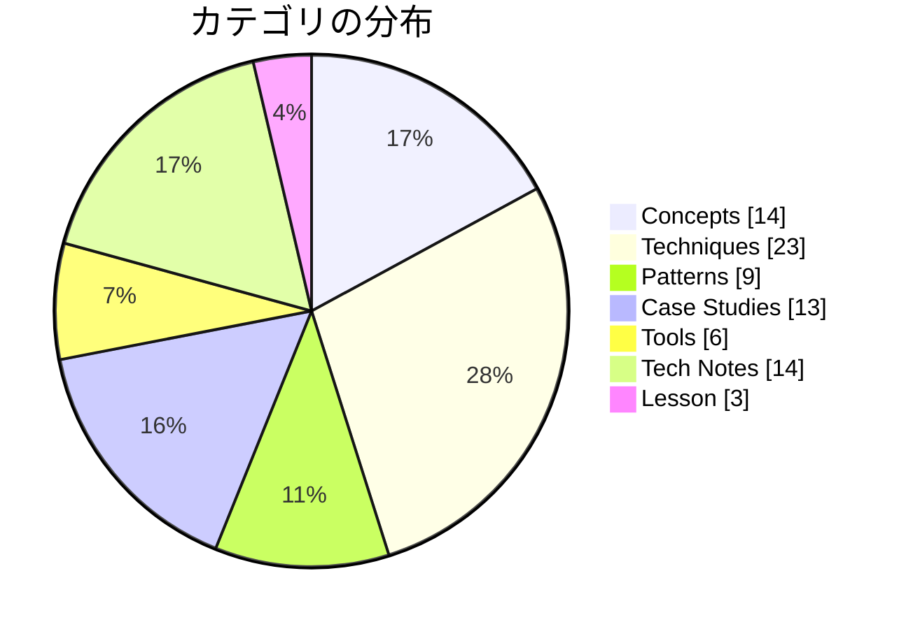

# Dinekt Knowledge Wiki

Claude Code と AI エージェントの設計・運用を続けるなかで積み上げてきた知見を、他のプロジェクトでも参照できる形でまとめたナレッジベースです。概念・手法・失敗パターン・道具・実際のケーススタディまでを横断して扱います。

  82 entries
  7 categories
  updated 2026-04-14

## カテゴリ構成

## カテゴリ別エントリ数

## はじめての方へ

**推奨の読み順**:

1. [Concepts](concepts/index.md) — 背景にある考え方を掴む
2. [Patterns](patterns/index.md) — 典型的な失敗と対策をチェックリストとして読む
3. [Techniques](techniques/index.md) — 設計手法として応用する
4. [Case Studies](case-studies/index.md) — 実例で理解を補強する

必要に応じて [Tools](tools/index.md) と [Tech Notes](tech-notes/index.md) を辞書的に参照してください。

## カテゴリ

-   __[Concepts](concepts/index.md)__

    ---

    AI 開発の根底にある概念・思想

    _14 entries_

-   __[Techniques](techniques/index.md)__

    ---

    エージェントやプロンプトの設計手法

    _23 entries_

-   __[Patterns](patterns/index.md)__

    ---

    失敗モードと再発防止のパターン集

    _9 entries_

-   __[Case Studies](case-studies/index.md)__

    ---

    実際に遭遇したケースと対応の記録

    _13 entries_

-   __[Tools](tools/index.md)__

    ---

    Dinekt が設計・運用している道具と実装

    _6 entries_

-   __[Tech Notes](tech-notes/index.md)__

    ---

    技術仕様・Tips・検証メモ

    _14 entries_

-   __[Lesson](lesson/index.md)__

    ---

    実体験から得た学び

    _3 entries_

## 最近のエントリ

-   __[AIエージェントセッションのトークン効率を構造化する](lesson/aiエージェントセッションのトークン効率を構造化する.md)__

    ---

    AIエージェント（Claude Code等）を使った開発で週次トークン上限に早期到達する場合、原因は『最高性能モデルでルーチン作業を実行』『同じファイルを複数回フルRead』『サブエージェントの完成原…

-   __[フレームワーク既定値は最後の手段として触る](lesson/フレームワーク既定値は最後の手段として触る.md)__

    ---

    Material for MkDocs・Next.js・Material UI・Tailwind UIなど完成度の高いフレームワークの既定挙動（z-index、focus管理、ナビゲーション、スクロー…

-   __[観察を先に、修正は後に — ランタイム挙動デバッグの鉄則](lesson/観察を先に修正は後に-ランタイム挙動デバッグの鉄則.md)__

    ---

    ブラウザDOM・サードパーティライブラリの出力・レンダリング後HTML・Shadow DOM・非同期描画など、ランタイムで動くものを扱うときは、修正コードを書く前に必ず実物の出力を観察する。コード読解…

-   __[Chrome 拡張 Manifest V3 での Content Script + Side Panel 連携](case-studies/chrome-拡張-manifest-v3-での-content-script-side-panel-連携.md)__

    ---

    Chrome 拡張 Manifest V3 で、Content Script（ページに注入するスクリプト）と Side Panel（ブラウザ右側のパネル UI）を連携させる際に遭遇した実装上の落とし穴…

-   __[Claude Code を使った効率的な不具合調査](case-studies/claude-code-を使った効率的な不具合調査.md)__

    ---

    不具合調査で Claude Code を使うと、「何となく修正して動いた」では終わらず、根本原因まで特定できる確率が大きく上がる。ただしやり方を間違えるとむしろ遅くなる。効率的な進め方を整理。 調査フ…

-   __[LLM エージェントに大規模リファクタリングを安全に任せる手順](case-studies/llm-エージェントに大規模リファクタリングを安全に任せる手順.md)__

    ---

    LLM エージェントに大規模な構造変更（リファクタリング）を任せる際、ナイーブに依頼すると既存挙動を壊す。段階分けと挙動保証の仕組みを先に作ってから進めるのが鉄則。 失敗パターン 成功させる 4 ステ…

## 関連リンク

- [ナレッジマップ](map.md) — 概念の全体像を俯瞰する
- [チートシート](cheatsheet.md) — 忙しいときの早見表
- [用語集](glossary.md)
- [タグ一覧](tags.md)

## Dinekt について

- [Dinekt 公式サイト](https://dinekt.com)
- [X (@dinekt_dev)](https://x.com/dinekt_dev)
- [Zenn](https://zenn.dev/dinekt)
