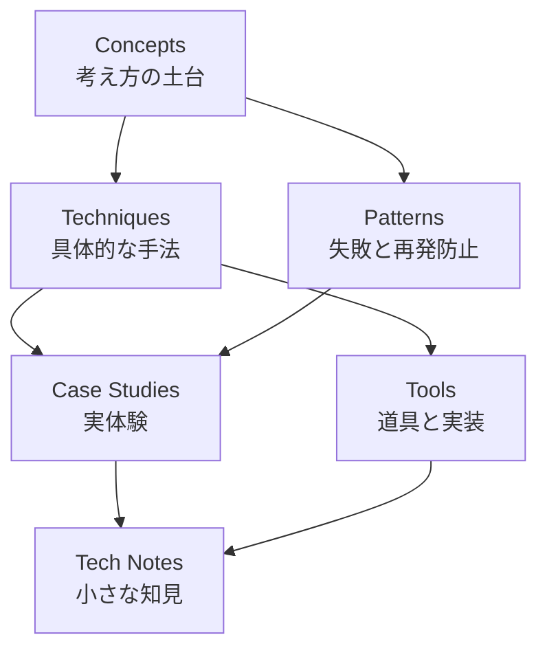
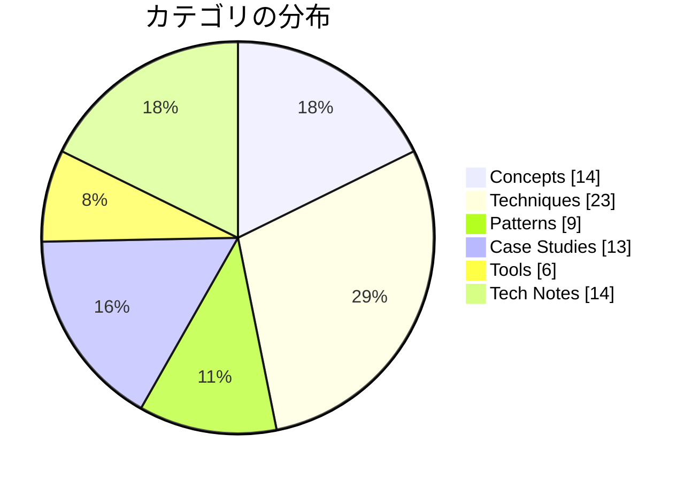

# Dinekt Knowledge Wiki

Claude Code と AI エージェントの設計・運用を続けるなかで積み上げてきた知見を、他のプロジェクトでも参照できる形でまとめたナレッジベースです。概念・手法・失敗パターン・道具・実際のケーススタディまでを横断して扱います。

  79 entries
  6 categories
  updated 2026-04-13

## カテゴリ構成

## カテゴリ別エントリ数

## はじめての方へ

**推奨の読み順**:

1. [Concepts](concepts/index.md) — 背景にある考え方を掴む
2. [Patterns](patterns/index.md) — 典型的な失敗と対策をチェックリストとして読む
3. [Techniques](techniques/index.md) — 設計手法として応用する
4. [Case Studies](case-studies/index.md) — 実例で理解を補強する

必要に応じて [Tools](tools/index.md) と [Tech Notes](tech-notes/index.md) を辞書的に参照してください。

## カテゴリ

-   __[Concepts](concepts/index.md)__

    ---

    AI 開発の根底にある概念・思想

    _14 entries_

-   __[Techniques](techniques/index.md)__

    ---

    エージェントやプロンプトの設計手法

    _23 entries_

-   __[Patterns](patterns/index.md)__

    ---

    失敗モードと再発防止のパターン集

    _9 entries_

-   __[Case Studies](case-studies/index.md)__

    ---

    実際に遭遇したケースと対応の記録

    _13 entries_

-   __[Tools](tools/index.md)__

    ---

    Dinekt が設計・運用している道具と実装

    _6 entries_

-   __[Tech Notes](tech-notes/index.md)__

    ---

    技術仕様・Tips・検証メモ

    _14 entries_

## 最近のエントリ

-   __[Chrome 拡張 Manifest V3 での Content Script + Side Panel 連携](case-studies/chrome-拡張-manifest-v3-での-content-script-side-panel-連携.md)__

    ---

    Chrome 拡張 Manifest V3 で、Content Script（ページに注入するスクリプト）と Side Panel（ブラウザ右側のパネル UI）を連携させる際に遭遇した実装上の落とし穴…

-   __[LLM モデル / プロバイダー切り替え時の互換性問題と段階移行](case-studies/llm-モデル-プロバイダー切り替え時の互換性問題と段階移行.md)__

    ---

    コストや性能を理由に、運用中の LLM を別のモデル・プロバイダーに切り替える場面は増えている。互換性は完全ではない。事前に想定すべき差分と、段階的な移行手順。 遭遇しうる差分 よく遭遇する具体的な問…

-   __[Next.js + Supabase + Prisma 併用時の認証と RLS の扱い方](case-studies/nextjs-supabase-prisma-併用時の認証と-rls-の扱い方.md)__

    ---

    Next.js アプリで Supabase（認証・RLS 付き Postgres）と Prisma（型付き ORM）を併用する際、認証情報の同期で詰まる問題と対処。 併用の基本構造 ハマりどころ 1.…

-   __[AI プロダクトと倫理 — 7 つの観点](concepts/ai-プロダクトと倫理-7-つの観点.md)__

    ---

    AI を組み込んだプロダクトを作る際、技術・コスト・品質だけでなく、倫理的な考慮を避けられない論点として扱う必要がある。具体的な 7 つの観点を示す。 7 つの倫理的論点 1. 透明性（Transpa…

-   __[AI 開発の速度と品質は両立できる](concepts/ai-開発の速度と品質は両立できる.md)__

    ---

    AI 開発では「速く作る」と「品質を担保する」がトレードオフに見えるが、実は両立可能。評価セット・自動化・仕組みが速度を下げず、品質を上げる。 見かけのトレードオフ 「速く作ると雑」「丁寧にやると遅い…

-   __[Drift Detection — 実装が意図から乖離する現象を検出する](concepts/drift-detection-実装が意図から乖離する現象を検出する.md)__

    ---

    AI エージェントによる実装が、当初の意図・仕様から徐々に乖離していく現象。これを検出して巻き戻す仕組みが drift-detection。 発生と検出のメカニズム なぜ drift が起きるか -…

## 関連リンク

- [ナレッジマップ](map.md) — 概念の全体像を俯瞰する
- [チートシート](cheatsheet.md) — 忙しいときの早見表
- [用語集](glossary.md)
- [タグ一覧](tags.md)

## Dinekt について

- [Dinekt 公式サイト](https://dinekt.com)
- [X (@dinekt_dev)](https://x.com/dinekt_dev)
- [Zenn](https://zenn.dev/dinekt)
