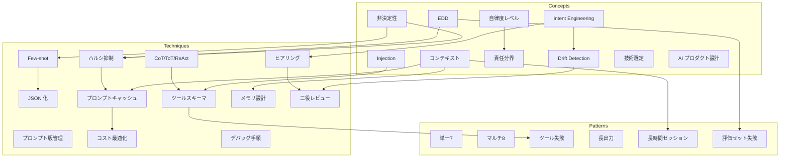
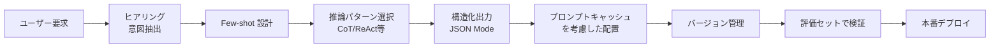
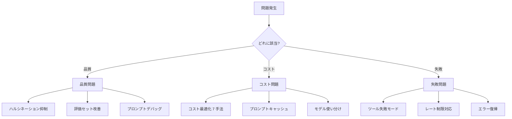

# ナレッジマップ

本 Wiki に含まれる主要な概念・手法・パターンの関係を俯瞰する。

## 全体像

## プロンプト設計の流れ

## トラブル対応の流れ

## カテゴリ別索引

- [Concepts](concepts/index.md) — 考え方の土台
- [Techniques](techniques/index.md) — 具体的な手法
- [Patterns](patterns/index.md) — 失敗と再発防止
- [Case Studies](case-studies/index.md) — 実体験
- [Tools](tools/index.md) — 道具と実装
- [Tech Notes](tech-notes/index.md) — 小さな知見

## このページの使い方

- **初めて読む方**: まず「全体像」で位置関係を眺めてから、気になったカテゴリに深入り
- **特定の問題がある方**: 「トラブル対応の流れ」で該当する問題を見つけてジャンプ
- **プロンプト改善したい方**: 「プロンプト設計の流れ」を順に読む
