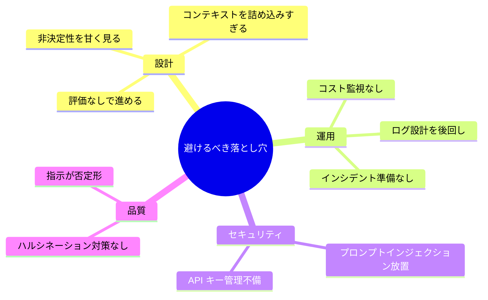
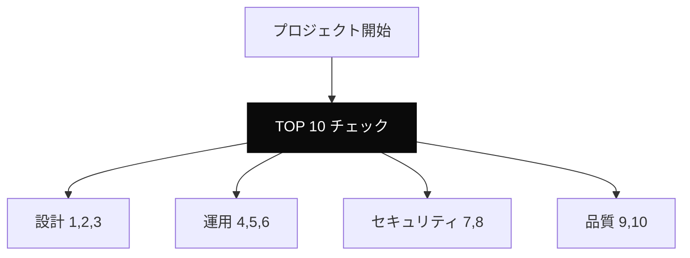

---
tags:
  - checklist
  - anti-pattern
  - summary
---

# LLM 開発で避けるべき落とし穴 TOP 10

Patterns
#checklist
#anti-pattern
#summary
updated 2026-04-13
5 min read

本 Wiki の各エントリから抽出した、**LLM / AI エージェント開発で絶対に避けるべき落とし穴**を 10 個に絞ってまとめる。新規プロジェクト開始時のチェックリストとして使える。

### TOP 10

## 1. 評価セットを作らずに本番投入

**何が起きるか**: 品質が感覚頼みになり、改善が進まない。本番で問題発覚。

**対策**: 開発初日から評価セットを作る。最低 50 件、成功・失敗・境界を網羅。

→ [評価駆動で LLM 機能をゼロから作った 5 日間の流れ](../case-studies/評価駆動で-llm-機能をゼロから作った-5-日間の流れ.md)

## 2. コンテキストを詰め込みすぎる

**何が起きるか**: 精度低下、コスト膨張、レイテンシ悪化。

**対策**: 関連度で絞る。タスクに応じた最適量を実験で決める。

→ [情報過多コンテキストの 4 つの失敗モード](情報過多コンテキストの-4-つの失敗モード.md)

## 3. 非決定性を「バグ」として扱う

**何が起きるか**: 「毎回同じ回答」を求めて消耗、統計的改善ができない。

**対策**: 非決定性を前提に、決定論的ロジックでサンドイッチする設計。

→ [LLM の非決定性を前提に設計する](../concepts/llm-の非決定性を前提に設計する.md)

## 4. ログ設計を後回し

**何が起きるか**: 本番で問題が起きても再現・分析ができない。改善ループが回らない。

**対策**: 入力・出力・メタ情報・結果を**本番投入前**から記録する仕組みに。

→ [LLM アプリのログ設計で残すべき 5 項目](../tech-notes/llm-アプリのログ設計で残すべき-5-項目.md)

## 5. コスト監視なし

**何が起きるか**: 想定の 10 倍になってから気づく。サービス停止を迫られる。

**対策**: 日次ダッシュボード、予算アラート、上限設定の 3 点を最初から。

→ [LLM コストを減らす 7 つの手法](../techniques/llm-コストを減らす-7-つの手法-優先順位つき.md)

## 6. インシデント対応を想定していない

**何が起きるか**: 発生時に大混乱。判断が遅れ、被害が拡大。

**対策**: 分類ごとの Runbook、オンコール体制、定期ドリル。

→ [LLM アプリのインシデント対応](../tech-notes/llm-アプリのインシデント対応.md)

## 7. プロンプトインジェクション対策なし

**何が起きるか**: 悪意ある入力で意図しない出力・情報漏洩・不正操作。

**対策**: 多層防御（入力フィルタ・プロンプト設計・ツール制限・出力検査）。

→ [プロンプトインジェクション — LLM アプリの最重要セキュリティ論点](../concepts/プロンプトインジェクション-llm-アプリの最重要セキュリティ論点.md)

## 8. API キー管理の不備

**何が起きるか**: Git コミット事故・クライアント露出等で漏洩。高額な不正利用。

**対策**: 環境変数・gitignore・pre-commit hook・用途別キー・ローテーション。

→ [LLM API キーの管理と漏洩防止](../tech-notes/llm-api-キーの管理と漏洩防止.md)

## 9. ハルシネーション対策なし

**何が起きるか**: 誤情報を自信を持って配信。ユーザー信頼失墜。

**対策**: RAG・ツール利用・JSON 化・Citations・検証者 LLM の層を重ねる。

→ [ハルシネーションを抑える 7 つの手法](../techniques/ハルシネーションを抑える-7-つの手法.md)

## 10. 指示を否定形で書く

**何が起きるか**: LLM は否定命令の遵守率が低く、**破られやすい**。

**対策**: 肯定形に書き換える。「削除しない」→「保持する」。

→ [単一エージェントの 7 つのアンチパターン](単一エージェントの7つのアンチパターン.md)

### サマリマップ

### 使い方

- **新規プロジェクト開始時**: 10 項目を確認。対応策を準備してから着手
- **既存プロジェクトの健康診断**: 10 項目で自己評価。未対応があれば計画的に対応
- **チーム共有**: オンボーディング資料として配布

### まとめ

LLM / AI エージェント開発の落とし穴は**共通のパターン**がある。10 個を事前に知っておけば、**他のプロジェクトが踏んだ地雷を避けられる**。このリストは開発開始時のチェックリストとして定期的に見直す。

## 関連エントリ

- [エージェント運用の失敗モード一覧と対策マップ](エージェント運用の失敗モード一覧と対策マップ.md)
- [単一エージェントの7つのアンチパターン](単一エージェントの7つのアンチパターン.md)
- [評価セット設計の 6 つのアンチパターン](評価セット設計の-6-つのアンチパターン.md)

  

  
[単一エージェントの7つのアンチパターン](単一エージェントの7つのアンチパターン.md) →

