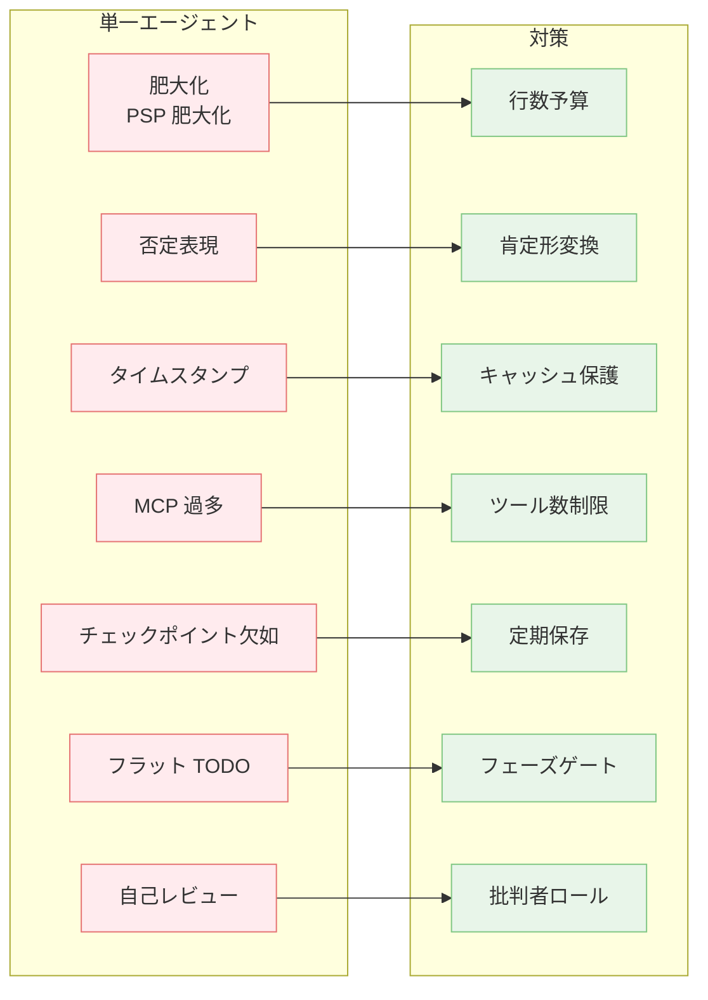

---
tags:
  - anti-pattern
  - failure-mode
  - checklist
---

# エージェント運用の失敗モード一覧と対策マップ

Patterns
#anti-pattern
#failure-mode
#checklist
updated 2026-04-13
4 min read

単一エージェント運用の典型的な 7 つのアンチパターンと、マルチエージェント運用で頻出する 8 つの失敗モードに対する、実装可能な対策の対応表。個別の解説は各エントリを参照。

### パターンと対策の対応図

### 単一エージェント運用

| # | アンチパターン | 筆者的な対策 |
|---|---------------|-------------|
| 1 | システムプロンプト肥大化 | 行数予算を設け、詳細は外部ドキュメントへ分離 |
| 2 | 否定表現の多用 | 肯定形に書き換え |
| 3 | タイムスタンプ混入 | プロンプトキャッシュを壊さない位置に置く |
| 4 | MCP 過多 | 6 本以下を目安に絞る |
| 5 | チェックポイント欠如 | 10〜15 分ごとの保存ルール |
| 6 | フラット TODO | フェーズゲート付きに分割 |
| 7 | 自己レビュー | 別ロールのレビュアーを配置 |

### マルチエージェント運用

| # | 失敗モード | 筆者的な対策 |
|---|-----------|-------------|
| 1 | Context Compression Amnesia | 重要決定を外部ファイルに永続化 |
| 2 | Self-Review Blindness | 批判者ロール分離 |
| 3 | Mid-Task Failure | チェックポイント戦略 |
| 4 | Concurrent File Edit Conflicts | ファイル所有権の事前宣言 |
| 5 | Flat Task List Inflexibility | フェーズゲート導入 |
| 6 | Lost Cross-Session Memory | 永続化ファイル |
| 7 | Knowledge Death | ADR 形式で意思決定記録 |
| 8 | Token Waste During Idleness | 実験ごとの時間上限 |

### 使い方

自チームのエージェント運用をこの 15 項目でセルフチェックし、該当する列の対策を出発点として具体化する。

## 参考ソース

- <https://cogentinfo.com/resources/when-ai-agents-collide-multi-agent-orchestration-failure-playbook-for-2026>
- <https://www.mindstudio.ai/blog/ai-agent-failure-pattern-recognition>

## 関連エントリ

- [LLM 開発で避けるべき落とし穴 TOP 10](llm-開発で避けるべき落とし穴-top-10.md)
- [ツール実行の 5 つの失敗モード](ツール実行の-5-つの失敗モード.md)
- [マルチエージェントの8つの失敗モード](マルチエージェントの8つの失敗モード.md)

  
← [評価セット設計の 6 つのアンチパターン](評価セット設計の-6-つのアンチパターン.md)

  

