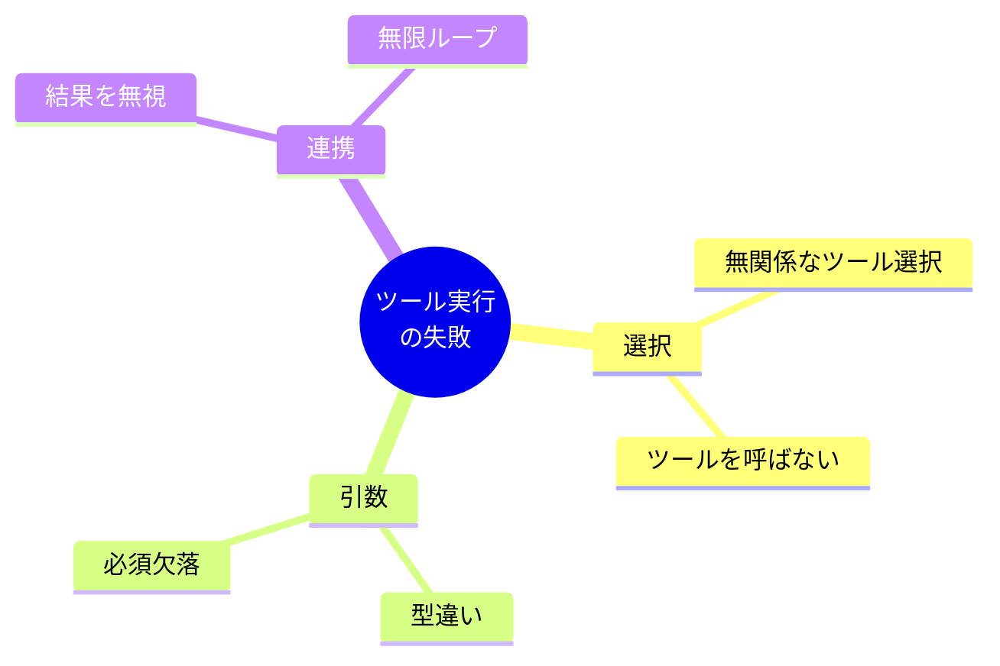
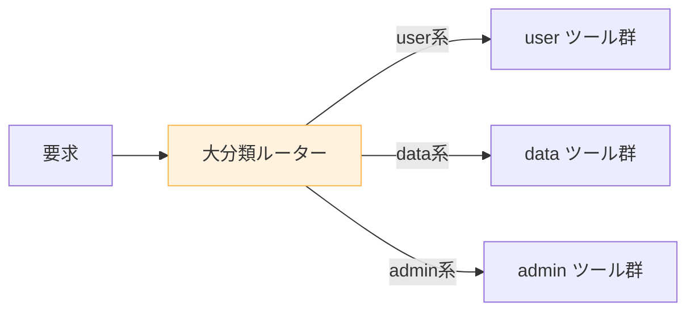
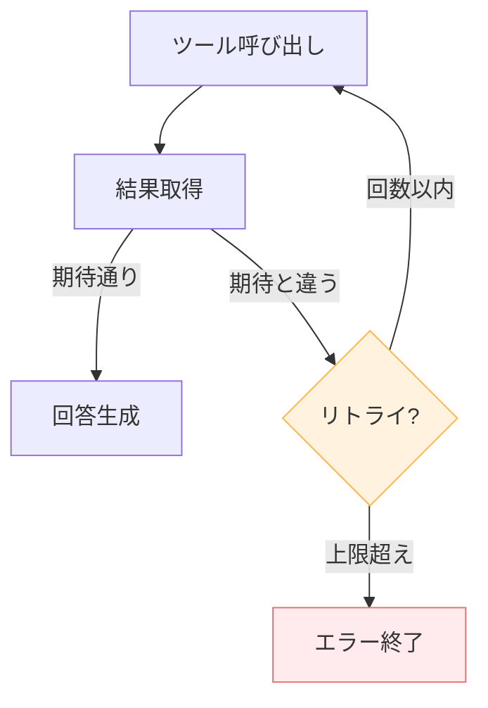

---
tags:
  - tool-use
  - failure-mode
  - patterns
---

# ツール実行の 5 つの失敗モード

<div class="dnk-meta" markdown>
<span class="pill cat">Patterns</span>
<span class="pill">#tool-use</span>
<span class="pill">#failure-mode</span>
<span class="pill">#patterns</span>
<span class="pill">updated 2026-04-13</span>
<span class="pill">4 min read</span>
</div>

LLM にツール（関数）を使わせる設計は、**ツール呼び出し特有の失敗モード**を抱える。筆者的な 5 パターンと対策を整理。

### 5 つの失敗モード



## 1. 無関係なツールを選ぶ

**症状**: 「天気を知りたい」と言われて、`search_users` を呼ぶ。

- **原因**: ツール説明が曖昧、ツール数が多すぎる
- **対策**:
  - ツール説明に**いつ使うか**を明記
  - 使用頻度が低いツールは削除
  - ツール数が 10 を超えたらグルーピング



## 2. ツールを呼ばない

**症状**: ツールを呼べば正確に答えられる質問なのに、LLM が記憶だけで答えてしまう。

- **原因**: ツールの説明に「いつ使うべきか」が書かれていない
- **対策**: 「以下のケースで必ず呼び出すこと」と明示

```
description: "ユーザー情報を取得する。
ユーザー名・ID・プロフィールを回答する前に、必ずこのツールで最新情報を取得すること。"
```

## 3. 引数の型違い・必須欠落

**症状**: 必須引数を省略、または型を間違えて呼び出す。

- **原因**: スキーマが緩い、必須指定なし
- **対策**:
  - 列挙型で選択肢を絞る
  - `required` で必須を明示
  - 引数ごとに説明を書く

## 4. ツール結果を無視する

**症状**: ツールを呼んだのに、結果を使わず自分の記憶で回答する。

- **原因**: プロンプトで「ツール結果を必ず反映せよ」と指示していない
- **対策**:
  - 「ツール呼び出しの結果に基づいて回答してください」と明記
  - ツール結果を無視した場合の例を few-shot で見せる

## 5. 無限ループ

**症状**: ツール呼び出し→結果→再度同じツール呼び出し、を繰り返す。

- **原因**: 終了条件が不明確、結果から次のアクションを導けない
- **対策**:
  - ツール呼び出し回数の上限を設ける（10 回等）
  - 同じツールを連続 3 回呼んだら停止する
  - 結果が期待と違う場合の fallback を指示



### 予防策

**1. ツール呼び出しログを残す**

どのツールを何回、どの引数で呼んだか記録する。無限ループや選択ミスの検出に使う。

**2. 評価セットにツール利用ケースを含める**

「この質問ではこのツールを呼んでほしい」という期待値を評価セットに入れる。

**3. Graceful degradation**

ツールが失敗したとき、LLM が潔く諦めて「ツールが使えませんでした」と返す設計にする。勝手に代替を考えさせない。

### チェックリスト

- [ ] ツール説明に「いつ使うか」が書かれている
- [ ] 必須引数が `required` で明示されている
- [ ] 列挙型で選択肢を絞っている
- [ ] ツール呼び出しの上限回数を設定
- [ ] ツール結果の反映を明示的に指示
- [ ] ツール呼び出しログを記録している

### まとめ

ツール実行は LLM の能力を大きく広げるが、**ツール定義の品質**と**運用制限**が伴わないと、むしろ失敗の温床になる。定義と運用の両輪で設計する。


## 関連エントリ

- [エージェント運用の失敗モード一覧と対策マップ](エージェント運用の失敗モード一覧と対策マップ.md)
- [マルチエージェントの8つの失敗モード](マルチエージェントの8つの失敗モード.md)
- [情報過多コンテキストの 4 つの失敗モード](情報過多コンテキストの-4-つの失敗モード.md)


<div class="dnk-prev-next" markdown>
  <div class="prev">← [マルチエージェントの8つの失敗モード](マルチエージェントの8つの失敗モード.md)</div>
  <div class="next">[情報過多コンテキストの 4 つの失敗モード](情報過多コンテキストの-4-つの失敗モード.md) →</div>
</div>
