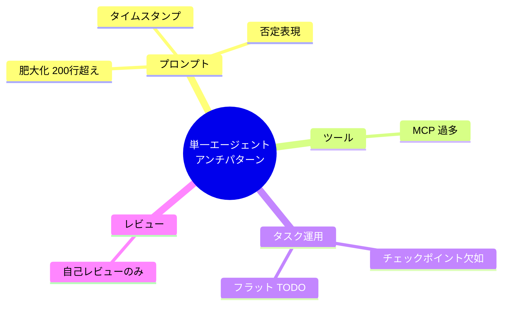

---
tags:
  - claude-code
  - anti-pattern
  - single-agent
  - prompt-design
---

# 単一エージェントの7つのアンチパターン

Patterns
#claude-code
#anti-pattern
#single-agent
#prompt-design
updated 2026-04-13
3 min read

Claude Code などシステムプロンプト主体のエージェント運用で繰り返し現れるアンチパターンと、その回避策。

### 7 つのアンチパターン 一覧

## 1. システムプロンプトを 200 行以上書く

指示予算（実質 100〜150 命令）を超えると、後半の指示が無視されやすくなる。

- **対策**: 30〜60 行に収める。詳細は ADR や別ドキュメントに分離する

## 2. 「〜しないこと」「〜禁止」で指示を書く

LLM は否定命令の遵守率が低い。禁止表現は破られやすい。

- **対策**: 肯定形に書き換える。例：「テストファイルを削除しないこと」→「テストファイルは保持すること」

## 3. タイムスタンプをシステムプロンプトに入れる

日時を埋め込むとプロンプトキャッシュが毎リクエスト無効化され、レイテンシとコストが跳ね上がる。

- **対策**: タイムスタンプはユーザーメッセージ側に置く。システムプロンプトに日時を書かない
- **例外**: ハーネス側が固定位置に注入するタイムスタンプ（`# currentDate` 相当）はキャッシュを壊さない

## 4. MCP を多数同時有効化する

ツール定義がコンテキストの 10% を超えると、Tool Search の自動遅延ロードが発動するが、それでも無駄が残る。

- **対策**: 不要な MCP は無効化する。目安は 6 本以下。7 本超は見直しの合図

## 5. チェックポイントなしで 30 分以上のタスクを実行する

エージェントが途中で死亡すると作業が全て消失する。

- **対策**: 10〜15 分ごとに git commit またはファイル保存のチェックポイントを挟む
- エージェント定義側に「一定時間ごとに成果をファイル保存する」旨を含める

## 6. 長大な TODO リストを 1 ファイルに全部書く

回復ポイントがなく、進捗不明、エージェントが方向を見失う。

- **対策**: フェーズゲート（Briefing → Planning → 実装 → Review）で分割する
- ファイルも分ける。1 ファイル 1 フェーズ

## 7. 同一モデルで自己レビューする

自分が書いたコードの問題を自分で見つけるのは困難（Self-Review Blindness）。

- **対策**: 別ロールのエージェント（批判者）にレビューさせる
- コードレビュー専用のサブエージェントを持つ

## 参考ソース

- <https://code.claude.com/docs/en/best-practices>
- <https://www.eesel.ai/blog/claude-code-best-practices>
- <https://www.builder.io/blog/claude-code-tips-best-practices>
- <https://achan2013.medium.com/ai-agent-anti-patterns-part-1-architectural-pitfalls-that-break-enterprise-agents-before-they-32d211dded43>
- <https://www.mindstudio.ai/blog/ai-agent-failure-pattern-recognition>

## 関連エントリ

- [LLM 開発で避けるべき落とし穴 TOP 10](llm-開発で避けるべき落とし穴-top-10.md)
- [エージェント運用の失敗モード一覧と対策マップ](エージェント運用の失敗モード一覧と対策マップ.md)
- [評価セット設計の 6 つのアンチパターン](評価セット設計の-6-つのアンチパターン.md)

  <a class="prev" href="../llm-開発で避けるべき落とし穴-top-10/">←LLM 開発で避けるべき落とし穴 TOP 10</a>
  <a class="next" href="../マルチエージェントの8つの失敗モード/">マルチエージェントの8つの失敗モード→</a>

