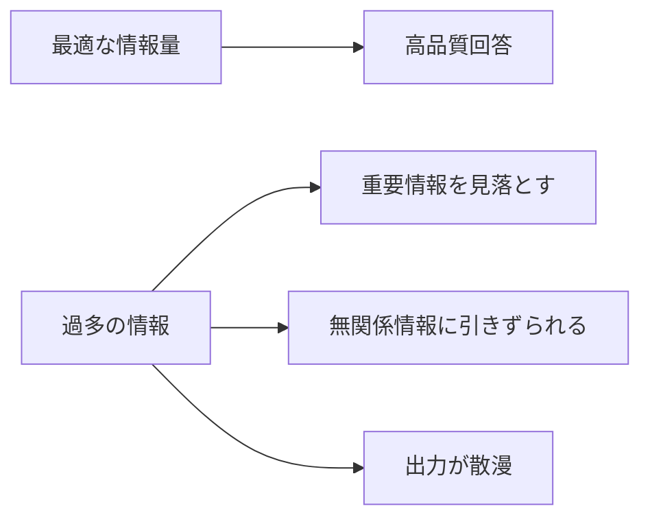
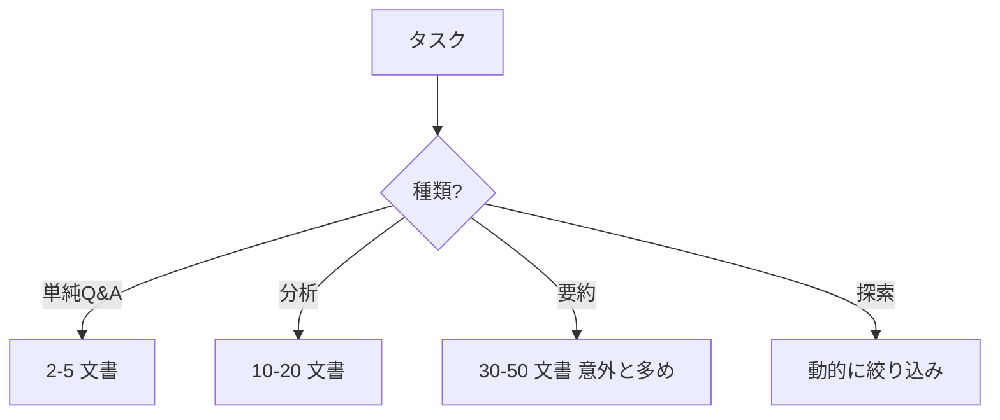

---
tags:
  - context
  - overload
  - patterns
---

# 情報過多コンテキストの 4 つの失敗モード

Patterns
#context
#overload
#patterns
updated 2026-04-13
4 min read

「コンテキストにたくさん情報を入れれば、精度が上がる」と思いがち。**実は逆**。情報過多のコンテキストは、かえって精度を落とす。

### 症状

### 4 つの失敗モード

## 1. 重要情報の見落とし (Lost in the Middle)

長いコンテキストの**中央部**にある情報を、LLM はしばしば見落とす。

- **症状**: 30 件の文書を渡して、真ん中の文書の情報を無視する
- **対策**: 重要情報は**先頭か末尾**に配置する

## 2. 無関係情報への引きずられ

質問と関係ない情報が混ざると、LLM はそれを引用したり、推論を歪められる。

- **症状**: 質問と関係ない過去の会話を引用して「〇〇と言っていましたよね」と答える
- **対策**: 関連度フィルタで絞り込んでから渡す

## 3. 出力の散漫

コンテキストが多いと、**全ての情報を盛り込もう**として、回答が長く散漫になる。

- **症状**: 「3 文で答えて」と言ってるのに 10 段落返ってくる
- **対策**: 出力制限を厳格に、コンテキストも絞る

## 4. トークン消費の膨張

使われない情報までトークンを消費して、コストとレイテンシが悪化。

- **症状**: 毎リクエストで 20,000 トークン消費、ヒット率が低い
- **対策**: 動的に関連度検索し、必要な分だけ含める

### 適切な情報量の目安

### 対策のテクニック

**1. 関連度スコアで絞り込む**

ベクトル検索で類似度スコアを取得し、上位 N 件だけを渡す。N は実験で決める。

**2. 段階的に絞り込む（Hierarchical Retrieval）**

最初は広く検索し、結果を要約してから再検索する。

    Phase 1: 50 件検索 → 各文書から要約を生成
    Phase 2: 要約から関連度を再評価 → 上位 10 件を選出
    Phase 3: 選出した 10 件の原文を使って回答生成

**3. 「何を知らなくていいか」を判定する**

「これは今回のタスクに不要」と判定する前処理を入れる。

**4. 文書のメタデータで先に絞る**

- 日付範囲（最新 3 ヶ月のみ）
- カテゴリ（該当する製品ラインのみ）
- 権限（ユーザーが見られる範囲のみ）

ベクトル検索の前に**決定論的フィルタ**を挟むと、コストが下がる。

### 測定方法

情報過多になっていないかは、**実験で確かめる**。

    # コンテキスト量を変えて精度を比較
    for n_docs in [3, 5, 10, 20, 30]:
        accuracy = evaluate(n_docs=n_docs)
        print(f"{n_docs} docs: {accuracy}%")

精度が頭打ちになる数が、その用途での上限。

### アンチパターン

- **「念のため全部入れておく」**: コストとレイテンシを無視して精度も下がる
- **ベクトル検索の Top-K を高めに固定**: タスクによって最適な K は違う
- **関連度閾値を設定しない**: 低スコアでも拾ってしまうと、ノイズが増える
- **同じコンテキストを全タスクで使い回す**: タスクごとに最適な情報量が違う

### チェックリスト

- [ ] コンテキスト量と精度の関係を実験で測定した
- [ ] 関連度フィルタを入れている
- [ ] 最新情報が中央に埋もれていない
- [ ] 決定論的フィルタで事前に絞っている
- [ ] タスクに応じてコンテキスト量を変えている
- [ ] 使われていない情報を定期的に棚卸しする

### まとめ

コンテキストは「多いほど良い」ではなく「**適切な量**が良い」。情報過多は精度・コスト・レイテンシのすべてで不利。**実験で最適量を探し、動的に絞り込む**設計にする。

### 関連

- [コンテキストは有限で劣化する資源である](../concepts/コンテキストは有限で劣化する資源である.md)
- [RAG のチャンクサイズを選ぶ基準](../techniques/rag-のチャンクサイズを選ぶ基準.md)

## 関連エントリ

- [ツール実行の 5 つの失敗モード](ツール実行の-5-つの失敗モード.md)
- [長時間セッションで遭遇する 6 つの失敗パターン](長時間セッションで遭遇する-6-つの失敗パターン.md)
- [ADR 参照コマンドによる意思決定の継承](../tools/adr-参照コマンドによる意思決定の継承.md)

  
← [ツール実行の 5 つの失敗モード](ツール実行の-5-つの失敗モード.md)

  
[長い出力を生成させるときの 5 つの失敗](長い出力を生成させるときの-5-つの失敗.md) →

