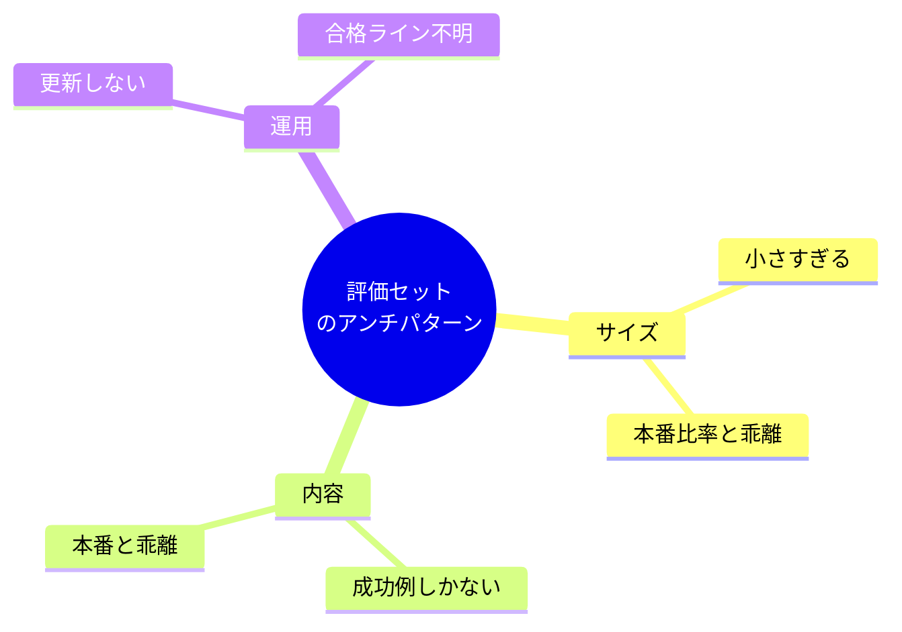
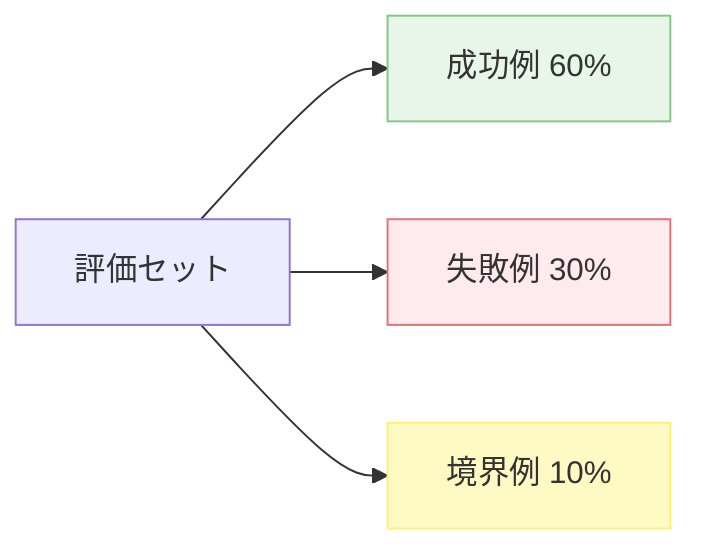
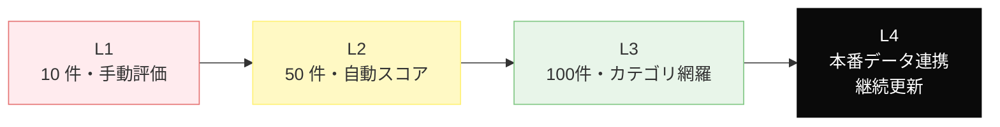

---
tags:
  - eval
  - anti-pattern
  - quality
---

# 評価セット設計の 6 つのアンチパターン

Patterns
#eval
#anti-pattern
#quality
updated 2026-04-13
4 min read

LLM 機能の品質を保つには評価セットが要だが、**評価セットの設計自体にアンチパターン**がある。よく遭遇する 6 つを挙げる。

### 典型的な失敗の分類

## 1. サンプルが少なすぎる

**症状**: 評価セットが 5〜10 件しかなく、合格率が不安定。

- **影響**: ノイズに埋もれて本当の改善が見えない
- **対策**: 最低 50 件、できれば 100 件以上。本番で起きうる筆者パターンを網羅

## 2. 成功例しかない

**症状**: 「これで正しく答えられる」例だけ集めている。

- **影響**: 失敗すべき入力で失敗することを検証できない。悪意ある入力・曖昧な入力に対する挙動が未検査
- **対策**: **失敗例を必ず含める**。期待通り拒否する入力、曖昧で確認を求める入力、無関係な入力

## 3. 本番データと乖離している

**症状**: 評価セットは綺麗な日本語、本番ではタイポ・敬語崩壊・絵文字が混ざる。

- **影響**: 評価で合格、本番で落ちる
- **対策**: 本番ログから**実データをサンプリング**して評価セットに入れる。個人情報はマスキングする

## 4. 合格ラインが決まっていない

**症状**: スコアは出るが、「OK とみなす基準」が曖昧。リリース判断ができない。

- **影響**: 改善したかどうかで揉める
- **対策**: **事前に数値目標を決める**。例: 成功例 90% 通過、失敗例 95% 検出。未達なら保留

## 5. 評価セットを更新しない

**症状**: 最初に作った評価セットを 6 ヶ月放置。本番で新しく見つかった失敗は入っていない。

- **影響**: 同じ失敗を何度も繰り返す
- **対策**: 本番で見つかった**失敗は必ず評価セットに追加**。週次で見直す

## 6. カテゴリが偏っている

**症状**: 評価セットの 80% が 1 種類のタスクパターン。他のパターンは 1〜2 件だけ。

- **影響**: 筆者性のない平均スコアを信用してしまう
- **対策**: タスクパターン別に最低サンプル数を決める。**層別サンプリング**

### 評価セットの成熟度モデル

段階的に育てる。最初から L4 を目指す必要はないが、**L2 未満で本番運用するのは危険**。

### チェックリスト

- [ ] 評価セットのサンプル数は 50 件以上
- [ ] 成功例と失敗例の両方を含む
- [ ] 本番データに基づく例が含まれる
- [ ] 合格ラインが数値で決まっている
- [ ] 新しい失敗は評価セットに追加される運用
- [ ] カテゴリ別のサンプル数が極端に偏っていない

### まとめ

評価セットは**アプリの品質保証の核**。サイズ・内容・運用の 3 点で失敗しないよう設計する。評価セットが育てば、プロンプト改善もモデル変更も安心してできるようになる。

## 関連エントリ

- [エージェント運用の失敗モード一覧と対策マップ](エージェント運用の失敗モード一覧と対策マップ.md)
- [単一エージェントの7つのアンチパターン](単一エージェントの7つのアンチパターン.md)
- [長い出力を生成させるときの 5 つの失敗](長い出力を生成させるときの-5-つの失敗.md)

  
← [長時間セッションで遭遇する 6 つの失敗パターン](長時間セッションで遭遇する-6-つの失敗パターン.md)

  
[エージェント運用の失敗モード一覧と対策マップ](エージェント運用の失敗モード一覧と対策マップ.md) →

