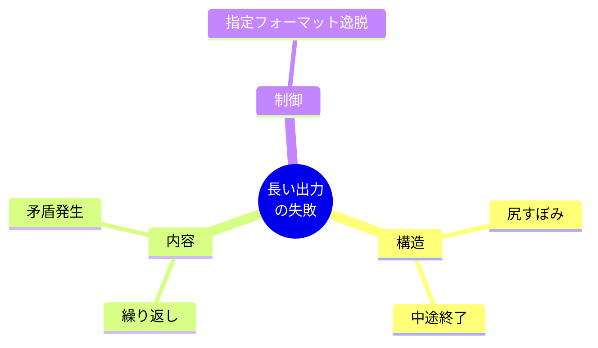
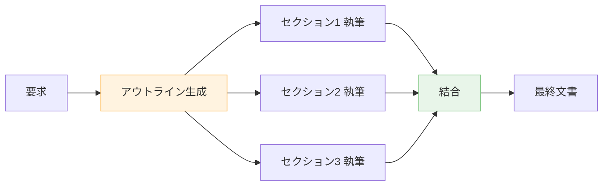
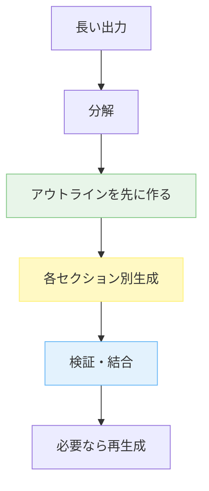

---
tags:
  - long-output
  - llm
  - anti-pattern
---

# 長い出力を生成させるときの 5 つの失敗

Patterns
#long-output
#llm
#anti-pattern
updated 2026-04-13
4 min read

LLM に長文（ブログ記事、ドキュメント、レポート等）を書かせる際、**短い出力より桁違いに失敗する**。中途終了・繰り返し・矛盾・尻すぼみなどの失敗モードが典型。

### 5 つの典型的な失敗

## 1. 尻すぼみ

**症状**: 冒頭は詳しく、後半になるほど簡潔化してしまう。

- **原因**: 出力トークンの予算感、モデルの「飽き」
- **対策**:
  - アウトラインを**先に生成させ、セクションごとに別呼び出し**で埋める
  - 各セクションの文字数目安を指示する

## 2. 中途終了

**症状**: `max_tokens` に到達して文が途中で切れる。

- **原因**: 出力上限設定が小さい、プロンプトが長い
- **対策**:
  - 出力上限を明示的に大きく設定（モデルの上限まで）
  - 中途終了を検知してリトライ（「続きから書いて」）
  - セクション分割で各呼び出しを小さくする

## 3. 繰り返し

**症状**: 同じ内容を言い換えて何度も書く。中身が薄まる。

- **原因**: コンテキストの圧縮、トークン稼ぎのような挙動
- **対策**:
  - 指示で「既に述べた内容は繰り返さない」と明示
  - セクションごとに「このセクションの論点」を事前に定める
  - 生成後、重複検出して編集

## 4. 矛盾発生

**症状**: 前半と後半で主張が食い違う。

- **原因**: 長い出力の中で一貫性を保つのは LLM が苦手
- **対策**:
  - 主張の軸を先に定義してから書く
  - 生成後、別の LLM で**矛盾チェック**を走らせる
  - 重要な主張には出典を要求する

## 5. 指定フォーマット逸脱

**症状**: 「Markdown で、見出しは ## で」と指示したのに、途中から崩れる。

- **原因**: 出力が長くなるほど、初期の指示が薄まる
- **対策**:
  - 例（few-shot）で形式を見せる
  - 長い出力はセクション分割し、各セクションで形式を再指示
  - 生成後に**自動整形**（lint）をかける

### 対処の原則

**1 回の呼び出しで完結させる**考えを捨て、**分解・検証・結合**の構造を前提にする。

### 品質のための工夫

- **アウトラインレビュー**: 構成段階で人間が一度確認する
- **セクション単位の評価**: 全体を見る前に、各セクションが独立して成立するかチェック
- **結合後の全体レビュー**: 繋がりが自然か、矛盾がないか確認

### アンチパターン

- **「長文を 1 リクエストで書かせる」**: 2000 文字を超えたら分割を検討
- **max_tokens を調整せず妥協**: 切れているなら上限を上げるかセクション分割
- **結果をそのまま採用**: 全体レビューなしに公開すると、矛盾や繰り返しに気づけない
- **繰り返しを放置**: 「この LLM はそういうもの」と思い込む。対策で改善できる

### チェックリスト

- [ ] 出力が 2000 文字を超えるならセクション分割を検討した
- [ ] アウトラインを先に生成して確認した
- [ ] 出力上限を十分に大きく設定した
- [ ] 生成後に重複・矛盾チェックをした
- [ ] フォーマット遵守を lint で確認した

### まとめ

長い出力は**「1 回で完璧に書かせる」のではなく、「分解して育てる」**発想が正解。構成・生成・検証の 3 段階で、LLM の得意な短距離走に変換する。

## 関連エントリ

- [エージェント運用の失敗モード一覧と対策マップ](エージェント運用の失敗モード一覧と対策マップ.md)
- [単一エージェントの7つのアンチパターン](単一エージェントの7つのアンチパターン.md)
- [評価セット設計の 6 つのアンチパターン](評価セット設計の-6-つのアンチパターン.md)

  
← [ツール実行の 5 つの失敗モード](ツール実行の-5-つの失敗モード.md)

  
[長時間セッションで遭遇する 6 つの失敗パターン](長時間セッションで遭遇する-6-つの失敗パターン.md) →

