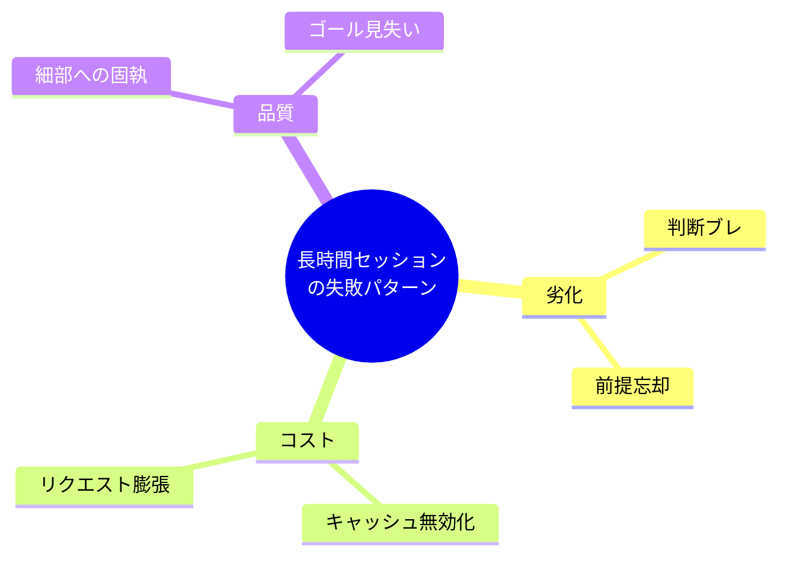
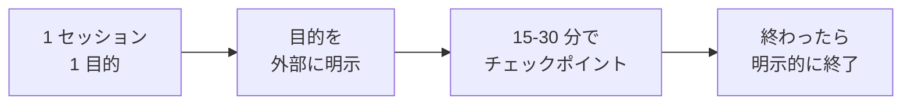

---
tags:
  - session
  - anti-pattern
  - context
---

# 長時間セッションで遭遇する 6 つの失敗パターン

Patterns
#session
#anti-pattern
#context
updated 2026-04-13
3 min read

LLM エージェントとのセッションが長時間化すると、品質が劣化し、コストが膨らみ、判断が不安定になる。**長時間セッションで繰り返し遭遇する 6 つの失敗パターン**と、対処方針。

### 6 パターンの分布

## 1. 判断がブレる

前半で決めた方針を、後半で覆す。圧縮や要約が入ると顕著。

- **症状**: 「さっき〇〇にすると言ったのでは?」と思う瞬間が増える
- **対策**: 重要決定を会話中にファイルに書き出す。再確認時はファイルを参照させる

## 2. 前提を忘れる

セッション序盤で共有した制約や前提を、後半で無視する。

- **症状**: 「この前提があるから〇〇はできません」と伝えたはずなのに提案してくる
- **対策**: 前提を `CLAUDE.md` 的なシステムプロンプトに移す。長くなる前にセッションを区切る

## 3. プロンプトキャッシュが効かなくなる

会話履歴が長くなると、キャッシュが効きにくくなる。コストが急増する。

- **症状**: レスポンスが遅くなる、コスト明細が想定より高い
- **対策**: セッションを明示的に区切る。固定部分を先頭に寄せる

## 4. リクエスト 1 件が膨張する

毎ターン、過去の会話全てを送るためトークン消費が雪だるま式。

- **症状**: 長いセッションで 1 問答に数十秒かかる
- **対策**: 要約を挟んで会話をリセット、または新しいセッションに移行

## 5. 細部への固執

全体を見失い、細かいスタイル修正に時間を使い続ける。

- **症状**: 「ここも直したほうが良いですか?」と無限に細部を提案してくる
- **対策**: タスクのゴールを明示的に再宣言。「これ以上の細部は別 Issue」と切る

## 6. ゴールを見失う

当初の目的からズレていき、エージェントが別タスクに没頭する。

- **症状**: 「そういえば何のためにこれやってるんだっけ?」と自分も混乱する
- **対策**: 目的を外部ファイルに書いておき、迷ったら参照させる。定期的にゴールを再確認

### 予防策: セッション設計の原則

- **1 セッション 1 目的**: 目的が変わったら新しいセッションを始める
- **チェックポイント**: 15-30 分に一度、進捗と残タスクを書き出す
- **終了を明示**: 「このセッションはここまで」と宣言して区切る

### まとめ

長時間セッションは**劣化・コスト・品質**の 3 つの敵を抱える。1 セッションを長く使うより、**短く区切って何度も開く**方が、結果的に安くて速くて質が高い。

## 関連エントリ

- [LLM 開発で避けるべき落とし穴 TOP 10](llm-開発で避けるべき落とし穴-top-10.md)
- [エージェント運用の失敗モード一覧と対策マップ](エージェント運用の失敗モード一覧と対策マップ.md)
- [単一エージェントの7つのアンチパターン](単一エージェントの7つのアンチパターン.md)

  <a class="prev" href="../長い出力を生成させるときの-5-つの失敗/">←長い出力を生成させるときの 5 つの失敗</a>
  <a class="next" href="../評価セット設計の-6-つのアンチパターン/">評価セット設計の 6 つのアンチパターン→</a>

