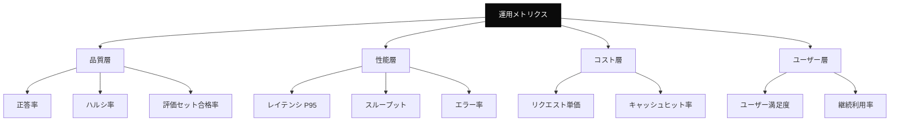
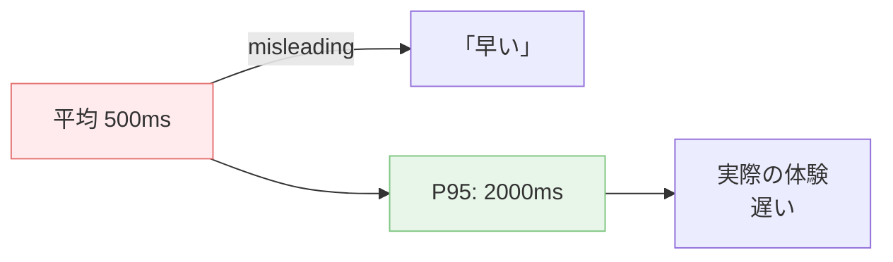
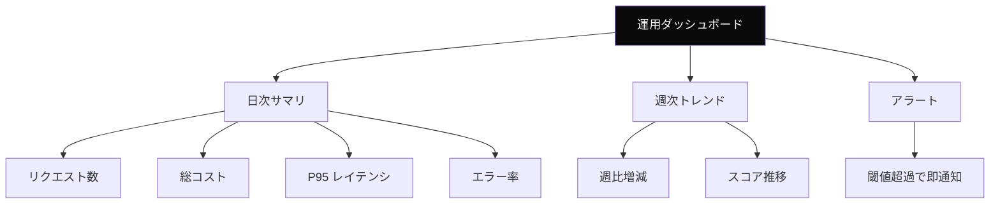

---
tags:
  - metrics
  - observability
  - ops
---

# AI エージェント運用の 10 メトリクス

Tech Notes
#metrics
#observability
#ops
updated 2026-04-13
5 min read

AI エージェントを本番運用する際、**何を計測すべきか**が曖昧だと改善できない。重要な 10 のメトリクスを 4 層で整理。

### メトリクスの 4 層

### 品質層

**1. 正答率（Accuracy）**

評価セットでの合格率。**週次で測定**し、傾向を追う。

- 目安: 合格ライン（80%）を継続的に満たす
- 閾値を下回ったら即アラート

**2. ハルシネーション率**

出力のうち、事実に基づかない比率。

- 測定方法: サンプリングして人間 or LLM-as-Judge で判定
- 目安: 3% 未満（タスク種別による）

**3. 評価セットのスコア推移**

プロンプト変更やモデル変更の前後で比較。**回帰を検出**する。

### 性能層

**4. レイテンシ（P95 / P99）**

95・99 パーセンタイルの応答時間。**平均値は誤魔化される**ので使わない。

- 目安: P95 で目標を設定（例: 3 秒以内）
- ストリーミングなら TTFB（Time To First Byte）を別途計測

**5. スループット**

秒間の処理リクエスト数。キャパシティプランニングに使う。

**6. エラー率**

HTTP 5xx・429・タイムアウトの合計比率。

- 目安: 1% 未満
- 種類別にも分解して見る（429 が多い → レート制限、5xx が多い → 内部エラー）

### コスト層

**7. リクエスト単価**

1 リクエストあたりの平均コスト。**日次で監視**。

- モデル別・エンドポイント別に内訳を出す
- 予算超過の早期警告に使う

**8. キャッシュヒット率**

プロンプトキャッシュが効いている比率。

- 目安: 70% 以上を目指す
- 下がったら「タイムスタンプが混入した」等の兆候

### ユーザー層

**9. ユーザー満足度**

実ユーザーがどう感じているかの指標。

- 直接フィードバック（Good/Bad ボタン）
- 間接指標（再質問率、離脱率）

**10. 継続利用率**

AI 機能が一度使われて終わりか、継続利用されているか。

- 低ければ品質 or UX に問題の可能性

### ダッシュボード設計

### アラート設計

| 指標 | 閾値 | 通知先 |
|------|------|-------|
| エラー率 | 5% 超え | 即通知 |
| P95 レイテンシ | 通常の 2 倍 | 即通知 |
| 総コスト / 日 | 予算の 150% | 即通知 |
| キャッシュヒット率 | 50% を下回る | 日次通知 |
| 評価セットスコア | 合格ライン未達 | リリース停止 |

### アンチパターン

**1. 平均値だけ見る**

中央値・P95・P99 を併記しないと、実体験を見誤る。

**2. メトリクスが多すぎる**

30 個のメトリクスを全部監視すると、どれも見なくなる。**10 個以下**に絞る。

**3. コスト監視を後回し**

想定の 10 倍になってから気づくケースがある。**最初から必須**で組み込む。

**4. アラートが少ない・多すぎ**

少ないと異常を見逃す、多すぎると慣れて無視する。**5〜10 個の本当に重要なアラート**に絞る。

### チェックリスト

- [ ] 4 層（品質・性能・コスト・ユーザー）をカバーしている
- [ ] P95 / P99 を使っている
- [ ] 評価セットスコアを定期測定している
- [ ] キャッシュヒット率を見ている
- [ ] コスト監視が動いている
- [ ] 重要アラートが 5〜10 個ある
- [ ] ダッシュボードで 10 秒で状況が分かる

### まとめ

AI エージェントの運用は**10 のメトリクスを 4 層で管理**する。計測なしの運用は改善できない。**最初から計測を設計**するのが王道。

## 関連エントリ

- [LLM アプリのログ設計で残すべき 5 項目](llm-アプリのログ設計で残すべき-5-項目.md)
- [Edge Runtime vs Node Runtime の使い分け](edge-runtime-vs-node-runtime-の使い分け.md)
- [LLM API のレート制限との付き合い方](llm-api-のレート制限との付き合い方.md)

  
← [LLM 機能を本番リリースする前のチェックリスト](llm-機能を本番リリースする前のチェックリスト.md)

  
[OpenAI と Anthropic API の主要差分](openai-と-anthropic-api-の主要差分.md) →

