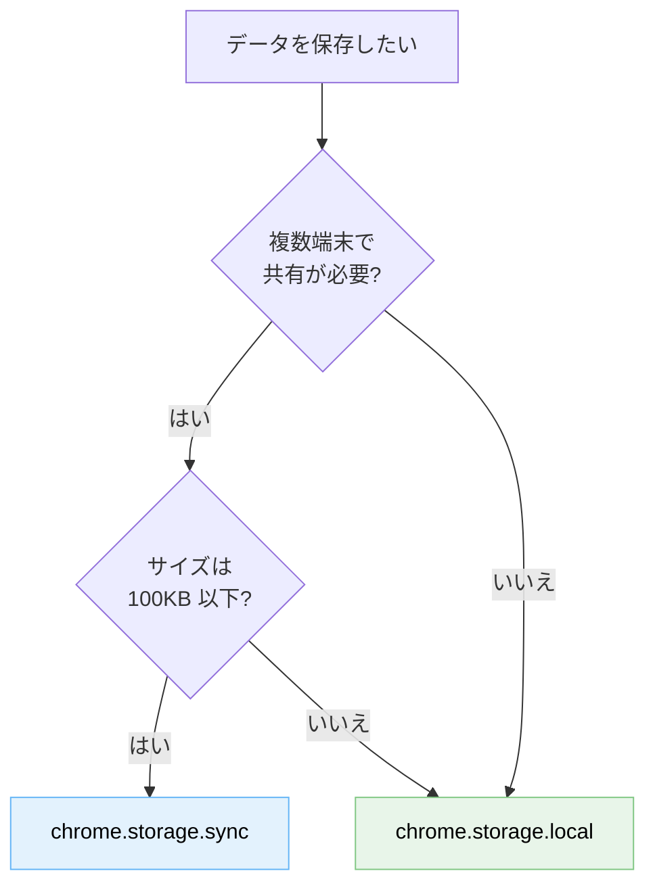

---
tags:
  - chrome-extension
  - storage
  - quota
---

# chrome.storage は local / sync / session を正しく使い分ける

Tech Notes
#chrome-extension
#storage
#quota
updated 2026-04-13
3 min read

Chrome 拡張で状態を保存する際、`chrome.storage.local` と `chrome.storage.sync` のどちらを使うかは意外と間違えやすい。誤って `sync` を選ぶと、クォータ制限にすぐ引っかかる。

### 違いを 1 図で

### クォータ比較

| ストレージ | 総容量 | 1 アイテム上限 | 書き込み制限 |
|-----------|-------|---------------|-------------|
| `chrome.storage.local` | 10 MB（`unlimitedStorage` で無制限） | 制限なし | 実質なし |
| `chrome.storage.sync` | 100 KB | 8 KB | 1 時間 1,800 回 / 1 分 120 回 |
| `chrome.storage.session` | 10 MB | 制限なし | メモリのみ（再起動で消失） |

### 使い分けの目安

- **ユーザー設定・フラグ**: `sync`（端末間で共有される方が嬉しい）
- **キャッシュ・履歴・大きなデータ**: `local`（容量制限に引っかからない）
- **セッション限定の一時データ**: `session`（再起動で消していい）

### 落とし穴

**1. `sync` の書き込み頻度制限**

フォームの入力値を毎キーストロークで保存する実装にすると、あっという間に上限に到達する。

- **対策**: デバウンス（500ms〜1s 程度まとめる）または `local` に逃がす

**2. `sync` が実際に同期されない**

ユーザーが Chrome にログインしていない、または同期を無効化している場合、`sync` は `local` と同じ挙動になる。コード上は動くが端末間共有されない。

- **対策**: 「本当に同期が必要か」を要件レベルで確認する。多くの場合、`local` で足りる

**3. サイズ超過時のエラーハンドリング**

クォータを超えた書き込みは silently fail することがある。`chrome.runtime.lastError` を必ずチェックする。

    chrome.storage.sync.set({key: bigValue}, () => {
      if (chrome.runtime.lastError) {
        console.error(chrome.runtime.lastError)
        // フォールバック: local に保存
      }
    })

### 判断の近道

**迷ったら `local` を選ぶ**。大半のケースで問題なく動く。`sync` を使う理由が明確な場合だけ `sync` にする。

## 関連エントリ

- [Chrome 拡張 Manifest V3 での Content Script + Side Panel 連携](../case-studies/chrome-拡張-manifest-v3-での-content-script-side-panel-連携.md)
- [AI エージェント運用の 10 メトリクス](ai-エージェント運用の-10-メトリクス.md)
- [Claude Code の Slash Command と Skill の使い分け](claude-code-の-slash-command-と-skill-の使い分け.md)

  
← [ナレッジベースのファイル命名規則とテキスト規約](ナレッジベースのファイル命名規則とテキスト規約.md)

  

