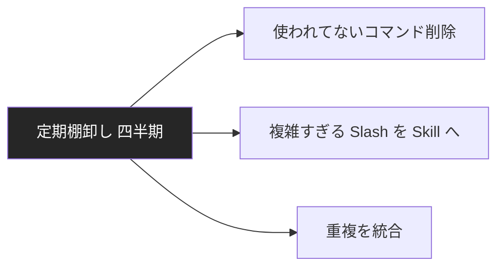

---
tags:
  - claude-code
  - slash-command
  - skill
---

# Claude Code の Slash Command と Skill の使い分け

<div class="dnk-meta" markdown>
<span class="pill cat">Tech Notes</span>
<span class="pill">#claude-code</span>
<span class="pill">#slash-command</span>
<span class="pill">#skill</span>
<span class="pill">updated 2026-04-13</span>
<span class="pill">6 min read</span>
</div>

Claude Code には `/<command>` で呼び出す **Slash Command** と、自然言語で起動される **Skill** がある。名前は似ているが**役割も実装も違う**。正しく使い分けると運用効率が大きく変わる。

### 違いの俯瞰

```mermaid
flowchart LR
    S[Slash Command] --> S1[/ で明示起動]
    S --> S2[シンプルな命令]
    S --> S3[固定挙動]
    K[Skill] --> K1[自然言語で起動]
    K --> K2[複雑な手順の自動化]
    K --> K3[動的判断を含む]

    style S fill:#e3f2fd,stroke:#64b5f6,color:#000
    style K fill:#fff3e0,stroke:#ffb74d,color:#000
```

### Slash Command

- **書式**: `/<command-name> [args]`
- **用途**: 明示的に呼ぶ特定の処理
- **例**: `/clear`（履歴クリア）、`/help`、`/commit`、`/review-pr`

**定義場所**: `~/.claude/commands/<name>.md`

**中身は Markdown**:

    ---
    description: 現在の変更をコミットする
    ---

    以下の手順で変更をコミットしてください:

    1. git status で状態確認
    2. git diff で変更内容確認
    3. 適切なコミットメッセージを作成
    4. コミット実行

**特徴**:

- ユーザーが明示的に呼ぶ
- 処理内容が固定的
- 定義がシンプル（Markdown 1 ファイル）

### Skill

- **書式**: 自然言語での依頼に応じて Claude が自動で起動
- **用途**: 特定ドメインの専門知識や手順を呼び出す
- **例**: `/plan-eng-review` や `/office-hours` 等

**定義場所**: `~/.claude/skills/<name>/SKILL.md`

    ---
    description: 技術検討を YC スタイルで深掘りする
    ---

    # オフィスアワースキル

    ## 起動条件
    - ユーザーが「オフィスアワー」と言及
    - 新規プロダクトアイデアの検証時

    ## 質問の型
    1. 問題は何か
    2. 誰の問題か
    ...

**特徴**:

- 複雑な手順や判断を含む
- 起動条件・質問フローが定義される
- 自然言語での起動が可能（Claude が判断する）

### 使い分け判断

```mermaid
flowchart TD
    N[新規機能] --> A{固定手順?}
    A -->|はい| S[Slash Command]
    A -->|いいえ<br/>動的判断必要| K[Skill]
    S --> U1[/ で明示呼び出し]
    K --> U2[自然言語で自動起動]

    style S fill:#e3f2fd,stroke:#64b5f6,color:#000
    style K fill:#fff3e0,stroke:#ffb74d,color:#000
```

### 典型的なユースケース

**Slash Command が向く**:

- Git 操作（commit、review-pr）
- プロジェクト固有のビルド・テスト
- リポート生成（週次、月次）
- 定型的なツール呼び出し

**Skill が向く**:

- アーキテクチャレビュー（複数の視点が必要）
- プロダクト企画（多段階の質問と判断）
- セキュリティ監査（専門知識を適用）
- オンボーディング支援（ユーザーの状態で分岐）

### 実装のコツ

**1. Slash Command は短く保つ**

30 行以下を目安。長くなるなら Skill に昇格を検討。

**2. Skill は起動条件を明示する**

「こういう状況で起動する」を明確に書かないと、Claude が判断できない。

**3. 両方併用もあり**

Skill の中から Slash Command を呼ぶ構成もできる。機能の再利用に役立つ。

**4. スコープを意識**

- グローバル: `~/.claude/commands/` or `~/.claude/skills/`
- プロジェクト: `.claude/commands/` or `.claude/skills/`

プロジェクト固有のものはプロジェクト側に置く。

### アンチパターン

**1. Slash Command に複雑ロジックを詰め込む**

30 行を超えたら Skill 化を検討。

**2. Skill の起動条件が曖昧**

「必要に応じて起動」のような書き方だと、Claude が判断できず使われない。

**3. 全てを Skill にする**

固定手順は Slash Command の方がシンプルで理解しやすい。

**4. ドキュメント化しない**

チームメンバーが知らないと使われない。README 等で一覧化する。

### 運用の棚卸し



### チェックリスト

- [ ] Slash Command と Skill の違いを理解している
- [ ] 固定手順は Slash、動的判断は Skill で分けている
- [ ] 起動条件を明示的に書いている
- [ ] プロジェクト固有のものはプロジェクトディレクトリに置いている
- [ ] 四半期ごとに棚卸しをしている

### まとめ

Slash Command と Skill は**似て非なるもの**。固定的・明示起動は Slash、複雑・自然言語起動は Skill。両方を適切に使い分けることで、Claude Code の日常運用が大きく効率化する。


## 関連エントリ

- [ADR 参照コマンドによる意思決定の継承](../tools/adr-参照コマンドによる意思決定の継承.md)
- [CLAUDE.md 肥大化を ADR 分離で回復した事例](../case-studies/claudemd-肥大化を-adr-分離で回復した事例.md)
- [Claude Code settings.json を使いこなす](../tools/claude-code-settingsjson-を使いこなす.md)


<div class="dnk-prev-next" markdown>
  <div class="prev">← [OpenAI と Anthropic API の主要差分](openai-と-anthropic-api-の主要差分.md)</div>
  <div class="next">[SQLite FTS5 で日本語を全文検索する](sqlite-fts5-で日本語を全文検索する.md) →</div>
</div>
