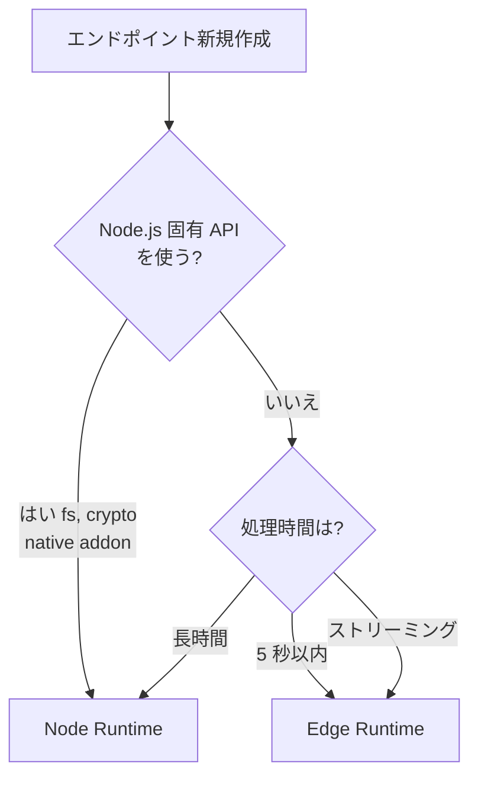

---
tags:
  - nextjs
  - vercel
  - edge-runtime
---

# Edge Runtime vs Node Runtime の使い分け

Tech Notes
#nextjs
#vercel
#edge-runtime
updated 2026-04-13
3 min read

Vercel（や Cloudflare Workers）の Edge Runtime は起動が速くグローバル分散できるが、Node.js API の大半が使えない。Node Runtime との使い分けを誤ると、運用時に詰む。

### 使い分け判断

### 制約比較

| 観点 | Edge Runtime | Node Runtime |
|------|-------------|--------------|
| 起動時間 | 数 ms | 数百 ms |
| グローバル分散 | ◎ | △ |
| メモリ上限 | 128 MB | 1024 MB+ |
| 実行時間上限 | 短い（プラン依存） | 長い |
| Node.js API | 制限あり | 全て使える |
| native モジュール | 使えない | 使える |
| ファイルシステム | 読み込みのみ | 読み書き可 |
| HTTP Streaming | ◎ | ○ |

### Edge Runtime で動かないもの

- `fs` / `path` の書き込み系
- native binding（sharp, canvas, node-sqlite 等）
- `Buffer` の一部 API（基本は polyfill あり）
- 重いライブラリ（puppeteer, Prisma の一部機能 等）

### 典型的な使い分け

**Edge 向き**

- LLM のストリーミング API プロキシ
- 認証トークン検証だけのミドルウェア
- A/B テストの振り分け
- 軽量な JSON API（読み取り中心）
- 地理的に近い応答が欲しい API

**Node 向き**

- 画像処理（sharp 等）
- PDF 生成（puppeteer 等）
- Prisma を使う API（Edge 対応もあるが機能限定）
- 長時間バッチ処理
- 複雑な依存を持つライブラリを使う処理

### 注意点

**1. 同じコードが両方で動くとは限らない**

ライブラリが Edge 対応していないと、ビルドは通っても実行時にエラー。ドキュメントで `edge-runtime compatible` を明記しているか確認する。

**2. リクエスト単位で切り替える**

Next.js では route ごとに `export const runtime = 'edge'` または `'nodejs'` を指定する。

    export const runtime = 'edge'
    export async function POST(req: Request) {
      // ...
    }

**3. テストが難しい**

ローカル開発では Node で動いて、本番（Edge）で動かないケースがある。`vercel dev` でローカル確認するか、プレビューデプロイで確認する。

### まとめ

**原則**: 迷ったら Node Runtime。Edge Runtime は「軽量・ストリーミング・低レイテンシ」が明確に必要な場合に限定して使う。

## 関連エントリ

- [Next.js + Supabase + Prisma 併用時の認証と RLS の扱い方](../case-studies/nextjs-supabase-prisma-併用時の認証と-rls-の扱い方.md)
- [Next.js で LLM のストリーミング応答を扱う実装パターン](../case-studies/nextjs-で-llm-のストリーミング応答を扱う実装パターン.md)
- [Stripe Webhook を Next.js で安全に実装する](../case-studies/stripe-webhook-を-nextjs-で安全に実装する.md)

  <a class="prev" href="../sqlite-fts5-クエリは-phrase-化して安全に渡す/">←SQLite FTS5 クエリは phrase 化して安全に渡す</a>
  <a class="next" href="../llm-api-のレート制限との付き合い方/">LLM API のレート制限との付き合い方→</a>

