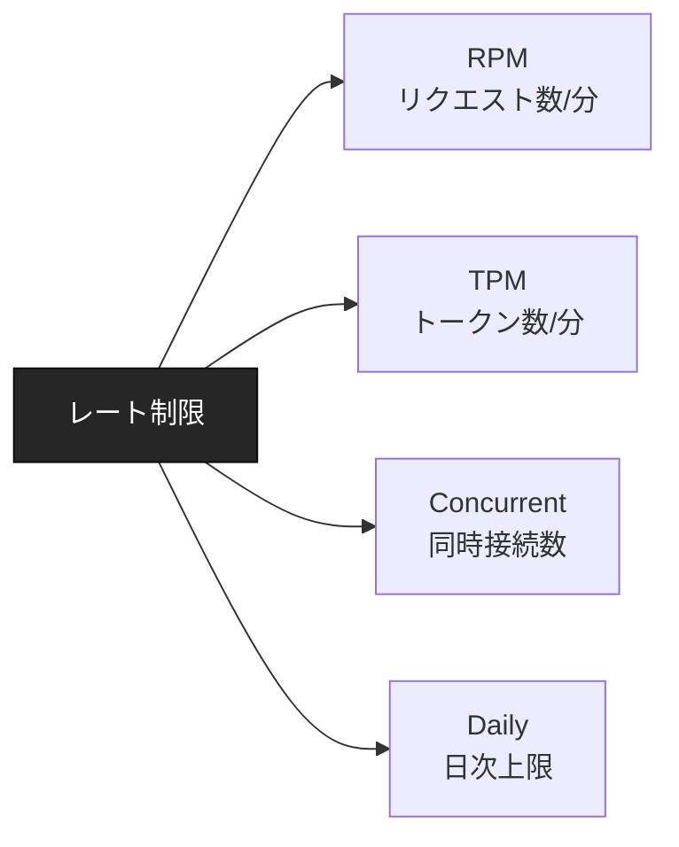
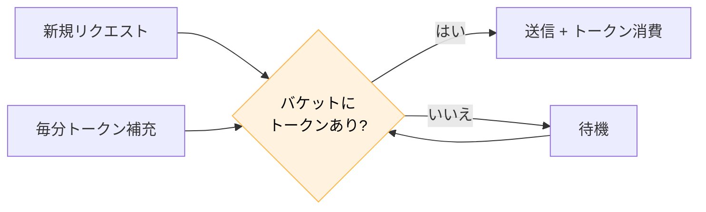
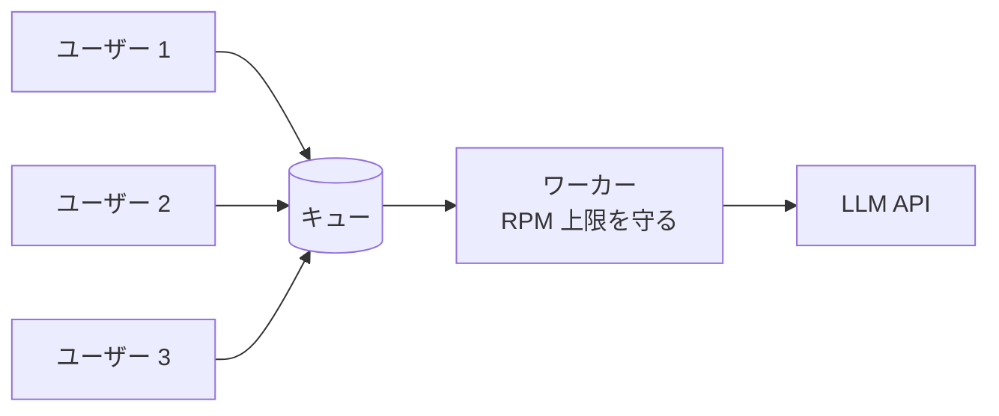

---
tags:
  - rate-limit
  - retry
  - llm
  - api
---

# LLM API のレート制限との付き合い方

Tech Notes
#rate-limit
#retry
#llm
#api
updated 2026-04-13
5 min read

LLM API（OpenAI・Anthropic 等）のレート制限は、負荷時に必ず遭遇する。**事前にリトライ戦略・バックオフ・キュー**を組み込んでおかないと、本番で落ちる。

### 主なレート制限の種類

- **RPM**（Requests Per Minute）: 1 分あたりのリクエスト上限
- **TPM**（Tokens Per Minute）: 1 分あたりのトークン数上限。**長いプロンプトは TPM を先に消費**
- **Concurrent Requests**: 同時に処理中のリクエスト数
- **Daily Limit**: 日次の総量上限

### 対応の 3 層

**1. リトライ + 指数バックオフ**

429 エラー（Too Many Requests）を受けたら、一定時間待ってから再試行する。待ち時間は指数的に増やす。

    import time, random

    def call_with_retry(fn, max_retries=5):
        for i in range(max_retries):
            try:
                return fn()
            except RateLimitError as e:
                if i == max_retries - 1:
                    raise
                wait = (2 ** i) + random.uniform(0, 1)
                time.sleep(wait)

- 初回: 1 秒、2 回目: 2 秒、3 回目: 4 秒...
- **ジッター**（ランダム要素）を加えて、複数クライアントが同時にリトライする問題を避ける

**2. トークンバケット制御**

自分でリクエスト数・トークン数を管理し、上限に近づいたら送らない。

ライブラリ（`ratelimit`, `aiolimiter` 等）を使うと実装が楽。

**3. キューイング**

一時的なピークを均す。Redis や SQS 等のキューにリクエストを積み、ワーカーが一定ペースで処理する。

### ステータスコードの見分け方

| コード | 意味 | 対応 |
|--------|------|------|
| 429 | レート制限 | バックオフでリトライ |
| 500/502/503 | サーバーエラー | 短めのリトライ |
| 529 (Anthropic) | 過負荷 | リトライ + スロットリング |
| 401/403 | 認証 | リトライしない、エラー |
| 400 | クライアントエラー | リトライしない、バグ |

**リトライしてはいけないもの**をリトライすると、延々失敗を繰り返す。

### ユーザー体験への対処

リトライ中のユーザーには状況を伝える。

- 「混雑しています。再試行中...」等のメッセージ
- 長時間待たせるなら、バックグラウンド処理に切り替えて完了通知
- 最終的に失敗したら、ユーザーに分かる形でエラー表示（「503 Service Unavailable」は NG）

### 運用時のチェック

- [ ] 429 を検知してリトライ実装済み
- [ ] 指数バックオフとジッターを使用
- [ ] 最大リトライ回数を設定（無限リトライ禁止）
- [ ] リトライしないエラーを区別
- [ ] リクエスト数/分をログに記録
- [ ] 上限到達前に警告する仕組み

### 契約プランと実質上限

API のプランを上げると上限も上がる。本番運用規模を見積もり、余裕を持ったプランに入っておく。**1 ヶ月後に急に流量が増えた**ときに焦らない準備。

### まとめ

レート制限への対応は**後付けが難しい**。最初から 3 層（リトライ・トークンバケット・キュー）を想定して設計する。

## 関連エントリ

- [LLM アプリのログ設計で残すべき 5 項目](llm-アプリのログ設計で残すべき-5-項目.md)
- [LLM 機能を本番リリースする前のチェックリスト](llm-機能を本番リリースする前のチェックリスト.md)
- [Eval-Driven Development — LLM 機能開発は評価から始める](../concepts/eval-driven-development-llm-機能開発は評価から始める.md)

  
← [Edge Runtime vs Node Runtime の使い分け](edge-runtime-vs-node-runtime-の使い分け.md)

  
[LLM アプリのログ設計で残すべき 5 項目](llm-アプリのログ設計で残すべき-5-項目.md) →

