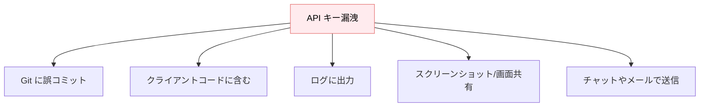
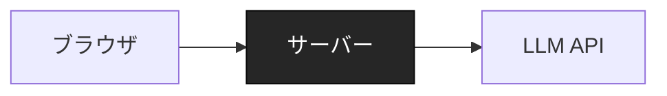
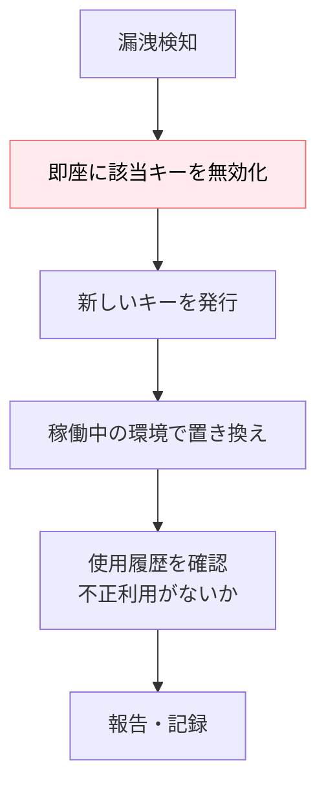

---
tags:
  - security
  - api-key
  - secrets
---

# LLM API キーの管理と漏洩防止

Tech Notes
#security
#api-key
#secrets
updated 2026-04-13
5 min read

LLM の API キー（OpenAI, Anthropic 等）は**高価・攻撃対象・漏洩時の影響が大きい**。最初から管理の仕組みを整えないと、事故を起こす。

### 漏洩の主な経路

### 基本の守り方

**1. 環境変数に置く**

コードに直書きしない。**環境変数**で管理する。

    # 良い
    client = OpenAI(api_key=os.environ["OPENAI_API_KEY"])

    # 悪い
    client = OpenAI(api_key="sk-...")

**2. .env ファイルを gitignore**

`.env` は必ず `.gitignore` に含める。**先に gitignore を書いてから** `.env` を作る。順序が大事。

    # .gitignore
    .env
    .env.local
    .env.*.local

**3. クライアントに露出しない**

フロントエンドに API キーを渡さない。ブラウザで動くコードに入ると、全ユーザーから見える。

- **NG**: `NEXT_PUBLIC_OPENAI_API_KEY`
- **OK**: サーバーサイドで使い、クライアントにはプロキシ経由で提供

サーバーが「API キーを持つ唯一の場所」になる設計。

**4. ログに出さない**

エラーログや HTTP リクエストログに API キーが含まれると漏れる。

    # ログに出やすい NG パターン
    logger.info(f"Calling API with headers: {headers}")  # headers に Authorization

ミドルウェアで**マスキング処理**を挟む。

**5. 用途別にキーを分ける**

- 本番用・開発用・CI 用で別キー
- 漏洩が疑われたら**該当キーだけ無効化**できる

**6. Rotation（定期更新）**

長期間同じキーを使わない。3〜6 ヶ月ごとに新しいキーを発行して切り替える。

### プラットフォーム別の格納先

| 環境 | 推奨の格納先 |
|------|-------------|
| ローカル開発 | `.env`（gitignore） |
| Vercel | Environment Variables |
| AWS | AWS Secrets Manager / SSM Parameter Store |
| GCP | Secret Manager |
| Azure | Key Vault |
| GitHub Actions | Repository Secrets |

平文で Docker image に焼き込んだり、リポジトリにコミットしたりしない。

### 漏洩時の対応

**順序が重要**。まず無効化、次に交換、最後に調査。

### 検出の仕組み

- **GitHub Secret Scanning**: リポジトリにコミットされた既知の形式のキーを自動検出
- **pre-commit hook**: コミット前にシークレットを検出（`detect-secrets`, `gitleaks`）
- **コスト異常検知**: 想定外の API 利用急増をアラート

これらをプロジェクト開始時に設定する。後付けは忘れがち。

### アンチパターン

- **「小さなプロジェクトだから大丈夫」**: 小さいうちこそコミット事故しやすい
- **「public repo じゃないから」**: private repo からも漏れることがある（CI ログ、画面共有、委託先経由等）
- **「ローテーションは後で」**: 事故後に慌てて rotation 手順を整えるのは大変。最初から仕組みに

### チェックリスト

- [ ] `.gitignore` に `.env` を追加
- [ ] pre-commit hook でシークレット検出
- [ ] 本番・開発・CI で別キー
- [ ] クライアントに API キーが露出していない
- [ ] ログのマスキング処理がある
- [ ] コスト異常アラートを設定
- [ ] rotation 手順を文書化

### まとめ

API キー管理は**プロジェクト最初のコミット**から仕組み化する。後付けはコストが高く、漏洩事故の修復も痛い。予防が全て。

## 関連エントリ

- [LLM アプリのインシデント対応](llm-アプリのインシデント対応.md)
- [LLM レッドチーミング — 意図的な攻撃で安全性を検証する](../techniques/llm-レッドチーミング-意図的な攻撃で安全性を検証する.md)
- [Stripe Webhook を Next.js で安全に実装する](../case-studies/stripe-webhook-を-nextjs-で安全に実装する.md)

  
← [実装言語を選ぶ前に環境前提を確認する](実装言語を選ぶ前に環境前提を確認する.md)

  
[LLM 機能を本番リリースする前のチェックリスト](llm-機能を本番リリースする前のチェックリスト.md) →

